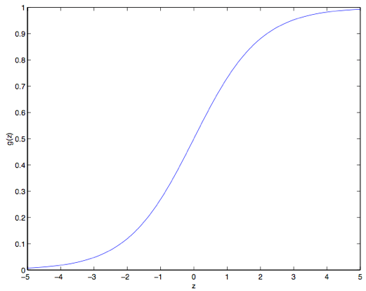

02. 监督学习（Supervised learning）

-----
[TOC]

# 1. 监督学习

​	如果我们用规范的方式来描述监督学习问题，我们的目标是：给定一个训练集，来让机器学习一个函数 $h: X \rightarrow Y$，让 $h(x)$ 能是一个与真实 y 值比较接近的评估值。这个函数 $h$ 就被叫做**假设（hypothesis）**。用图标表示的话，这个过程大概就是下面这样：

如果我们要预测的目标变量 $y$ 是**连续的**，这种学习问题就被称为**回归问题**；如果 $y$ 是**离散的值**，这样的问题就叫做**分类问题**。

# 2. 线性回归（Linear Regression）

​	为了让我们的房屋问题更加具有代表性，我们对数据集增加**多个输入特征**，如下：

| 居住面积（平方英尺） | 卧室数目（个） | 价格（千美元） |
| :------------------: | :------------: | :------------: |
|         2104         |       3        |      400       |
|         1600         |       3        |      330       |
|         2400         |       3        |      369       |
|         1416         |       2        |      232       |
|         3000         |       4        |      540       |
|         ...          |      ...       |      ...       |

现在，输入特征 $x$ 是一个在 $R^2$ 范围内取值的一个二维向量了，例如 $x_1^{(i)}$ 就是训练集中第 i 个房屋的面积，而 $x_2^{(i)}$  就是训练集中第 i 个房屋的卧室数目。要进行这个监督学习，我们必须确定好合适的**假设 $h$** 进行表示。在这里，我们选择简单的**线性函数**表示：
$$
h(x) = h_\theta(x) = \theta_0 + \theta_1 \times x_1 + \theta_2 \times x_2
$$
这里的 $\theta_i$ 是参数，是从 x 到 y 的线性函数映射的空间参数。在不至于引起混淆的情况下，我们可以把 $h_\theta(x)$ 里面的 $\theta$ 省略掉，就简写成 $h(x)$。另外，为了简化公式，假设 $x_0 = 1$（**截距项 intercept term**），$n$ 为输入特性的**维数**，简化成向量表示如下： 
$$
h(x) = \sum^n_{i=0} \theta_i x_i = \theta^T x
$$
## 2.1 代价函数（cost function）

​	给定了**训练集**和**假设 $h$**，我们如何选择合适的学习参数 $\theta$ 呢？一个看上去比较合理的方法就是让 $h(x)$ 尽量逼近 $y$，用公式的表示的话，就要定义一个函数，来衡量不同的 $\theta$ 值时，$h(x^{(i)})$ 与 $y^{(i)}$ 的距离。用这样的方式定义的函数就叫做成本函数（cost function）。在当前问题中，我们采用最小均方算法（LMS algorithm）作为代价函数，如下：
$$
J(\theta) = \frac {1}{2}  \sum^m_{i=1} (h_\theta(x^{(i)}) - y^{(i)})^2
$$
其中，$m$ 表示训练集中样本的个数。

## 2.2 梯度下降法（gradient descent algorithm）

​	我们希望选择一个能让 $J(\theta)$ 最小的 $\theta$ 值。怎么做呢，我们使用一个搜索的算法，首先对 $\theta$ 进行初始化，然后通过某种方法对 $\theta$ 值不断进行调整，使得 $J(\theta)$ 逐渐变小直至收敛。这里我们使用梯度下降法（gradient descent algorithm），初始化 $\theta$ 值，使用如下公式进行重复更新直至收敛，其中 $\alpha$ 表示学习速率：
$$
\theta_j := \theta_j - \alpha \frac {\partial} {\partial\theta_j}J(\theta)
$$

> 注：本文中 $:= $ 表示的是计算机程序中的一种赋值操作，是把等号右边的计算结果赋值给左边的变量，$a := b$ 就表示用 B 的值覆盖 A 原有的 值。要注意区分，如果写的是 $a = b$ 则表示的是判断二者相等的关系。

要实现这个算法，咱们需要解决等号右边的倒数项。首先考虑只有一组训练样本 $(x, y)$ 的情况，计算过程如下：
$$
\begin{split}

\frac{\partial}{\partial\theta_j} J(\theta) &= \frac{\partial}{\partial\theta_j} \frac{1}{2} (h_\theta(x)-y)^2 \\
&= 2 \times \frac{1}{2} (h_\theta(x)-y) \times \frac{\partial}{\partial\theta_j} (h_\theta(x)-y) \\
&= (h_\theta(x)-y) \times \frac{\partial}{\partial\theta_j} (\sum^n_{i=0}\theta_i x_i - y)) \\
&= (h_\theta(x)-y) \times x_i

\end{split}
$$
对第 $i$ 个训练样本，更新规则如下所示：
$$
\theta_j := \theta_j + \alpha (y^{(i)} - h_\theta(x^{(i)}))x_j^{(i)}
$$
当训练集有超过一个训练样本的时候，有两种对这个规则的修改方法。

### 1. 批量梯度下降法（batch gradient descent）

​	**批量梯度下降法**更新规则如下：

​	重复直至收敛 `{`

​		$\theta_j := \theta_j + \alpha \sum^m_{i=1}(y^{(i)} - h_\theta(x^{(i)}) )x_j^{(i)}$ （对每个 $j$）

​	`}`

​					批量梯度下降法：更新规则实际就是对原始的代价函数 $J$ 进行简单的梯度下降。在==每个步长内检查整个训练集==中的所有样本。

​	然而，由于每次进行一个批量梯度下降算法，都需要遍历整个训练集。当训练集 $m$ 变得很大时，因此引起的性能开销就很不划算了。

### 2. 随机梯度下降法（stochastic gradient descent）

​	**随机梯度下降法**更新规则如下：

​	循环：`{`

​	i=1:m`{`

​			$\theta_j := \theta_j - \alpha (h_\theta(x^{(i)}) - y^{(i)})x_j^{(i)}$ （对每个 $j$）

​		`}`

​	`}`

​	 随机梯度下降法：我们对整个训练集进行循环遍历，每次遇到一个训练样本，根据每个单一训练样本的误差梯度来对参数进行更新。即在==每个步长内使用单个样本==。对于训练集很大的数据，随机梯度下降法速度很快。

​	然而， 随机梯度下降法通常不会精确地收敛到全局的最小值，会在最小值附近震荡，通常情况下在最小值附近的这些值大多数其实也足够逼近了，足以满足咱们的精度要求，所以也可以用。不过更常见的情况是我们事先对数据集已经有了描述，并且选择了合适的学习速率 $\alpha$；然后来运行随机梯度下降，同时更新学习速率 $\alpha$ 随着算法的运行逐渐趋于 $0$，这样也能保证我们的参数会收敛到最小值。基于以上种种原因，通常推荐使用的都是随机梯度下降法，而不是批量梯度下降法，尤其是在训练用的数据集比较大的情况下。

## 2.3 正规方程（The normal equations）

### 1. 矩阵倒数

​	假如有一个函数 $f: R_{m\times n} → R$ 从 $m\times n$ 大小的矩阵映射到实数域，那么就可以定义当矩阵为 A 的时候有导函数 $f$ 如下所示：

$$
\nabla_A f(A) = 
\begin{bmatrix} 
\frac {\partial f}{\partial A_{11}} & \vdots & \frac {\partial f}{\partial A_{1n}} \\ 
\vdots  & \vdots & \vdots  \\ 
\frac {\partial f}{\partial A_{m1}} & \vdots  & \frac {\partial f}{\partial A_{mn}} \\ 
\end{bmatrix}
$$

因此，这个梯度 $\nabla_A f(A)$本身也是一个 m*n 的矩阵，其中的第 $(i, j)$ 个元素是 $\frac {\partial f}{\partial A_{ij}} $ 。

### 2. 矩阵的迹

​	对于一个给定的 $n\times n$ 方形矩阵 A，它的迹定义为对角项和：
$$
trA = tr(A) = \sum^n_{i=1} A_{ii}
$$

- 迹函数的线性
  $$
  tr(A+B) = trA + trB	\\
  tr(aA) = atrA	\\
  $$

- 迹函数的矩阵乘积
  $$
  trA = trA^T	\\
  tr(AB) = tr(BA)	\\
  tr(ABC) = tr(CAB) \\
  $$

- 迹函数的矩阵导数
  $$
  \begin{aligned}
     \nabla_A tr AB & = B^T & \text{(1)} \\
     \nabla_{A^T} f(A) & = (\nabla_{A} f(A))^T & \text{(2)} \\
     \nabla_A tr ABA^TC& = CAB+C^TAB^T & \text{(3)} \\
     \nabla_A|A| & = |A|(A^{-1})^T & \text{(4)} \\
  \end{aligned}
  $$

结合（2）和（3），我们可以得到公式（5）：
$$
\begin{aligned}
	\nabla_{A^T} tr ABA^TC &=B^TA^TC^T+BA^TC & \text{(5)}	\\
\end{aligned}
$$

### 3. 最小二乘法

​	首先我们把 $J$ 用矩阵－向量的记号来重新你描述。给定一个训练集，把**设计矩阵（design matrix）** $Ｘ$ 设置为一个  $m \times (n+1)$ 矩阵（考虑到　$\theta_0$），这个矩阵里包含了训练样本的输入值作为一行：
$$
X =
\begin{bmatrix}
	-(x^{(1)}) ^T-\\
	-(x^{(2)}) ^T-\\
	\vdots \\
	-(x^{(m)}) ^T-\\
\end{bmatrix} 
$$
然后，我们设 $\vec{y}$ 是一个 $m$ 维向量，包含了训练样本中的所有目标值：
$$
y =
\begin{bmatrix}
	y^{(1)}\\
	y^{(2)}\\
	\vdots \\
	y^{(m)}\\
\end{bmatrix} 
$$
由于 $h_\theta (x^{(i)}) = (x^{(i)})^T\theta $，可以证明存在下面这种等量关系：
$$
\begin{aligned}
X\theta - \vec{y}  &=
	\begin{bmatrix}
		(x^{(1)})^T\theta \\
		\vdots \\
		(x^{(m)})^T\theta\\
	\end{bmatrix} -
	\begin{bmatrix}
	y^{(1)}\\
	\vdots \\
	y^{(m)}\\
	\end{bmatrix}\\
& =
	\begin{bmatrix}
		h_\theta (x^{1}) -y^{(1)}\\
		\vdots \\
		h_\theta (x^{m})-y^{(m)}\\
	\end{bmatrix}\\
\end{aligned}
$$
利用点积公式，可以推出：

$$
\begin{aligned}
\frac 12(X\theta - \vec{y})^T (X\theta - \vec{y}) &=　\frac 12 \sum^m_{i=1}(h_\theta (x^{(i)})-y^{(i)})^2\\
\end{aligned}
$$
最后，要让 $J$ 的值最小，就要找到导数为 0 的点，因此就有：
$$
\begin{aligned}
\nabla_\theta J(\theta) &= \nabla_\theta \frac 12 (X\theta - \vec{y})^T (X\theta - \vec{y}) \\
&= \frac  12 \nabla_\theta (\theta ^TX^TX\theta -\theta^T X^T \vec{y} - \vec{y} ^TX\theta +\vec{y}^T \vec{y})\\
&= \frac  12 \nabla_\theta tr(\theta ^TX^TX\theta -\theta^T X^T \vec{y} - \vec{y} ^TX\theta +\vec{y}^T \vec{y})\\
&= \frac  12 \nabla_\theta (tr \theta ^TX^TX\theta - 2tr\vec{y} ^T X\theta)\\
&= \frac  12 (X^TX\theta+X^TX\theta-2X^T\vec{y}) \\
&= X^TX\theta-X^T\vec{y}\\
\end{aligned}
$$
在第三步，我们利用定理：一个实数的迹就是这个实数本身；第四步中，用到了 $trA = trA^T$ 这个定理；第五步中，利用等式（１）和（５），其中 $A^T =\theta、B=B^T =X^TX、C=I$。

然后令导数为 0，得到下面的法线方程：
$$
X^TX\theta = X^T\vec{y} \\
\theta = (X^T X)^{-1} X^T \vec{y}	\\
$$
所以让 $J(\theta)$ 取得最小值的 $\theta$ 就是 $\theta = (X^T X)^{-1} X^T \vec{y}$ 。

## 2.3 概率解释（Probabilistic interpretation）

​	当面对回归问题时，我们会有疑问，为什么选择最小二乘法作为代价函数？在本节中，我们会给出一系列的概率基本假设，基于这些假设，就可以推出最小二乘法回归是一种非常自然的算法。

1. 首先我们假设目标变量和输入值存在下面这种等量关系：
   $$
   y^{(i)} = \theta^T x^{(i)}+ \epsilon ^{(i)}
   $$
    其中 $ \epsilon ^{(i)}$ 是误差项，用以描述建模忽略的变量和随机噪声。

2. 其次假设 $ \epsilon ^{(i)}$ 服从高斯分布，即 $ \epsilon ^{(i)} ∼ N (0, \sigma ^2)$，概率密度函数就是：
   $$
   p(\epsilon ^{(i)} )= \frac 1{\sqrt{2\pi\sigma}} exp (- \frac  {(\epsilon ^{(i)} )^2}{2\sigma^2})
   $$

   这也意味着在给定参数 $\theta$ 下， $y^{(i)}$ 相对与输入 $x^{(i)}$ 服从高斯概率分布：
   $$
   y^{(i)} | x^{(i)}; \theta ∼ N (\theta ^T x^{(i)}, \sigma^2) \\
    p(y ^{(i)} |x^{(i)}; \theta)= \frac 1{\sqrt{2\pi\sigma}} exp (- \frac  {(y^{(i)} -\theta^T x ^{(i)} )^2}{2\sigma^2}) \\
   $$

根据上面讲的**设计矩阵 Ｘ**，包含了全部的 $x^{(i)}$，然后再给定 $\theta$，那么 $y^{(i)}$ 的分布是什么样子呢？数据的概率以 $p (\vec{y}|X;\theta )$ 的形式给出。为了衡量 $\theta$ 对向量 $\vec{y}$ 的贡献，我们定义一个**似然函数（likelihood function）**$L(\theta)$：
$$
\begin{aligned}
L(\theta) &=L(\theta;X,\vec{y})　\\
&=p(\vec{y}|X;\theta)　\\
&=\prod ^m _{i=1} \frac  1{\sqrt {2\pi \sigma }} exp(- \frac {(y^{(i)}-\theta^T x^{(i)})^2}{2\sigma^2})　\\
\end{aligned}
$$
$\theta$ ＂越好＂，$L(\theta)$ 分布越集中，值越大，所以接下来我们求最大值，此次对应的 $\theta$ 就是最佳的 ，这种方法称为**极大似然法（maximum likelihood）**。我们使用对数方便计算：

$$
\begin{aligned}
l(\theta) &=\log L(\theta)\\
&=\log \prod ^m _{i=1} \frac  1{\sqrt {2\pi \sigma }} exp(- \frac {(y^{(i)}-\theta^T x^{(i)})^2}{2\sigma^2})\\
&= \sum ^m _{i=1} \frac  1{\sqrt {2\pi \sigma }} exp(- \frac {(y^{(i)}-\theta^T x^{(i)})^2}{2\sigma^2})\\
&= m \times \log \frac  1{\sqrt {2\pi \sigma}}- \frac 1{\sigma^2}\times \frac 12 \sum^m_{i=1} (y^{(i)}-\theta^Tx^{(i)})^2\\
\end{aligned}
$$
因此，对 $l(\theta)$ 取得最大值也就意味着下面这个子式取到最小值：
$$
\frac 12 \sum^m _{i=1} (y^{(i)}-\theta^Tx^{(i)})^2
$$
到这里我们能发现这个子式实际上就是 $J(\theta)$，也就是最原始的最小二乘函数。总结一下也就是：在对数据进行概率假设的基础上，最小二乘回归得到的 θ 和最大似然法估计的 θ 是一致的。所以这是一系列的假设，其前提是认为最小二乘回归（least-squares regression）能够被判定为一种非常自然的方法。

## 2.4 局部加权线性回归（Locally weighted linear regression）

​	假如问题还是根据从实数域内取值的 $x ∈ R$ 来预测 y 。左下角的图显示了使用 $y = \theta_0 + \theta_1x$ 来对一个数据集进行拟合。我们明显能看出来这个数据的趋势并不是一条严格的直线，所以用直线进行的拟合就不是好的方法。

那么这次不用直线，而增加一个二次项，用$y = \theta_0 + \theta_1x +\theta_2x^2$ 来拟合，(看中间的图) 很明显，我们对特征补充得越多，效果就越好。不过，增加太多特征也会造成危险的：最右边的图就是使用了五次多项式 $y = \sum^5_{j=0} \theta_jx^j$ 来进行拟合。看图就能发现，虽然这个拟合曲线完美地通过了所有当前数据集中的数据，但我们明显不能认为这个曲线是一个合适的预测工具，比如针对不同的居住面积 x 来预测房屋价格 y。先不说这些特殊名词的正规定义，咱们就简单说，最左边的图像就是一个**欠拟合（under fitting）**的例子，比如明显能看出拟合的模型漏掉了数据集中的结构信息；而最右边的图像就是一个**过拟合（over fitting）**的例子。

​	正如前文谈到的，也正如上面这个例子展示的，一个学习算法要保证能良好运行，特征的选择是非常重要的。在本节，咱们就简要地讲一下**局部加权线性回归**（locally weighted linear regression ，LWR），这个方法是假设有足够多的训练数据，对不太重要的特征进行一些筛选。
在原始版本的线性回归算法中，要对一个查询点 x 进行预测，比如要衡量$h(x)$，要经过下面的步骤：

1. 使用参数 θ 进行拟合，让数据集中的值与拟合算出的值的差值平方$(y^{(i)} − \theta^T x^{(i)} )^2$最小（最小二乘法的思想）；参数 $\theta$ 一旦确定，无论选择哪个 $x$，都不会变。
2. 输出 $\theta^T x$ 。

相应地，在 LWR 局部加权线性回归方法中，步骤如下：

1. 使用参数 θ 进行拟合，让加权距离$w^{(i)}(y^{(i)} − \theta^T x^{(i)} )^2$ 最小；此时参数 $\theta$ 随着 $w^{(i)}$ 变化，而 $w^{(i)}$ 随着 $x$ 变化，即对于不同的 $x$，每次衡量 $h(x)$ 时，都要重新计算 $\theta$；==训练集要保留==
2. 输出 $\theta^T x$。

上面式子中的 $w^{(i)}$ 是非负的权值。直观点说就是，如果对应某个i 的权值 $w^{(i)}$ 特别大，那么在选择拟合参数 θ 的时候，就要尽量让这一点的 $(y^{(i)} − \theta^T x^{(i)} )^2$ 最小。而如果权值$w^{(i)}$  特别小，那么这一点对应的$(y^{(i)} − \theta^T x^{(i)} )^2$ 就基本在拟合过程中忽略掉了。
对于权值的选取可以使用下面这个比较标准的公式：
$$
w^{(i)} = exp(- \frac {(x^{(i)}-x)^2}{2\tau^2})
$$

如果 x 是有值的向量，那就要对上面的式子进行泛化，得到的是
$$
w^{(i)} = exp(− \frac {(x^{(i)}-x)^T(x^{(i)}-x)}{2\tau^2})
$$
或者:
$$
w^{(i)} = exp(− \frac {(x^{(i)}-x)^T\Sigma ^{-1}(x^{(i)}-x)}{2})
$$
这就看是选择用$\tau$ 还是 $\Sigma$。

​	要注意的是，权值是依赖每个特定的点 x 的，而这些点正是我们要去进行预测评估的点。此外，如果 $|x^{(i)} − x|$ 非常小，那么权值 $w^{(i)} $就接近 1；反之如果 $|x^{(i)} − x|$ 非常大，那么权值 $w^{(i)} $就变小。所以可以看出， θ 的选择过程中，查询点 x 附近的训练样本有更高得多的权值。（θis chosen giving a much higher “weight” to the (errors on) training examples close to the query point x.）（还要注意，当权值的方程的形式跟高斯分布的密度函数比较接近的时候，权值和高斯分布并没有什么直接联系，尤其是当权值不是随机值，且呈现正态分布或者其他形式分布的时候。）
​	随着点$x^{(i)} $ 到查询点 x 的距离降低，训练样本的权值的也在降低，参数$\tau$  控制了这个降低的速度；$\tau$也叫做**带宽参数**，这个也是在你的作业中需要来体验和尝试的一个参数。
​	局部加权线性回归是咱们接触的第一个非参数算法。而更早之前咱们看到的无权重的线性回归算法就是一种参数学习算法，因为有固定的有限个数的参数（也就是 $\theta_i$ ），这些参数用来拟合数据。我们对 $\theta_i$ 进行了拟合之后，就把它们存了起来，也就不需要再保留训练数据样本来进行更进一步的预测了。与之相反，如果用局部加权线性回归算法，我们就必须一直保留着整个训练集。这里的非参数算法中的 非参数“non-parametric” 是粗略地指：为了呈现出假设 h 随着数据集规模的增长而线性增长，我们需要以一定顺序保存一些数据的规模。

# 3. 分类和逻辑回归（Classification and logistic regression）

​	分类问题与回归问题很像，只不过我们要预测的 $y$ 的值仅局限于若干个有限的离散值。接下来我们关注简单的二值化分类问题。

## 3.1 逻辑回归（logistic regression）

​	首先不同于分类问题，我们改变**假设函数** $h_\theta (x)$ 的形式，用一个**逻辑函数**表示，如下：
$$
h_\theta(x) = g(\theta^T x) = \frac {1}{1+e^{-\theta^Tx}}
$$
其中 $g(z)$ 函数的方程、导数和图像如下所示：
$$
\begin{aligned}
g(z) &= \frac {1} {1+e^{-z}}	\\
\frac {d}{dz}{g}(z) & = \frac d{dz} \times \frac 1{1+e^{-z}}\\
& = \frac  1{(1+e^{-z})^2} \times (e^{-z}))\\
& = \frac  1{(1+e^{-z})} \times (1- \frac 1{(1+e^{-z})})\\
& = g(z)(1-g(z))\\
\end{aligned}
$$

那么给定了逻辑回归模型，我们如何选择一个合适的 $\theta$ 呢？在上述的概率解释中，我们得知可以通过极大似然估计来推出。故我们先写出 $\theta$ 下的 $y^{(i)}$ 的概率分布，然后写出似然函数，然后求最大似然估计，可以求倒数、利用梯度求 $\theta$ 的变化规律。

1. 概率分布
   $$
   p(y^{(i)}|x^{(i)};\theta)=(h_\theta (x^{(i)}))^{y^{(i)}}(1- h_\theta (x^{(i)}))^{1-y^{(i)}}
   $$

2. 似然函数，假设 $m$ 个训练样本是各自独立生成的，即通过累乘可以得到似然函数
   $$
   \begin{aligned}
   max: L(\theta)
   &= \prod^m_{i=1}  p(y^{(i)}| x^{(i)}; \theta)\\
   &= \prod^m_{i=1} (h_\theta (x^{(i)}))^{y^{(i)}}(1-h_\theta (x^{(i)}))^{1-y^{(i)}} \\
   \end{aligned}
   $$
   跟以前一样，取个对数更容易计算最大值：
   $$
   \begin{aligned}
   l(\theta) &=\log L(\theta) \\
   &= \sum^m_{i=1} [ y^{(i)} \log h_\theta(x^{(i)})+(1-y^{(i)})\log (1-h_\theta(x^{(i)})]
   \end{aligned}
   $$

3. 如何取得最大似然函数呢？我们使用**梯度上升法（gradient ascent）**，写成向量的形式，也就是 $ \theta := \theta +\alpha \nabla _\theta l(\theta)$ 。
   $$
   \begin{aligned}
   \frac  {\partial}{\partial \theta_j} l(\theta) 
   &= \sum^m_{i=1} [y^{(i)} \times \frac {1}{h_\theta(x^{(i)})} - (1-y) \times \frac {1}{h_\theta(x^{(i)})}] \frac {\partial}{\partial \theta_j}g(\theta ^Tx^{(i)}) \\
   &= \sum^m_{i=1} [y^{(i)} \times \frac {1}{h_\theta(x^{(i)})} - (1-y) \times \frac {1}{h_\theta(x^{(i)})}]g(\theta^Tx)(1-g(\theta^Tx)) \frac  {\partial}{\partial \theta_j}\theta ^Tx \\
   &= \sum^m_{i=1} [y^{(i)} \times (1-g(\theta^Tx)) - (1-y) \times g(\theta^Tx)] x_j^{(i)} \\
   &= \sum^m_{i=1} (y^{(i)} - h_\theta(x^{(i)})) x_j^{(i)}
   \end{aligned}
   $$

   $$
   \theta_j := \theta_j + \alpha \sum^m_{i=1}(y^{(i)} - h_\theta(x^{(i)}))x_j^{(i)}
   $$

这里写**累和**符号是**批量梯度**法，不写累和的话是**随机梯度**法，一般选择随机梯度法，所以公式可以简化为如下形式：
$$
\theta_j := \theta_j + \alpha (y^{(i)} - h_\theta(x^{(i)}))x_j^{(i)}
$$

## 3.2 题外话：感知器学习算法（The perceptron learning algorithm）

​	现在咱们来岔开一下话题，简要地聊一个算法，这个算法的历史很有趣，并且之后在我们讲学习理论的时候还要讲到它。设想一下，对逻辑回归方法修改一下，“强迫”它输出的值要么是 0 要么是 1。要实现这个目的，很自然就应该把函数 $g$ 的定义修改一下，改成一个**阈值函数（threshold function）**：
$$
g(z)= 
\begin{cases} 
	1, &  {if  z \geq 0 } \\
	0, &  {if  z < 0 } 
\end{cases}
$$
如果我们还像之前一样令 $h_\theta(x) = g(\theta^T x)$，但用刚刚上面的阈值函数作为 $g$ 的定义，然后如果我们用了下面的更新规则：

$$
\theta_j := \theta_j +\alpha(y^{(i)}-h_\theta (x^{(i)}))x_j^{(i)}
$$

这样我们就得到了感知器学习算法。但一定要注意，虽然这个感知器学习算法可能看上去表面上跟我们之前讲的其他算法挺相似，但实际上==这是一个和逻辑回归以及最小二乘线性回归等算法在种类上都完全不同的算法==；更重要的是，**很难对感知器的预测赋予有意义的概率解释，也很难作为一种极大似然估计算法来推出感知器学习算法**。

## 3.3 取 $l(\theta)$ 最大值的另外一个算法－牛顿法

​	再回到用 S 型函数 $g(z)$ 来进行逻辑回归的情况，咱们来讲一个让 $l(\theta)$ 取最大值的另一个算法。开始之前，咱们先想一下求一个方程零点的牛顿法。假如我们有一个从实数到实数的函数 $f:R \to R$，然后要找到一个 θ ，来满足 $f(\theta)=0$，其中 $\theta∈R$ 是一个实数。牛顿法就是对 θ 进行如下的更新：
$$
\theta := \theta - \frac {f(\theta)}{f'(\theta)}
$$
这个方法可以通过一个很自然的解释，我们可以把它理解成用一个线性函数来对函数 $f$ 进行逼近，这条直线是 $f$ 的切线，而猜测值是 θ，解的方法就是找到线性方程等于零的点，把这一个零点作为 θ 设置给下一次猜测，然后依次类推。下面是对牛顿法的图解：

​	牛顿法的给出的解决思路是让 $f(\theta) = 0$ 。如果咱们要用它来让函数 $l$ 取得最大值能不能行呢？函数 $l$ 的最大值的点应该对应着是它的导数$l′(\theta)$ 等于零的点。所以通过令$f(\theta) = l′(\theta)$，咱们就可以同样用牛顿法来找到 $l$ 的最大值，然后得到下面的更新规则：
$$
\theta := \theta - \frac {l'(\theta)}{l''(\theta)}
$$
最后，在咱们的逻辑回归背景中，θ 是一个有值的向量，所以我们要对牛顿法进行扩展来适应这个情况。牛顿法进行扩展到多维情况，也叫牛顿-拉普森法（Newton-Raphson method），如下所示：

$$
\theta := \theta - H^{-1}\nabla_\theta l(\theta)
$$

​	上面这个式子中的 $\nabla_\theta l(\theta)$和之前的样例中的类似，是关于 $\theta_i$ 的 $l(\theta)$ 的偏导数向量；而 h 是一个 $n\times n$ 矩阵 ,实际上如果包含截距项的话，应该是, $(n + 1)\times (n + 1)$，也叫做 Hessian, 其详细定义是：

$$
H_{ij}= \frac {\partial^2 l(\theta)}{\partial \theta_i \partial \theta_j}
$$

​	牛顿法通常都能比（批量）梯度下降法收敛得更快，而且达到最小值所需要的迭代次数也低很多。然而，牛顿法中的单次迭代往往要比梯度下降法的单步耗费更多的性能开销，因为要查找和转换一个  $n\times n$的 Hessian 矩阵；不过只要这个 $n$ 不是太大，牛顿法通常就还是更快一些。当用牛顿法来在逻辑回归中求似然函数$l(\theta)$ 的最大值的时候，得到这一结果的方法也叫做Fisher评分（Fisher scoring）。

# 4. 广义线性模型（Generalized Linear Models）

​	到目前为止，我们已经看过了回归案例和分类案例。在回归的案例中，我们得到的函数是：$y|x;\theta - N(\mu, \sigma)$；而在分类的案例中，我们得到的函数是：$y|x;\theta - Bernoulli(\phi)$。这里面的 $\mu$ 和 $\phi$ 分别是 $x$ 和 $\theta$ 的某种函数。在本节中，我们会发现这两种方法都是一个更广泛使用的模型的特例，这种更广泛使用的模型就叫做广义线性模型。我们还会讲一下广义线性模型中的其他模型是如何推出的，以及如何应用到其他的分类和回归问题上。

## 4.1 指数族（The exponential family）

​	在学习 GLMs 之前，我们要先定义指数族分布（exponential family distributions）。如果一个分布能用下面的方式写出来，我们就说这个分布属于**指数族**：
$$
p(y; \eta) = b(y)exp(\eta^TT(y) - a(\eta))
$$
上面的式子中，各参数如下所示：

- $\eta$：该分布的自然参数（natural parameter）（ ==我的理解==：不一定对：$\eta＝\theta^Tx$）
- $T(y)$：充分统计量（sufficient statistic），一般 $T(y) = y$。
- $b(y)$：
- $a(\eta)$：一个对数分割函数（log partition function）

对 $T、b、a$ 固定选择后，就定义了一个用 $\eta$ 进行参数话的分布族；通过改变 $\eta$，我们就能得到这个分布族中的不同分布。

​	现在看到的**高斯分布**和**伯努利分布**都属于指数分布族。首先我们来分析伯努利分布：$\phi-(x;\theta)$
$$
\begin{aligned}
p(y;\phi) 
&= \phi^y(1-\phi)^(1-y)	\\
&= exp(y \log \phi + (1-y)\log(1-\phi))	\\
&= exp((log (\frac {\phi}{1-\phi}))y+\log (1-\phi) )\\
\end{aligned}
$$
所以，我们可以得到自然参数 $\eta = log\frac{\phi}{1-\phi}$。有趣的是，如果我们反转定义 ，求解 $\phi$，就会发现一下有趣的事实：
$$
\phi = \frac{1}{1+e^{-\eta}}	\\
T(y) = y	\\
b(y) = 1	\\
a(\eta) = -log(1-\phi) = log(1+e^{\eta})
$$

观察上面的形式，可以看到 $\phi$ 正是我们之前见过的 S 型函数。而且上面的 T、b、a 说明了伯努利分布可以写成指数族的形式。

==注意==：这里 $\phi$ 可以看成是关于 $(x; \theta)$ 的函数，令 $\eta＝\theta^Tx$ ，我们可以得到这个方程：观察最右边
$$
\phi(x;\theta) = \frac{1}{1+e^{-\eta}} = \frac {1} {1+e^{-\theta^Tx}} = h_\theta(x)
$$
这个就是逻辑回归的方程形式，下面的线性回归也可以写成类似的形式。

​	接下来我们来看高斯分布，$\mu-(x;\theta)$，在推导线性回归的概率解释时，我们知道 $\sigma$ 的选择对我们最终的 $\theta$ 和 $h_\theta(x)$ 都没有影响。所以我们可以给 $\sigma^2$ 取一个任意值。为了简化推导过程，就令 $\sigma^2 = 1$。然后就有了下面的等式：
$$
\begin{aligned}
p(y;\mu) &= \frac 1{\sqrt{2\pi}} exp (- \frac  12 (y-\mu)^2) \\
& =  \frac 1{\sqrt{2\pi}} exp (- \frac  12 y^2) \times exp (\mu y -\frac  12 \mu^2) \\
\end{aligned}
$$
所以，我们可以得到自然参数 $\eta = \mu$。类比上面的伯努利分布，有以下结论：
$$
\mu = \eta	\\
T(y) = y	\\
b(y) = \frac{1}{\sqrt {2\pi }}exp(-\frac{1}{2}y^2)	\\
a(\eta) = \frac{1}{2} \mu^2 = \frac{1}{2} \eta^2 	\\
$$
==注意==：$\mu = \eta$ 正是线性回归的方程，我的解释如下，类比逻辑回归：观察最右边
$$
\mu(x;\theta) = \eta = \theta^Tx = h_\theta(x)
$$
**等价如下推论**：第一行左边是假设的分布的均值，符合假设 2；第二行参数替换，符合假设 3。
$$
\begin{aligned}
\phi \ or \ \mu &= f(\eta) & \text 我们要求的假设的一种形式 \\
&=f(\theta^Tx)	& \text 利用\eta=\theta^Tx	\\
&=h_\theta(x)	& \text 假设\ h \ 的直观形式	\\
\end{aligned}
$$
​	指数族里面还有很多其他的分布：**多项式分布**（multinomial）；**泊松分布**（Poisson），用于对计数类数据进行建模；$\gamma$ 和**指数分布**（the gamma and the exponential），这个用于对连续的、非负的随机变量进行建模，例如时间间隔；$\beta$ 和**狄利克雷分布**（the beta and the Dirichlet），这个是用于概率的分布。

## 4.2 构建广义线性模型（Constructing GLMs）

​	设想一个分类或者回归问题，要预测一些随机变量 $y$ 的值，作为 $x$ 的一个函数。要想导出适用于这个问题的广义线性模型，就需要对我们的模型、即给定 $x$ 下的 $y$ 的条件分布，来做出以下三个假设（与我上面的推论类似）：

1. $y | x; \theta \ \ ～ \ \ Exponential Family(\eta)$：即给定 $x、\theta$，$y$ 的分布属于指数族分布，是一个参数为 $\eta$ 的指数族。
2. 给定 $x$，目的是预测对应这个 $x$ 的充分统计量的期望值，即 $E[T(y)|x]$。==一个好的期望值对应的 $\theta$ 和分布公式使我们的目标==。咱们的例子中绝大部分情况都是 $T(y) = y$，这也就意味着我们的学习假设 $h$ 输出的预测值 $h(x)$ 要满足 $h(x) = E[y|x]$。（然后我们假设的高斯分布均值为 $\mu$，伯努利分布均值为 $\phi$，符合上面的推论。）
3. 自然参数 $\eta$ 和输入值 $x$ 线性相关：$\eta = \theta^T x$；或者如果 $\eta$ 是有值的向量，则有​ $\eta_i = \theta_i^T x$。

​	上面几个假设中，第三个可能看上去证明得最差，所以也更适合把这第三个假设看作是一个我们在设计广义线性模型时候的一种 **“设计选择”** ，而不是一个假设。那么这三个假设 or 设计中，可以推导出一个非常适合的学习算法类别，也就是**广义线性模型 GLMs**，这个模型有很多特别友好又理想的性质，而且很容易学习。此外，这类模型对一些关于 $y$ 的分布的不同类型建模来说效率都很高；例如，我们下面介绍用广义线性模型来推导的最小二乘法和逻辑回归。

### 1. 线性回归（Linear Regression）

​	我们这一节要讲的是普通最小二乘法实际上是广义线性模型中的一个特例，设想如下的背景设置：目标变量 $y$ 是连续的，然后我们将给定 $x$ 的 $y$ 的分布以高斯分布 $N(\mu, \tau2)$ 来建模。这样我们根据指数族分布和三个假设条件，可以得到下面的等式：
$$
\begin{aligned}
h_\theta(x)
& = E[y|x;\theta] 	& \text{假设 2}		\\
& = \mu 			& \text{高斯分布均值}	 \\
& = \eta 			& \text{假设 1}		\\
& = \theta^Tx		& \text{假设 3}		\\
\end{aligned}
$$
即推导出线性回归的假设 $h$，然后利用梯度下降法求解。

### 2. 逻辑回归（Logistic Regression）

​	接下来我们分析逻辑回归，选择伯努利分布来对给定 $x$ 的 $y$ 的分布进行建模，如果有 $y|x; \theta ∼ Bernoulli(\phi)$，那么 $E [y|x; \theta] = \phi$。所以就跟刚刚推导普通最小二乘法的过程类似，有以下等式：
$$
\begin{aligned}
h_\theta(x)
& = E[y|x;\theta] \\
& = \phi \\
& = 1/(1+ e^{-\eta}) \\
& = 1/(1+ e^{-\theta^Tx})\\
\end{aligned}
$$
与刚才推导的高斯分布一致。

​	再解释一点术语，这里给出分布均值的函数 $g$ 是一个关于自然参数的函数，$g(\eta) = E[T(y); \eta]$，这个函数也叫做**规范响应函数**（canonical response function），它的反函数 $g^{−1}$ 叫做**规范链接函数**（canonical link function）。因此，对于高斯分布来说，它的规范响应函数正好就是识别函数（identify function）；而对于伯努利分布来说，它的规范响应函数则是逻辑函数（logistic function）。

> 注：很多教科书用 $g$ 表示链接函数，而用反函数$g^{−1}$ 来表示响应函数；但是咱们这里用的是反过来的，这是继承了早期的机器学习中的用法，我们这样使用和后续的其他课程能够更好地衔接起来。

### 3. Softmax 回归

​	咱们来看一个广义线性模型的例子吧。设想这样一个分类问题，其中响应变量 $y$ 的取值可以是 $k$ 值中的任意一个，即 $y \in \{1, 2, ..., k\}$。因此我们就要用**多项式分布**（multinomial distribution）来进行建模。下面我们就通过这种多项式分布来推出一个广义线性模型。要实现这一目的，首先还是要把多项式分布也用指数族分布来进行描述。

1. 用 $k-1$ 个参数对概率分布进行参数化；

   虽然 $y$ 有 $k$ 个取值，但考虑到概率分布之和要等于 $1$，所以我们仅需要 $k-1$ 个参数 $\phi_1,\ ...,\ \phi_ k$ 进行描述，如下：
   $$
   \phi_1 + \phi_2 + \ ...\ + \phi_k = 1	\\
   \phi_k = 1 - \sum_{i=1}^{k-1}\phi_i		\\
   p(y=i; \phi) = \phi_i, \ \ \ \ p(y=k; \phi) = 1 - \sum_{i=1}^{k-1}\phi_i	\\
   $$

2. 定义充分统计量 $T(y)$；
   $$
   T(1)=\left[
       \begin{array}{cc|c}
         1\\
         0\\
   	  0\\
   	  \vdots \\
   	  0\\
       \end{array}
   \right],
   T(2)=\left[
       \begin{array}{cc|c}
         0\\
         1\\
   	  0\\
   	  \vdots \\
   	  0\\
       \end{array}
   \right],
   T(3)=\left[
       \begin{array}{cc|c}
         0\\
         0\\
   	  1\\
   	  \vdots \\
   	  0\\
       \end{array}
   \right],
   T(k-1)=\left[
       \begin{array}{cc|c}
         0\\
         0\\
   	  0\\
   	  \vdots \\
   	  1\\
       \end{array}
   \right],
   T(k)=\left[
       \begin{array}{cc|c}
         0\\
         0\\
   	  0\\
   	  \vdots \\
   	  0\\
       \end{array}
   \right]
   $$
   这次和之前的样例都不一样，现在，$T(y)$ 是一个 $k-1$ 维的**向量**，而且有 $k$ 个样式，而不是一个实数了。把样式统一起来表示为：向量 $T(y)$ 中的第 $i$ 个元素可以写成 $T(y)_i$。

   下面介绍一个非常有用的符号，$1\{\cdot  \}$ **指示函数**（indicator function），这个 $1$ 可以等效为 `if`，如果参数为真，则等于1；反之则等于0。则向量 $T(y)$ 可以简化为 $T(y)_i = 1\{y=i\}$。

3. 表示 $E[T(y)|x]$，1、2步可以表述为为假设 1 准备，这一步是为假设 2 准备；
   $$
   E[T(y)_i|x] = P(y = i) = \phi_i
   $$

4. 准备就绪，可以把多项式写成指数族分布了；
   $$
   \begin{aligned}
   p(y;\phi) 
   &= \phi_1^{1\{y=1\}}\phi_2^{1\{y=2\}}...\phi_{k-1}^{1\{y=k-1\}}\phi_k^{1\{y=k\}}\\
   &= \phi_1^{1\{y=1\}}\phi_2^{1\{y=2\}}...\phi_{k-1}^{1\{y=k-1\}}\phi_k^{1-\sum_{i=1}^{k-1} 1\{y=i\}}\\
   &= \phi_1^{T(y)_1}\phi_2^{T(y)_2}...\phi_{k-1}^{T(y)_k}\phi_k^{1-\sum_{i=1}^{k-1} T(y)_i}\\
   &= exp( T(y)_1log(\phi_1) + T(y)_2log(\phi_2) + ... 
   	  + T(y)_{k-1}log(\phi_{k-1}) + (1-\sum_{i=1}^{k-1} T(y)_i)log(\phi_k) )\\
   &= exp(\sum_i^{k-1}\frac{log(\phi_i)}{log(\phi_k)}{T(y)_i} \ +\ log(\phi_k)) \\
   &= b(y)exp(\eta^T T(y) - a(\eta)) \\
   &= p(y;\eta) \\
   \end{aligned}
   $$
   观察第 5 行，这是一个内积表达式，所以我们得到的 $\eta$ 是一个向量，各参数表达式如下：
   $$
   \begin{aligned}
   \eta 
   &=  \left[
   	\begin{array}{cc|c}
         \log (\phi _1/\phi _k)	\\
         \log (\phi _2/\phi _k)	\\
   	  \vdots 					\\
   	  \log (\phi _{k-1}/\phi _k)\\
   	\end{array}
   	\right]						\\
   b(y) &= 1						\\
   a(\eta) &= -\log (\phi _k)		\\
   
   \end{aligned}
   $$
   这样我们就把多项式分布作为一个指数族写了出来，与 $\ i(i \in \{1,2,\ ..,\ k-1\})$ 对应的链接函数为：
   $$
   \begin{aligned}
   \eta_i = log{\frac{\phi_i}{\phi_k}}	\\
   \eta_k = log{\frac{\phi_k}{\phi_k}} = 0 \ \ \ \ \  & \text{方便计算}\\
   \end{aligned}
   $$

5. 计算响应函数；
   $$
   e^{\eta_i} = \frac {\phi_i}{\phi_k}	\\
   \phi_k e^{\eta_i} = \phi_i	\\
   \phi_k \sum_{i=1}^k e^{\eta_i} = \sum_{i=1}^k \phi_i = 1	\\
   \phi_k = \frac {1}{\sum_{i=1}^k e^{\eta_i}} = \frac {1}{1+\sum_{i=1}^{k-1} e^{\eta_i}}	\\
   $$
   这样就得到了响应函数：
   $$
   \phi_i = \frac {e^{\eta_i}}{\sum_{j=1}^k e^{\eta_j}} = \frac {e^{\eta_i}}{1+\sum_{j=1}^{k-1} e^{\eta_j}}
   $$

   上面这个函数从 $\eta$ 映射到了 $\phi$，称为 Softmax 函数。

6. 为了完成我们的建模，利用假设 3，也就是 $\eta_i$ 是一个 $x$ 的线性函数。所以就有了 $\eta_ = \theta_i^T x \ \ (for:\ i = 1,\  ...,\  k − 1)$，其中的 $\theta_1, ..., \theta_{k−1} \in R^{n+1}$ 就是我们建模的参数。为了表述方便，我们这里还是定义 $\theta_k = 0$，这样就有 $\eta_k = \theta_k^T x = 0$，跟前文提到的相符。因此，我们的模型假设了给定 x 的 y 的条件分布为：
   $$
   \begin{aligned}
   p(y=i|x;\theta) 
   &= \phi_i	\\
   &= \frac {e^{\eta_i}}{1+\sum_{j=1}^{k-1} e^{\eta_j}}	\\
   &= \frac {e^{\theta_i^T x}}{1+\sum_{j=1}^{k-1} e^{\theta_j^T x}}	\\
   \end{aligned}
   $$
   这个适用于解决 $y \in \{1, ..., k\}$ 的分类问题的模型，就叫做 Softmax 回归。 这种回归是对逻辑回归的一种扩展泛化。

7. **假设（hypothesis）**$h$ 则有如下形式：
   $$
   \begin{aligned}
   h_\theta(x) 
   &= E[T(y)|x;\theta]			\\
   &= E\left[
   	\begin{array}{cc|c}
       	1(y=1)\\
         	1(y=2)\\
   	  	\vdots \\
   	  	1(y=k-1)\\
   	\end{array}|x;\theta
   	\right]\\
   &= E\left[
       \begin{array}{cc|c}
         	\phi_1\\
         	\phi_2\\
   	  	\vdots \\
   	  	\phi_{k-1}\\
       \end{array}
   	\right]\\
   &= E\left[
       \begin{array}{cc|c}
       	\frac {exp(\theta_1^Tx)}{1+\sum^{k-1}_{j=1}exp(\theta_j^Tx)} \\
         	\frac {exp(\theta_2^Tx)}{1+\sum^{k-1}_{j=1}exp(\theta_j^Tx)} \\
   	  	\vdots \\
   	  	\frac {exp(\theta_{k-1}^Tx)}{1+\sum^{k-1}_{j=1}exp(\theta_j^Tx)} \\
       	\end{array}
   	\right]\\
   \end{aligned}
   $$

   也就是说：我们的假设函数会对每一个 $i = 1, 2,...,k$，给出 $p (y = i|x; \theta)$ 概率的估计值。（虽然咱们在前面假设的这个 $h_\theta(x)$ 只有 $k-1$ 维，但很明显 $p (y = y|x; \theta)$ 可以通过用 1 减去其他所有项目概率的和来得到，即$1− \sum^{k-1}_{i=1}\phi_i$。）

==注意==：这里的 $\theta$ 是一个 $(n+1)\times k$ 的矩阵，$n+1$ 表示的是输入 $x$ 的 $n$ 维特征；$k$ 表示输出 $y$ 的分布；矩阵 $\theta$ 的每一列对应着一个 $\theta _ i$，一行输入 $x$ 与 每一列 $\theta _ i$ 相乘，输出一个 $1 \times k $ 的向量，其中最大的那个值的下标就表示 $y$ 该取的那个值。例如判断一个数字是 $0-9$ 中的哪一个，则 $k = 10$；如果输出的向量第一个元素比较大，就意味着这个数字很大概率是 0，即 $y=0$。  

#### 参数拟合

​	这和我们之前推导的线性回归和逻辑回归的原始推导类似，假设我们有 $m$ 个训练样本，我们可以先写出其似然函数的对数：
$$
\begin{aligned}
l(\theta)
&= \sum^m_{i=1} \log p(y^{(i)}|x^{(i)};\theta) \\
&= \sum^m_{i=1} log \prod ^k_{l=1}(\frac {e^{\theta_l^Tx^{(i)}}}{\sum^k_{j=1} e^{\theta_j^T x^{(i)}}})^{1(y^{(i)}=l)}\\
\end{aligned}
$$
要得到上面等式的第二行，要用到步骤 4 中的设定 $p(y|x; \theta)$。现在就可以通过对 $l(\theta)$ 取最大值得到的 θ 而得到对参数的最大似然估计，使用的方法就可以用梯度上升法或者牛顿法了。

