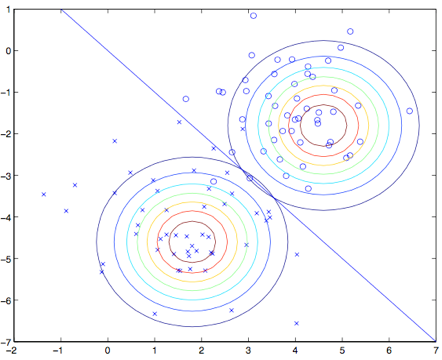

03. 生成式学习算法（Generative Learning algorithms）

-----
[TOC]

# 1. 生成式学习算法（Generative Learning algorithms）

- **判别式学习算法**（Discriminative Learning algorithms）：对 $p(y|x; \theta)$ 进行建模，得到 $h_\theta(x)$；也就是==给定 $x$ 下的 $y$ 的条件分布==（似然函数累乘的项就是条件分布），以  $\theta$  为参数。常见的判别式模型有：

  - 线性回归（Linear Regression）
  - 逻辑回归（Logistic Regression）
  - 支持向量机（SVM）
  - 神经网络（Neural Network）

- **生成式学习算法**（Generative Learning algorithms）：对 $p(x|y)$ 和 $p(y)$ 进行建模，也就是说对 $p(x, y)$ 进行建模，即==求 $x, y$ 的联合分布==（似然函数累乘的项就是联合分布）；解释是：一个生成模型在给定了样本所属的类的条件下，对样本特征建立概率模型。在对 $p(x|y)$ 和 $p(y)$ 进行建模之后，我们用**贝叶斯公式（Bayes rule）**可以
  $$
  \begin{aligned}
  p(xy) &= p(y|x)p(x) = p(x|y)p(y) & \text {条件概率公式}\\
  p(y|x) &= \frac{p(xy)}{p(x)} =\frac{p(x|y)p(y)}{p(x)}
  \end{aligned}
  $$
  这里的分母为：$p(x) = p(x|y = 1)p(y = 1) + p(x|y = 0)p(y = 0)$（其实就是条件概率）。实际上如果我们计算$p(y|x)$ 来进行预测，那就并不需要去计算这个分母，因为有下面的等式关系：
  $$
  \begin{aligned}
  \arg \max_{y}p(y|x) 
  &= \arg \max_{y} \frac{p(x|y)p(y)}{p(x)}	\\
  &= \arg \max_{y} p(x|y)p(y)
  \end{aligned}
  $$
  常见的生成式模型有：

  - 高斯判别分析（GDA）
  - 朴素贝叶斯法（Naive Bayes）
  - 隐形马尔可夫模型（HMM）

# 2. 高斯判别分析（Gaussian Discriminant Analysis）

​	我们要学的第一个生成学习算法是**高斯判别分析（Gaussian Discriminant analysis，GDA）**。在这个模型里面，我们假设 $p(x|y)$ 是一个多元正态分布。所以咱们首先简单讲一下多元正态分布的一些特点，然后再继续讲 GDA。

## 2.1 多元正态分布（multivariate normal distribution）

​	$n$ 维多元正态分布，也叫做多变量高斯分布，参数为一个均值向量 $\mu \in R^n $，以及一个协方差矩阵 $\Sigma \in R^{n \times n}$，其中 $\Sigma >= 0$ 是一个对称的半正定矩阵。写成概率密度形式为：
$$
p(x|y) \sim N(\mu, \Sigma)	\\
p(x;\mu,\Sigma) = \frac {1}{(2\pi)^{n/2}|\Sigma|^{1/2}} exp(- \frac {1}{2} (x-\mu)^T\Sigma^{-1}(x-\mu))
$$
在上面的等式中，$|\Sigma|$ 的意思是矩阵 $\Sigma$ 的**行列式**（determinant）。

随机变量 $Z$ 是一个有值的向量（vector-valued random variable），$Z$ 的**协方差**（covariance）定义是：
$$
\begin{aligned}
Cov(Z) 
&= E[(Z-E[Z])(Z-E[Z])^T ]	\\
&= E[ZZ^T]-(E[Z])(E[Z])^T
\end{aligned}
$$
如果 $X$ 是一个多变量正态分布，即 $X \sim N (\mu, \Sigma)$，则有：
$$
E[X] = \mu	\\
Cov(X) = \Sigma	\\
$$

## 2.2 高斯判别分析模型（Gaussian Discriminant Analysis model）

​	假设我们有一个分类问题，其中输入特征 $x$ 是一系列的**连续随机变量**，那就可以使用**高斯判别分析**（GDA）模型，其中对 $p(x|y)$ 用多元正态分布来进行建模。这个模型为：
$$
y \sim Bernoulli(\phi)			\\
x|y=0 \sim N(\mu_0, \Sigma)		\\
x|y=1 \sim N(\mu_1, \Sigma)	\\
$$
分布写成的具体形式为：
$$
p(y) = \phi^{y}(1-\phi)^{1-y}		\\
p(x|y=0) = \frac{1}{(2\pi)^{n/2}|\Sigma|^{1/2}} exp ( - \frac{1}{2}(x-\mu_0)^T\Sigma^{-1}(x-\mu_0) )	\\
p(x|y=1) = \frac{1}{(2\pi)^{n/2}|\Sigma|^{1/2}} exp ( - \frac{1}{2}(x-\mu_1)^T\Sigma^{-1}(x-\mu_1) )	\\
$$
在上面的等式中，模型的参数包括 $\phi, \mu_0, \mu_1, \Sigma$（要注意，虽然这里有两个不同方向的均值向量 $\mu_0$ 和 $\mu_1$，针对这个模型还是一般只是用一个协方差矩阵 $\Sigma$）。取**对数的似然函数**（log-likelihood）如下所示：
$$
\begin{aligned}
l(\phi, \mu_0, \mu_1, \Sigma)
&=log \prod_{i=1}^m p(x^{(i)}, y^{(i)}, \phi, \mu_0, \mu_1, \Sigma)	\\
&=log \prod_{i=1}^m p(x^{(i)}|y^{(i)}； \phi, \mu_0, \mu_1, \Sigma)p(y^{(i)};\phi) \\
\end{aligned}
$$

通过使 $l$ 取得最大值，找到对应的参数组合（即将 $l$ 对四个参数依次求导，令导数为 0，求解相应的参数），然后就能找到该参数组合对应的最大似然估计，如下所示：
$$
\phi = \frac{1}{m} \sum_{i=1}^{m}\{y^{(i)} = 1\}	\\
\mu_0 = \frac {\sum_{i=1}^{m}1\{y(i)=0\}x^{(i)}}{\sum_{i=1}^{m}1\{y(i)=0\}}	\\
\mu_1 = \frac {\sum_{i=1}^{m}1\{y(i)=1\}x^{(i)}}{\sum_{i=1}^{m}1\{y(i)=1\}}	\\
\Sigma = \frac{1}{m}\sum_{i=1}^{m}(x^{(i)}-\mu_{y^{(i)}})(x^{(i)}-\mu_{y^{(i)}})^T	\\
$$
用图像化的方式来表述，这个算法可以按照下面的图示所表示：

图中展示的点就是训练数据集，图中的两个高斯分布就是针对两类数据各自进行的拟合。要注意这两个高斯分布的轮廓图有同样的形状和拉伸方向，这是因为他们都有**同样的协方差矩阵** $\Sigma$，但他们有**不同的均值** $\mu_o$ 和 $\mu_1$。此外，图中的直线给出了 $p(y=1|x) = 0.5$ 这条边界线。在这条边界的一侧，我们预测 $y=1$ 是最大可能搞得结果；而另一侧，就估计 $y=0$。

## 2.3 讨论：高斯判别分析（GDA）与逻辑回归（logistic regression）

​	高斯判别分析模型与逻辑回归有很有趣的相关性。如果我们把变量（quantity）$p (y = 1|x; \phi, \mu_0, \mu_1, \Sigma)$ 作为一个 $x$ 的函数，就会发现可以用如下的形式来表达：
$$
p(y = 1|x; \phi, \mu_0, \mu_1, \Sigma)= \frac{1}{1+exp(-\theta^T x)}
$$
其中的 $\theta$ 是对 $\phi, \mu_o, \mu_1, \Sigma$ 的某种函数；这就是逻辑回归用来对 $p(y=1|x)$ 建模的形式。

这两个模型中什么时候该选哪一个呢？一般来说，高斯判别分析（GDA）和逻辑回归，对同一个训练集，可能给出的判断曲线是不一样的。哪一个更好呢？

事实上，二者的关系有如下推论：

- 如果 $p(x|y)$ 是一个多变量的高斯分布（且具有一个共享的协方差矩阵 $\Sigma$），那么 $p(y|x)$ 则必然符合一个逻辑函数；
- 然而，反过来，这个命题是不成立的。例如：假如 $p(y|x)$ 是一个逻辑函数，这并不能保证 $p(x|y)$ 一定是一个多变量的高斯分布（实际上，第一个命题只要是可以指数族分布描述的，都可以推导出 $p(y|x)$ 符合一个逻辑函数）。

这就表面==高斯判别模型==比==逻辑回归==对数据进行==更强的建模和假设==（stronger modeling assumptions）。1）这也就意味着，在这两种模型假设都可用的时候，高斯判别分析法去拟合数据是更好的，是一个更好的模型。尤其当$p(x|y)$已经确定是一个高斯分布（有共享的协方差矩阵 $\Sigma$），那么高斯判别分析是渐进有效的（asymptotically efficient）。2）实际上，这也意味着，在面对非常大的训练集（训练样本规模 $m $特别大）的时候，严格来说，可能就==没有什么别的算法能比高斯判别分析更好==（比如考虑到对 $p(y|x)$估计的准确度等等）。3）所以在这种情况下就表明，高斯判别分析（GDA）是一个比逻辑回归更好的算法；再扩展一下，即便对于小规模的训练集，我们最终也会发现高斯判别分析（GDA）是更好的。

> 总结一下：当两种模型都可用的情况下，高斯判别分析有着更强的建模和假设：高斯判别分析拟合数据更好；而且无论大规模样本或者小规模样本，高斯判别分析都更好。

奈何事有正反，由于逻辑回归做出的假设要明显更弱一些，所以因此逻辑回归给出的判断也更健壮（robust），也对错误的建模假设不那么敏感。事实上，有很多不同的假设集合都能够将 $p(y|x)$ 引向逻辑回归函数。例如，如果 $x|y = 0 \sim Poisson(\lambda_0)$、$x|y = 1 \sim Poisson(\lambda_1)$ 都是一个泊松分布，那么 $p(y|x)$ 也将是适合逻辑回归的。逻辑回归也正适用于这类的泊松分布的数据。但对这样的数据，如果我们强行使用高斯判别分析，然后用高斯分布来拟合这些非高斯数据，那么结果的可预测性就会降低，而且GDA这种方法也许可行，也有可能是不能用。

> 总结一下：很多分布都能将 $p(y|x)$ 引向逻辑回归函数，当数据分布不符合高斯分布时，逻辑回归对不同分布都很健壮，预测结果更加准确。

即：

- **高斯判别分析（GDA）**能够建立更强的模型假设，并且在数据利用上更加有效；前提是模型尽可能接近正确。
- **逻辑回归**建立的假设更弱，因此对偏离的模型来说更加健壮：如果训练集数据的确是非高斯分布的，而且是有限的大规模数据，那么逻辑回归几乎总是比GDA要更好的。因此，在实际中，逻辑回归的使用频率要比高斯判别分析（GDA）高得多。

# 3. 朴素贝叶斯法（Naive Bayes）

​	在**高斯判别分析（GDA）**中，特征向量 $x$ 的值是连续的、实数的向量。下面我们要讲的是当 $x_i$ 是离散值的时候来使用的另一种学习方法——**朴素贝叶斯法（NB）**。

​	假设我们有一个训练集（也就是一堆已经标好了是否为垃圾邮件的邮件）。要构建垃圾邮件分类器，我们应该先确定用来描述一封邮件的特征 $x_i$ 有哪些。我们将用一个特征向量来表示一封邮件，这个向量的长度等于字典中单词的个数。如果邮件中包含了字典中的第 $i$ 个单词，那么就令 $x_i = 1$；反之则 $x_i = 0$。例如下面这个向量：
$$
x = 
\begin{bmatrix} 1\\ 0\\ 0\\ \vdots \\ 1\\ \vdots \\ 0\end{bmatrix}
\begin{matrix} \text{a}\\ \text{aardvark}\\ \text{aardwolf}\\ \vdots\\ \text{buy}\\ \vdots\\ \text{zygmurgy}\\ \end{matrix}
$$
选好了特征向量了，接下来就是建立一个生成模型（generative model），所以我们必须对 $p(x|y)$ 进行建模。要给 $p(x|y)$ 建模，先来做一个非常强的假设。我们假设特征向量 $x_i$ 对于给定的 $y$ 是独立的。这个假设也叫做**朴素贝叶斯假设**（Naive Bayes ，NB assumption），基于此假设衍生的算法也就叫做**朴素贝叶斯分类器**（Naive Bayes classifier）。然后我们就得到了等式：
$$
\begin{aligned}
p(x_1, x_2, \dots, x_n|y) 
&= p(x_1|y)p(x_2|y,x_1) \dots p(x_n|y,x_1,x_2,\dots,x_{n-1})	\\
&= p(x_1|y)p(x_2|y) \dots p(x_n|y)	\\
& = \prod_{i=1}^n p(x_i|y)	\\
\end{aligned}
$$
值得注意的是，贝叶斯假设是一个很强的假设，产生的这个算法可以适用于很多种问题。我们这个模型的参数为  $\phi_{i|y=1} = p (x_i = 1|y = 1),\  \phi_{i|y=0} = p (x_i = 1|y = 0)$，而 $\phi_y = p (y = 1)$，公式表达为：
$$
p(y) = \phi_y^y(1-\phi_y)^{1-y}	\\
p(x_i|y=0) = \phi_{i|y=0}^{x_i}(1-\phi_{i|y=0})^{1-x_i}	\\
p(x_i|y=1) = \phi_{i|y=1}^{x_i}(1-\phi_{i|y=1})^{1-x_i}	\\
$$
即**这三个分布都是伯努利分布**，$x_i, y \in \{0,1\} $，可以类比写出来，然后就可以写出下面的联合似然函数：
$$
\begin{aligned}
L(\phi_y, \phi_{j|y=0}, \phi_{j|y=1}) 
&= \prod^m_{i=1} p(x^{(i)},y^{(i)})	\\
&= \prod^m_{i=1} p(x^{(i)}|y^{(i)}; \phi_{j|y=0}, \phi_{j|y=1})p(y^{(i)};\phi_y)	\\
\end{aligned}
$$
找到使联合似然函数取得最大值的对应参数组合 $\phi_y$，$\phi_{j|y=0}$ 和 $\phi_{j|y=1}$ 就给出了最大似然估计：
$$
\begin{aligned}
\phi_{y} &= \frac{\sum^m_{i=1}1\{y^{(i)} =1\}}{m}\\
\phi_{j|y=0} &= \frac{\sum^m_{i=1}1\{x^{(i)} =1 \text{ and } y^{(i)} =0\} }{\sum^m_{i=1}1\{y^{(i)} =0\}} \\
\phi_{j|y=1} &=\frac{\sum^m_{i=1}1\{x^{(i)} =1 \text{ and } y^{(i)} =1\} }{\sum^m_{i=1}1\{y^{(i)} =1\}} \\
\end{aligned}
$$
这些参数有一个非常自然的解释。例如 $\phi_{j|y=1}$ 正是单词 $j$ 出现的邮件中垃圾邮件所占 $(y = 1)$ 的比例。拟合好了全部参数后，要对一个新样本的特征向量 $x$ 进行预测，只需要进行如下简单地运算：
$$
\begin{aligned}
p(y=1|x) 
&= \frac {p(x|y=1)p(y=1)}{p(x)}	\\
&= \frac {(\prod_{i=1}^{n}p(x_i|y=1)) \times p(y=1)}{(\prod_{i=1}^{n}p(x_i|y=1)) \times p(y=1) + (\prod_{i=1}^{n}p(x_i|y=0)) \times p(y=0)}	\\
\end{aligned}
$$
然后选择有高后验概率的分类。

最后，我们要注意，刚刚我们对朴素贝叶斯算法的使用中，特征向量 $x_i$ 都是二值化的，其实特征向量也可以是多个离散值，比如 $\{1, 2, \dots, k_i\}$ 这样也都是可以的。只需要把 $p(x_i|y)$ 的建模从伯努利分布==改成多项式分布==。实际上，即使一些原始的输入值是连续值（例如房屋面积），也可以转换成一个小规模的离散值的集合，然后再使用朴素贝叶斯方法。例如我们用特征向量 $x_i$ 来表示住房面积，那么就可以按照下面所示的方法来对这一变量进行离散化：

|居住面积|<400|400-800|800-1200|1200-1600|>1600|
|---|---|---|---|---|---|
|离散值 $x_i$|1|2|3|4|5|

这样，我们可以根据上面的集合中对应的值得到离散化的特征向量，然后就可以对 $p(x_i|y)$ 用**多项式分布**来进行建模。然后就给前面讲过的内容一样了（也可以类似 Softmax 处理方式）。当原生的连续值的属性不太容易用一个多元正态分布来进行建模的时候，将其特征向量离散化然后使用朴素贝叶斯法（NB）来替代高斯判别分析法（GDA），通常能形成一个更好的分类器。

## 3.1 拉普拉斯光滑（Laplace smoothing）

​	刚刚讲述的朴素贝叶斯的方法能够解决很多问题了，但还能对这种方法进行一点调整来进一步提高效果，尤其是应对文本分类的情况。我们来简要讨论一下一个算法当前状态的一个问题，然后在讲一下如何解决这个问题。

​	还是考虑垃圾邮件分类的过程，设想你学完了 CS229 的课程，然后做了很棒的研究项目，之后你决定在 2003 年 6 月把自己的作品投稿到 NIPS 会议，这个 NIPS 是机器学习领域的一个顶级会议，递交论文的截止日期一般是六月末到七月初。你通过邮件来对这个会议进行了讨论，然后你也开始受到带有 nips 四个字母的信息。但这个是你第一个 NIPS 论文，而在此之前，你从来没有接到过任何带有 nips 这个单词的邮件；尤其重要的是，nips 这个单词就从来都没有出现在你的垃圾/正常邮件训练集里面。加入这个 nips 是你字典中的第35000个单词那么你的朴素贝叶斯垃圾邮件筛选器就要对参数 $\phi_{35000|y}$ 进行最大似然估计，如下所示：
$$
\begin{aligned}
\phi_{35000|y=1} &=  \frac{\sum^m_{i=1}1\{x^{(i)}_{35000}=1 \wedge y^{(i)}=1  \}}{\sum^m_{i=1}1\{y^{(i)}=0\}}  &=0 \\
\phi_{35000|y=0} &=  \frac{\sum^m_{i=1}1\{x^{(i)}_{35000}=1 \wedge y^{(i)}=0  \}}{\sum^m_{i=1}1\{y^{(i)}=0\}}  &=0 \\
\end{aligned}
$$
也就是说，因为之前程序从来没有在别的垃圾邮件或者正常邮件的训练样本中看到过 nips 这个词，所以它就认为看到这个词出现在这两种邮件中的概率都是0.因此当要决定一个包含 nips 这个单词的邮件是否为垃圾邮件的时候，他就检验这个类的后验概率，然后得到了：
$$
\begin{aligned}
p(y=1|x) &= \frac{ \prod^n_{i=1} p(x_i|y=1)p(y=1) }   {\prod^n_{i=1} p(x_i|y=1)p(y=1) +\prod^n_{i=1} p(x_i|y=0)p(y=0)    }\\
&= \frac00\\
\end{aligned}
$$

这是因为对于 $\prod^n_{i=1} p(x_i|y)$ 中包含了$p(x_{35000}|y) = 0$的都加了起来，也就还是 0。所以我们的算法得到的就是 $\frac00$，也就是不知道该做出怎么样的预测了。然后进一步概况这个问题就是，统计学上来说，只因为你在自己以前的有限的训练数据集中没见过一件事，就估计这个事件的概率为 0， 明显是一个坏注意。例如上面朴素贝叶斯最大似然估计的 $\phi_y$ 参数公式如下：
$$
\begin{aligned}
\phi_{y} &= \frac{\sum^m_{i=1}1\{y^{(i)} =1\}}{m}\\
\end{aligned}
$$
如果我们使用这个最大似然估计，假设我们的 $m$ 个独立观测中没有出现该事件，我们单纯的利用公式的得到的 $\phi_y=0$，这就会出现刚才的问题，即 $\frac{0}{0}$。为了避免这个问题，我们可以引入**拉普拉斯光滑**（Laplace smoothing），即对所以的事件都加上一个 $1$ 避免这个问题，新的估计公式如下：
$$
\phi_j = \frac {\sum_{i=1}^m 1\{z{(i)=j}\}+1}{m+k}
$$
 这里首先是对分子加 $1$，然后对分母加 $k$（指 $y$ 的 $k$ 个可能的取值，$\sum^k_{j=1} \phi_j = 1$），这样就能保证对所有的 $\phi_j \neq 0$；这样就解决了概率估计为零的问题。

回到我们的朴素贝叶斯分选器问题上，使用了拉普拉斯光滑之后，对参数的估计就可以写成下面这个样子：
$$
\begin{aligned}
\phi_{j|y=0} &= \frac{\sum^m_{i=1}1\{x^{(i)} =1 \text{ and } y^{(i)} =0\} +1}{\sum^m_{i=1}1\{y^{(i)} =0\}+2} \\
\phi_{j|y=1} &=\frac{\sum^m_{i=1}1\{x^{(i)} =1 \text{ and } y^{(i)} =1\} +1}{\sum^m_{i=1}1\{y^{(i)} =1\}+2} \\
\end{aligned}
$$
这里的 $2$ 指的是 $x_i$ 的两种可能的取值 $\{0, 1\}$，如果 $x_i$ 有 $l$ 种可能的取值，则将 $2$ 替换成 $l$。

（在实际应用中，通常是否对 $\phi_y$ 使用拉普拉斯并没有太大影响，因为通常我们会对每个垃圾邮件和非垃圾邮件都有一个合适的划分比例，所以 $\phi_y$ 会是对$p(y = 1)$ 的一个合理估计，即我们选取的样本满足 $\phi_y \neq 0$。）

## 3.2 针对文本分类的事件模型（Event models for text classification）

​	到这里就要给咱们关于生成学习算法的讨论进行一下收尾了，所以就接着讲一点关于文本分类方面的另一个模型。我们刚已经演示过的朴素贝叶斯方法能够解决很多分类问题了，不过还有另一个相关的算法，在针对文本的分类效果还要更好。

​	我们上面讲的朴素贝叶斯方法使用的是一种叫做**多元伯努利事件模型（Multi-Variate Bernoulli event model）**的方法。这个模型里面，我们假设的主体是：每封收到的邮件是否为垃圾邮件都是随机的。那么收件人首先遍历词典，得到一个表（假设这个表长度为 $n$）；然后对收到的每一封邮件查询是否包含单词 $i$，各个单词之间独立，且服从概率分布 $p(x_i=1|y) = \phi_{i|y}(i \in \{1, 2, ...,n\})$。因此，一封邮件的联合概率可以写为：
$$
p(x, y) = (\prod_{i=1}^{n}p(x_i|y))p(y)
$$
​	然后还有另外一个模型。叫做**多项式事件模型（Multinomial event model）**。要描述这个模型，我们需要使用一个不同的记号和特征集来表征各种邮件。首先我们有一个词汇表，其长度为 $|V|$。然后，对于收到的每封邮件，用 $x_i$ 表示邮件中的第 $i$ 个单词在词汇表中的位置（即 $x_i \in \{1, 2, ..., |V|\}$）；用 $n$ 表示单词总数，这样我们可以用一个长度为 $n$ 的向量 $(x_1, x_2, ..., x_n)$ 表征该邮件。例如，如果一个邮件的开头是 “A NIPS  . . .” ，那么$x_1 = 1$ （"a" 是词典中的第一个），而 $x_2 = 35000$  （这是假设 "nips"是词典中的第35000个）。这里要注意，对于不同的邮件内容，$n$ 的取值可以不同。

​	在多项式事件模型中，我们的参数假设还是和以前一样，即 $\phi_y = p(y)$、$\phi_{k|y=0} = p(x_j =k|y=0)$ 以及 $\phi_{k|y=1} = p(x_j =k|y=1)$。表面上看这和之前的多元伯努利事件模型的概率很相似，但实际上意义完全不同，这里的 $p(x_j=k|y)$ 是一个多项式分布，而不是伯努利分布了。==其中 $k$ 的意义为：$x_j$ 处的单词在词汇表中的位置== $k \in \{1, 2, ..., |V|\}$。

如果给定一个训练集 $\{(x^{(i)},y^{(i)}); i = 1,2, ..., m\}$，其中 $x^{(i)} = (x_1^{(i)}, x_2^{(i)}, ..., (x_{n_i}^{(i)},)$（这里的 $n_i$ 是在第 $i$ 个训练样本中的单词总数），那么这个数据的似然函数如下所示：
$$
\begin{aligned}
L(\phi,\phi_{k|y=0},\phi_{k|y=1})
&= \prod^m_{i=1} p( x^{(i)}, y^{(i)}) \\
& = \prod^m_{i=1} \Big( \prod^{n_i}_{j=1}p(x_j^{(i)}|y;\phi_{i|y=0},\phi_{i|y=1}) \Big) p( y^{(i)};\phi_y) \\
\end{aligned}
$$
让上面的这个函数最大化就可以产生对参数的最大似然估计：
$$
\phi_y = \frac {\sum_{i=1}^m 1\{y^{(i)}=1\}}{m}	\\
\phi_{k|y=0} = \frac {\sum_{i=1}^m \sum_{j=1}^{n_i} 1\{y^{(i)}=0 \wedge x_j^{(i)}= k\}}{\sum_{i=1}^m 1\{y^{(i)}=0\}n_i}\\
\phi_{k|y=1} = \frac {\sum_{i=1}^m \sum_{j=1}^{n_i} 1\{y^{(i)}=1 \wedge x_j^{(i)}= k\}}{\sum_{i=1}^m 1\{y^{(i)}=1\}n_i}\\
$$
等式含义解释：

- $\phi_y$ 的值表示样本中垃圾邮件的百分比；
- $\phi_k|y=0$ 的分母：表示样本中正常邮件的单词总量；分子：词汇表中的第 $k$ 个单词在正常邮件中出现的总次数；
- $\phi_k|y=1$ 的分母：表示样本中垃圾邮件的单词总量；分子：词汇表中的第 $k$ 个单词在垃圾邮件中出现的总次数；

如果使用拉普拉斯光滑（实践中会用这个方法来提高性能）来估计 $\phi_{k|y=0}$ 和 $\phi_{k|y=1}$，即在分子上加 $1$，分母上加 $k$ 的可能的取值的个数 $|V|$，就得到了下面的等式：
$$
\phi_{k|y=0} = \frac {\sum_{i=1}^m \sum_{j=1}^{n_i} 1\{y^{(i)}=0 \wedge x_j^{(i)}= k\} +1}{\sum_{i=1}^m 1\{y^{(i)}=0\}n_i +|V|}\\
\phi_{k|y=1} = \frac {\sum_{i=1}^m \sum_{j=1}^{n_i} 1\{y^{(i)}=1 \wedge x_j^{(i)}= k\} +1}{\sum_{i=1}^m 1\{y^{(i)}=1\}n_i +|V|}\\
$$
当然，这个不一定就是一个最好的分类算法，不过朴素贝叶斯分选器通常用起来都是出乎意料的那么好。所以，这个方法可以作为一个很好的 “首发选择”，很简单有很好实现。