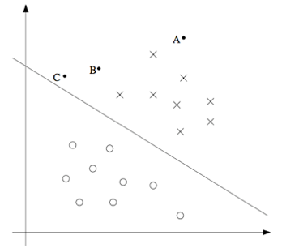

04. 支持向量机（Support Vector Machines）

-----
[TOC]

# 1. 支持向量机（Support Vector Machines）

​	本章的讲义主要讲述的是**支持向量机（Support Vector Machines，SVM）**学习算法。SVM 算得上现在最好的现成的监督学习算法之一，很多人实际上认为这里没有“之一”这两个字的必要，认为 SVM 就是最好的现成的监督学习算法。讲这个 SVM 的来龙去脉之前，我们需要现将一些关于**间隔**的内容，以及对数据进行分割成**大的区块（gap）**的思路。接下来，我们要讲一些**最优间隔分类器（optimal margin classifier）**，其中还会引入一些关于**拉格朗日对偶（Lagrange duality）**的内容。然后我们还会接触到**核（Kernels）**，这提供了一种在非常高的维度（例如无穷维度）中进行 SVM 学习的高效率方法。最终本章结尾部分会讲 **SMO 算法**，也就是 SVM 算法的一个有效实例。

# 2. 间隔（Margins）

主要分为三部分：

- 间隔：直觉
- 记号
- 函数间隔和几何间隔

## 2.1 间隔：直觉（Margins：Intuition）

​	学 SVM 算法，先从**间隔（Margins）**开始，本节主要介绍间隔的一些直观展示、以及对于我们做出的预测的 ”信心“ ；在第三小节中，会对这些概念进行更正式化的表述：

​	考虑逻辑回归，其中的概率分布 $p(y=1|x;\theta)$ 是基于 $h_\theta(x)=g(\theta^T x)$ 而建立的模型。当且仅当 $h_\theta(x) \geq 0.5 $，也就是 $\theta^T x \geq 0$ 的时候，我们才会预测 $1$；反过来，对于训练样本 $y=1$，那么 $\theta^T x$ 越大，$h_\theta (x) = p(y = 1|x; \theta)$ 也就越大，我们对预测 Label 为 $1$ 的 “信心” 也就越强；总结来说，如果 $y=1 \and \theta^T x >> 0$，我们就对这时候进行的预测非常有信心。同理对于负样本，如果有 $y = 0 \and \theta^T x << 0$，我们也对这时候给出的预测很有信心。因此可以用一种不太正确的方式来说：如果我们找到一个合适的 $\theta$，满足：$ y=1 \rightarrow \theta^T x >> 0 \ and \ y=0 \rightarrow \theta^T x << 0$，我们就是这个对训练数据的拟合很好。为了描述这种思路，稍后我们引入**函数间隔符号（notion of function margins）**。

​	此外还有另外一种更直观的表示，如下图所示：x 表示正样本；o 表示负样本；中间直线是**分类边界（decision boundary）**，也叫**分类超平面(separating hyperplane)**，通过 $\theta^T x=0$ 确定。

可以发现 A 点距离分界线较远，我们对 A 点进行预测的话，我们很有信心认为该位置 $y=1$，反之对于 C 点，这个点距离边界线很近，我们进行预测的话，不是有很大把握。由此，我们可以推出：如果一个点距离**分类超平面（separating hyperplane）**比较远，我们就可以对给出的预测很有信心。那么给定一个训练集，如果我们能够找到一个分类边界，利用这个边界我们可以对所有的训练样本给出正确并且有信心（也就是数据点距离分类边界要都很远）的预测，那这就是我们想要达到的状态了。当然上面这种说法还是很不正规，后面我们会使用**几何间隔记号**(**notion of geometric margins**)来更正规地来表达。

## 2.2 记号（Notation）

​	在讨论 SVM 的时候，我们需要引入新的记号，用来表示分类。例如我们针对一个二值化分类的问题建立一个线性分类器，其中用来分类的**标签（label）**为 $y \in \{-1, 1\}$，分类特征（feature）为 $x$，线性分类器的参数更改为 $\vec w, b$，这样分类器可以写为：
$$
h_{w,b}(x) = g(w^Tx + b)	\\
\begin{equation} 
	g(z) = \left \{
		\begin{aligned}
			 1, \ \ z \geq 0	\\
			-1, \ \ z < 0		\\
		\end{aligned}
	\right.
\end{equation}
$$
注意：$w \in R^n, b \in R, x \in R^n$，即 $b$ 相当于参数 $\theta_0$，$w$ 相当于参数 $[\theta_1, ..., \theta_n]^T$。

## 2.3 函数间隔和几何间隔（Function and geometric margins）

### 1. 函数间隔

​	给定一个训练集的第 $i$ 个样本 $(x^{(i)}, y^{(i)})$，我们用下面的方法来定义对应 该样本的**函数间隔** $(w, b)$：
$$
\hat \gamma^{(i)} = y^{(i)} (w^T x^{(i)} + b)
$$
要注意，如果 $y^{(i)} = 1$，那么为了让函数间隔很大，我们就需要 $w^T x + b >> 0$；如果 $y^{(i)} = -1$，为了让函数间隔变大，我们就需要 $w^T x + b << 0$。而且，只要满足 $y^{(i)}(w^T x + b) \ge 0$，那我们针对这个样本的预测就是正确的。因此，一个大的函数间隔就表示了一个可信且正确的预测。对于一个训练集 $S=(x^{(i)}, y^{(i)});i \in \{1,...,m\}$，我们如何衡量整个训练集的函数间隔呢？我们将对应 **$S$ 的函数间隔 $(w, b)$** 定义为每个训练样本的函数间隔的最小值，记作 $\hat \gamma$（我们的目的是求得合适的 $(w, b)$，使得 $\hat \gamma$ 最大，即让最小的样本的函数间隔最大化，那样整个训练集也会有一个很大的函数间隔）。可以写成：
$$
\hat\gamma = \min_{i=1,...,m} \hat\gamma^{(i)} = \min_{i=1,...,m} y^{(i)} (w^T x^{(i)} + b)
$$
​	然而，对于一个线性分类器，函数间隔的一个性质却使得这个分类器并不具有良好的置信度，例如成比例的缩放 $(w, b)$，对分类结果没有影响，却可以人为的改变函数间隔。为了解决这个问题，我们需要引入某种归一化条件，例如 $||w|| =  1$ 固定化函数间隔的度量。

### 2. 几何间隔

​	图中斜线给出了对应 $(w, b)$ 的分类边界，其法线方向为向量 $w$ 的方向（这里的 $w$ 是与分类超平面**垂直**的）。假设有图中所示的一个点 A，此点表示的是训练样本的输入特征 $x^{(i)}$，对应标签为 $y^{(i)} = 1$。假设这个点到分类超平面的距离为 $\gamma^{(i)}$，也称为**几何间隔**（我们先假设其长度，可以算出来）。如何计算 $\gamma^{(i)}$ 的值呢？由于 B 点位于分类边界上，其满足方程 $w^T x + b = 0$，即我们可以得到方程：
$$
w^T (x^{(i)} - \gamma^{(i)} \frac{w}{||w||}) + b = 0	\\
\gamma^{(i)} = \frac{w^Tx^{(i)} + b}{||w||} = (\frac{w}{||w||})^Tx^{(i)} + \frac{b}{||w||}
$$
这个解是针对 A 这个正样本的结果，如果对公式更泛化一下，就可以定义对应训练样本 $(x^{(i)}, y^{(i)})$ 的**几何边界** $ (w, b)$ 为：
$$
\begin{aligned}
\gamma^{(i)} 
&= y^{(i)} \big( (\frac{w}{||w||})^Tx^{(i)} + \frac{b}{||w||} \big)	\\
&= y^{(i)} \big( (\frac{w^Tx^{(i)}}{||w||} + \frac{b}{||w||} \big)	\\
\end{aligned}
$$
这里注意，==几何间隔是不受参数缩放影响的==。且，如果 $||w|| = 1$，那么几何间隔就等于函数间隔。最后，给定一个训练集 $S=(x^{(i)}, y^{(i)});i \in \{1,...,m\}$，我们也可以将对应 **$S$ 的几何间隔 $(w, b)$** 定义为每个训练样本的几何间隔的最小值：
$$
\gamma = \min_{i=1,...,m} \gamma^{(i)}
$$

# 3. 最优间隔分类器（optimal margin classifier）

主要分为三部分：

- 最优间隔分类器问题的形式化
- 拉格朗日对偶性（Lagrange duality）
- 最优间隔分类器（Optimal margin classifier）

## 3.1 最优间隔分类器问题的形式化

​	给定一个训练集，根据我们前文的讨论，似乎很自然地第一要务就是要尝试找出一个分类边界，使（几何）间隔能够最大。这样生成的分类器，能够把正向和负向的训练样本分隔开，中间有一个空白区，也就是几何间隔。到目前为止，我们都是假定给定的训练集是**线性可分**的（linearly separable）（即一定可以找到一个超平面来进行划分）。那么如何找到使几何间隔最大的那组参数呢？我们提出下面的这样一个优化问题（optimization problem）：
$$
\max_{\gamma, w, b} \gamma	\\
s.t.\ y(i)(w^T x^{(i)} +b) \geq \gamma,\ i = 1,..., m;\ ||w|| = 1	\\
$$
也就是说，我们要让 $\gamma$ 取最大值，必须满足每一个训练样本的函数间隔都至少为 $\gamma$，并且满足 $||w|| = 1$ 这个约束条件（保证函数间隔与几何间隔相等）。因此，对上面这个优化问题进行求解，就能得出对应训练集合的最大可能几何间隔的 $(w, b)$。

​	然而，$||w|| = 1$ 这个约束条件是**非凸**的，不能简单的通过标准优化软件解决，所以我们要对这个优化问题进行改善，让它更好解，这就引出第二种表示方法：
$$
\max_{\gamma, w, b} \frac{\hat\gamma}{||w||}	\\
s.t.\ y(i)(w^T x^{(i)} +b) \geq \hat\gamma,\ i = 1,..., m\\
$$
这时候，我们要让 ${\hat\gamma}/{||w||}$ 的取值最大（几何间隔和函数间隔通过这个公式联系：$\gamma = {\hat\gamma}/{||w||}$），使得函数间隔都至少为 $\hat\gamma$，这样我们就能得到我们想要的结果。这样，我们的**约束条件就没有非凸**的问题了，然而我们的**目标函数 ${\hat\gamma}/{||w||}$ 却变成了非凸**的，依然不好解决。

​	那我们继续往下调整，记得我们之前说的可以对参数 $w, b$ 进行任意缩放，而不会有任何实质性改变。那我们引入一个缩放约束参数，使得 $(w, b)$ 的函数间隔相对训练集为 1，即：
$$
\hat\gamma = 1
$$
我们总能找到合适的缩放参数，满足上述假设，这样我们的问题就简化成了如下问题：
$$
\max_{\gamma, w, b} \frac{1}{||w||} = \min_{\gamma, w, b} \frac{1}{2}{||w||^2}	\\
s.t.\ y(i)(w^T x^{(i)} +b) \geq 1,\ i = 1,..., m\\
$$
（对第一行等式不理解的话，对 ${1}/{||w||}$ 求导，分母变为 $||w||^2$，然后对左边的最大化问题等于对右边的最小化问题）这样问题就变得容易解决了。上面的问题变成了一个具有**凸二次对象（a convex quadratic objective）**的目标和仅受**线性约束（only linear constraints）**的优化问题。

​	这样问题基本得到了解决，接下来我们聊一下拉格朗日对偶性。这样就引出我们这个优化问题的**对偶形式（dual form）**，这种形式会在我们后续要使用**核（kernels）**的过程中扮演重要角色。**核（kernels）**可以有效地对**极高维度空间**中的数据建立最优边界分类器。通过这种对偶形式，我们还能够推出一种非常有效的算法，来解决上面这个优化问题。

## 3.2 拉格朗日对偶性（Lagrange duality）

​	咱们先把 SVMs 以及最大化边界分类器都放到一边，先来谈一下约束优化问题的求解。例如下面这样的一个问题：
$$
\min_{w}f(w)	\\
s.t.\ h_i(w) = 0, \ i= 1, ..., l
$$
我们可以使用拉格朗日乘数法（method of Lagrange multipliers）来解决。首先定义一个拉格朗日函数为：
$$
L(w, b) = f(w) + \sum_{i=1}^{l} \beta_i h_i(w)
$$
上面这个等式中，这个 $\beta_i$ 就叫做**拉格朗日乘数（Lagrange multipliers）**。接下来求偏导数，使其为零：
$$
\frac {\partial L}{\partial w_i} = 0;\ \ \frac {\partial L}{\partial \beta_i} = 0; 
$$
然后就可以解出对应的 $w, \beta$。在本节中，我们对此进一步泛化，扩展到约束优化问题上，其中包含**不等约束和等式约束**。下面这个，我们称之为主最优化问题（primal optimization problem）：
$$
\min_w f(w)	\\
s.t. \ g_i(w) \leq 0, \ i = 1, ..., k  \\
\ \ \ \ \ \ \ h_i(w) = 0,\ i = 1, ..., l	 \\
$$
要解决上面这样的问题，首先定义广义拉格朗日函数（generalized Lagrangian）：
$$
L(w, \alpha, \beta) = f(w) + \sum_{i=1}^{k}\alpha_i g_i(w) 
						   + \sum_{i=1}^{l}\beta_i h_i(w)
$$

#### 1. 原始问题（primal problem）

在上式中，$\alpha_i, \  \beta_i$ 都是**拉格朗日乘数**。设有下面这样一个**量（quantity）**：
$$
\begin{aligned}
\theta_P(w) &= \max_{\alpha,\beta;\alpha_i \geq 0}L(w,\alpha,\beta) &\text{P: primal}
\end{aligned}
$$
这里，$P$ 是 **primal（原始）**的简写。设想我们有一些假定的 $w$，如果 $w$ 不能满足某些主要约束（即 $s.t.$ 中的条件不满足：$g_i(w) > 0$，则 $\theta_P(w) = \infty , because \ \alpha_i  \geq 0$；$h_i(w) \neq 0$，则 $\theta_P(w) = \infty, because \ \beta_i h_i(w)  =  \infty$）。总结起来就是：
$$
\theta_P(w)= \begin{cases} f(w) & \text {如果 w 满足约束条件} \\
\infty & \text{otherwise} \end{cases}
$$
因此，如果 $w$ 的所有值都满足主要约束条件，那么 $\theta_p$ 的值就等于此优化目标的目标量，所以我们可以进一步引出下面这个最小化问题：
$$
\min_{w} f(w) = \min_{w} \theta_p(w) 
			  = \min_{w} \max_{\alpha,\beta;\alpha_i \geq 0}L(w, \alpha, \beta)
$$
第一个等号是指我们将**一个约束条件优化问题换成了一种新提出的问题，二者有一样的解**。为了方便书写，我们这里定义一个**目标量的最优值** $p^{\ast}$，我们把这个值称为**原始优化问题的值（value of the primal problem）**:
$$
p^{\ast} = \min_w \theta_p(w)
$$

#### 2. 对偶问题（dual problem）

接下来，我们定义一个稍微不同的问题，即 $\theta_D(\alpha, \beta)$：
$$
\begin {aligned}
\theta_D(\alpha, \beta) &= \min_{w} L(w, \alpha, \beta) &\text{D: dual}
\end {aligned}
$$
这里，$D$ 是 **dual（对偶）**的简写。这里要注意，$\theta_P$ 是对 $(\alpha, \beta)$ 优化求最大值；$\theta_D$ 是对 $(w)$ 优化求最小值。下面我们就能给出这个对偶优化问题了：
$$
\max_{\alpha, \beta; \alpha_i \geq 0} \theta_D(\alpha, \beta) = 
\max_{\alpha, \beta; \alpha_i \geq 0} \min_{w} L(w, \alpha, \beta)
$$
这个形式基本与我们之前见到的主要约束问题是一样的了，唯一不同的是 $max$ 和 $min$ 的顺序不同。事实上，我们也可对这种对偶问题的最优值进行定义，即：
$$
d^{\ast} = \max_{\alpha, \beta; \alpha_i \geq 0} \theta_D(\alpha, \beta)
$$
原始优化问题如何和对偶优化问题联系在一起的呢，通过下面的公式就很容易发现：
$$
d^{\ast} = \max_{\alpha, \beta; \alpha_i \geq 0} \min_{w} L(w, \alpha, \beta) \leq
\min_{w} \max_{\alpha, \beta; \alpha_i \geq 0} L(w, \alpha, \beta) = p^{\ast}
$$
上面的公式恒成立，在某些特殊的情况下，就会有二者相等的情况：$d^{\ast}  =  p^{\ast} $。这样我们就可以通过解决对偶约束问题来解决原始约束问题。那么二者相等的条件是什么呢？

​	假设 $f$ 和 $g_i$ 都是**凸函数（convex）^[3]^**，$h_i$ 是**仿射的（affine）^[4]^**。进一步假设 $g_i$ 是**严格可行的（strictly feasible）**；这就意味着会存在某个 $w$，使得对所有的 $i$ 都有 $g_i(w) < 0$。

> 3. 当 f 有一个海森矩阵(Hessian matrix)的时候，那么当且仅当这个海森矩阵(Hessian matrix)是半正定矩阵，f 才是凸的。例如，$f (w) = w^T w$ 就是凸的；类似的，所有的线性（linear）以及仿射（affine)函数也都是凸的。
> 4. 例如，存在 $a_i$ 和 $b_i$ 满足 $h_i(w) = a^T_i w + b_i$。仿射（affine）的意思大概就跟线性（linear）差不多，不同的就是在矩阵进行了线性变换的基础上还增加了一个截距项（extra intercept term） $b_i$。

基于上面的假设，可知必然存在 $w^\ast、\alpha^\ast、\beta^\ast$ 满足 $w^{\ast}$ 为**原始问题（primal problem）**的解，$\alpha^\ast、\beta^\ast$ 是**对偶问题（dual problem）**的解，此外存在一个 $p^\ast = d^\ast = L(w^\ast,\alpha^\ast, \beta^\ast)$。另外这三个还会满足 **KKT** 条件（Karush-Kuhn-Tucker conditions，KKT），如下所示：
$$
\begin{aligned}
\frac{\partial}{\partial w_i} L(w^\ast,\alpha^\ast,\beta^\ast) &= 0,\ i=1,...,n & \text{(3)}\\
\frac{\partial}{\partial \beta_i} L(w^\ast,\alpha^\ast,\beta^\ast)&= 0,\ i=1,...,l &  \text{(4)}\\
\alpha_i ^\ast g_i(w^\ast) &= 0,\ i=1,...,k & \text{(5)}\\
g_i(w^\ast)    & \leq 0, \ i=1,...,k & \text{(6)}\\
\alpha_i ^\ast & \geq 0, \ i=1,...,k & \text{(7)}\\
\end{aligned}
$$
反过来，如果一组 $w^\ast、\alpha^\ast、\beta^\ast$ 满足 KKT 条件，那么这一组解也是原始约束问题和对偶问题的解。

公式（3）和（4）利用拉格朗日乘数法，即公式（3）意义是：$f(w)、h_i(w)$ 法向量共线；公式（4）意义是：满足约束条件 $h_i(w) = 0$。然后我们着重分析公式（5），公式（5）也叫作 **KKT 对偶互补条件**（dual complemen-tarity condition）。这个公式联合约束条件（6）（7）暗示着很多意义，不过先来解释这个公式的形成，如下注释。

> 1. 如果 $g_i(w) < 0$，由于 $\alpha_i \geq 0$，那么为了得到最大化的 $\theta_P(w)$，我们必须令 $\alpha_i = 0$；
>
> 2. 如果 $g_i(w) = 0$（也称为为活动条件），那么 $\alpha_i$ 的取值不影响 $\theta_P(w)$ 的结果（我们以后会注意到满足 $g_i(w) = 0$ 的样本非常关键，称为**支持向量**，这也是支持向量机的由来）。
>
>    如果我们将两种结果糅合在一起，那么我们就得到了公式（5）：$\alpha_i g_i(w) = 0$。

公式（5）暗示，当 $\alpha_i^\ast > 0$ 的时候，则有 $g_i(w^\ast) = 0$（也就是说，$g_i(w) \leq 0$ 这个约束条件存在的话，则应该是相等关系）。后面的学习中，这个等式很重要，尤其对于表明 SVM 只有**少数的支持向量**（Support Vectors）；在学习 SMO 算法的时候，还可以用 KKT 对偶互补条件来进行**收敛性检测**（convergence test）。

## 3.2 最优边界分类器（Optimal margin classifiers）

​	在前面的内容中，我们讲到了寻找最优边界分类器的优化问题形式：
$$
\max_{\gamma, w, b} \frac{1}{||w||} = \min_{\gamma, w, b} \frac{1}{2}{||w||^2}	\\
s.t.\ y(i)(w^T x^{(i)} +b) \geq 1,\ i = 1,..., m\\
$$
这里的约束条件形式可以写成下面的形式：
$$
g_i(w) = -y^{(i)}(w^T x^{(i)} + b) +1 \leq 0
$$
对于训练集中的每一个样本 $i$，都要满足上面的约束条件。要注意，通过 **KKT 对偶互补条件**可知，只有训练样本的**函数间隔确定为 1** 的情况下，才有 $\alpha_i \geq  0$ （此时这些样本对应的约束条件关系都是等式，即 $g_i(w) = 0$）。如下图所示，其中用实线所表示的就是最大间隔分界超平面（maximum margin separating hyperplane）。

具有最小间隔的样本点正好就是距离分类间隔最近的那些点；图中所示，一共有三个这样的点，它们所处的位置即虚线，与分类边界线相平行。因此，在这个优化问题中的最优解里面，只有这三个样本点所对应的 **$\alpha_i$ 是非零**的（即这些样本是所谓的**支持向量**）。这种现象就是，**支持向量的规模（number of support vectors）**可以比**整个训练集的规模（size of the tra_ning set）**更小。

​	那么接下来，我们就要使用拉格朗日对偶性来解决上述的约束优化问题，为了方便书写和表达清晰，我们会以内积的形式给出算法，例如 $\langle x^{(i)}, x^{(i)} \rangle$ 来表示 $(x^{(i)})^T x^{(i)}$，即输入特征空间的点相乘得到的内积。当使用**核技巧（kernel trick）**的时候，内积形式就显得极为重要。

1. 在构建拉格朗日函数的时候，有下面的等式：
   $$
   \begin {aligned}
   L(w, b, \alpha) &= \frac{1}{2}||w||^2 - 
   \sum_{i=1}^{m} \alpha_i[y^{(i)}(w^T x^{(i)} + b) -1]	&\text{(8)}
   \end {aligned}
   $$
   这里的拉格朗日乘数只有 $\alpha_i$，没有 $\beta_i$。因为问题中只有不等式约束条件。

2. 然后我们写出这个问题的对偶问题：
   $$
   \max_{\alpha; \alpha_i \geq 0} \theta_D(\alpha_i) = 
   \max_{\alpha; \alpha_i \geq 0} \min_{w, b} L(w, b, \alpha)
   $$
   即首先固定 $\alpha$，调整 $w、b$，使 $L(w, b, \alpha)$ 取最小值；然后选择合适的 $\alpha$，得到对偶问题的解。

3. 如何使 $L(w, b, \alpha)$ 取最小值呢，即对参数 $w、b$ 求偏导数并等于 0，结果如下
   $$
   \begin {aligned}
   \nabla_w L(w,b,\alpha) &= w - \sum_{i=1}^{m}\alpha_i y^{(i)} x^{(i)} = 0 \\
   \nabla_b L(w,b,\alpha) &= -\sum_{i=1}^{m} \alpha_i y^{(i)} = 0	\\
   \end {aligned}
   $$
   整理得：
   $$
   \begin {aligned}
   w &= \sum_{i=1}^{m}\alpha_i y^{(i)} x^{(i)} & \text {(9)} \\
   \sum_{i=1}^{m} \alpha_i y^{(i)} &= 0 & \text {(10)}\\
   \end {aligned}
   $$
   我们已经得到求 $max$ 时的 $w、b$ 参数了，将公式（9）（10）代入公式（8）中，化简得到：
   $$
   \begin{aligned}
   L(w,b,\alpha) &= \frac{1}{2} \sum_{i=1}^{m} \sum_{j=1}^{m} y^{(i)} y^{(j)} \alpha_i \alpha_j (x^{(i)})^T x^{(j)} - \sum_{i=1}^{m} \sum_{j=1}^{m} y^{(i)} y^{(j)} \alpha_i \alpha_j (x^{(i)})^T x^{(j)} - b\sum_{i=1}^{m} \alpha_i y^{(i)} + \sum_{i=1}^{m} \alpha_i	\\
   &= \sum_{i=1}^{m} \alpha_i - \frac{1}{2} \sum_{i=1}^{m} \sum_{j=1}^{m} y^{(i)} y^{(j)} \alpha_i \alpha_j (x^{(i)})^T x^{(j)}\\
   \end{aligned}
   $$

4. 对偶问题初步总结，我们已经解决了对偶问题的 $min​$ 部分，接下来我们将公式整理得到 $max​$ 部分的对偶优化问题：
   $$
   \begin{aligned}
   \max_{\alpha} W(\alpha) 
   &= \sum_{i=1}^{m} \alpha_i - \frac{1}{2} \sum_{i=1}^{m} \sum_{j=1}^{m} y^{(i)} y^{(j)} \alpha_i \alpha_j (x^{(i)})^T x^{(j)}	\\
   &= \sum_{i=1}^{m} \alpha_i - \frac{1}{2} \sum_{i=1}^{m} \sum_{j=1}^{m} y^{(i)} y^{(j)} \alpha_i \alpha_j \langle x^{(i)}, x^{(j)}\rangle	\\
   
   s.t.\ \alpha_i &\geq 0, \ i = 1,...,m	\\
   \sum_{i=1}^{m} \alpha_i y^{(i)} &= 0, \ i = 1, ..., m	\\
   \end{aligned}
   $$
   可以证明我们这个优化问题的条件是满足 $p^\ast = d^\ast$ 和 KKT 条件的。这样，我们就可以通过求解这个对偶问题来解决掉原来的主优化问题。

具体来说，就是我们构建了一个**以 $\alpha_i$ 为参数**的取最大值问题，如果能把这个问题解出来（找到 $\alpha$ ，使得 $W(\alpha)$ 取最大值，且满足约束条件），那么我们可以利用公式（9）找到最优的 $w$，然后再考虑原始优化问题，就能找到 $b$ 的最优值了，$w, b$ 参数表达式如下：
$$
\begin {aligned}
w &= \sum_{i=1}^{m}\alpha_i y^{(i)} x^{(i)}	& \text {(9)}	\\
b &= - \frac{\max_{i:y(i)=-1} w^T x{(i)} + \min_{i:y(i)=1} w^T x{(i)}}{2} & \text {(11)}	\\
\end {aligned}
$$

> 公式（11）的推导过程我个人认为是：我们回到最原始的约束条件 $y(i)(w^T x^{(i)} +b) \geq 1$ 上，此时我们已经找到了合适的 $w$ 了，目的就是求 $b$；将 $y^{(i)} = -1$ 和 $y^{(i)} = 1$ 分别带入约束条件中，可以得到如下不等式组：
> $$
> \begin {aligned}
> b &\leq -1 - (w^T x^{(i)})max		& \text {(y = -1)}	\\
> b &\geq  1 - (w^T x^{(i)})min		& \text {(y =  1)}	\\
> \end {aligned}
> $$
> 即 $b$ 的取值一定要大于 1 减 y = 1 的最小值了；小于 -1 减 y = -1 的最大值，即：
> $$
> b = - \frac{\max_{i:y(i)=-1} w^T x{(i)} + \min_{i:y(i)=1} w^T x{(i)}}{2}
> $$
>

​	好了，让我们看等式（9）和（11），分析一下代表意义：根据前面的对**支持向量**的定义，我们可以看出，$w$ 是由支持向量的特征乘以权重构成的（只有支持向量 $\alpha_i \neq 0$）；而 $b$ 则是负样本中的最大估计 和 正样本中的最小估计的均值的相反数的值。我们已知 $w, b$，对于新输入的特征 $x$，我们可以利用如下公式预测 $y$：
$$
\begin {aligned}
w^T x + b 
&= (\sum_{i=1}^{m} \alpha_i y^{(i)} x^{(i)})^T x + b  & \text {(12)} \\
&= \sum_{i=1}^{m} \alpha_i y^{(i)} \langle x^{(i)}, x \rangle + b	& \text {(13)}\\
\end {aligned}
$$
这样的话，要进行一个预测，如果已经找到了 $\alpha_i$，那么预测的值只依赖新的输入特征与训练集中各个样本的内积。另外，我们知道除了支持向量外的 $\alpha_i = 0$。那么上面的求和中有很多项都等于 $0$，这就意味着我们仅需要计算 $x$ 与少量的支持向量的内积即可得到公式（13），用于预测。

​	通过检验优化问题的对偶形式，我们对要解决的问题的结构有了深入的了解，并且还根据输入特征向量之间的内积来编写整个算法。 在下一节中，我们将充分利用这些内容，然后对我们的分类问题使用**核（kernels）方法**。 最终得到的算法，就是支持向量机（support vector machines）算法，将能够在非常高的维度空间中有效地学习。

# 4. 核与 SMO 算法

主要分为三部分：

- Kernel
- Soft magin
- SMO algorithm

## 4.1 核（Kernel）

### 1. 特征映射与核

​	我们之前讲线性回归的时候，遇到过这样一个问题，其中输入特征 $x​$ 是一个房屋的居住面积，然后我们考虑使用特征 $x, x^2, x^3​$ 来进行拟合得到一个立方函数。要区分出两组数据集，我们把原始的输入值称为**一个问题的输入属性**，例如 $x​$；我们把这些值映射到另外的一些数据集来传递给学习算法的时候，这些新的数据值就成为**输入特征**。然后我们用 $\phi​$ 来表示**特征映射（feature mapping）**，即从问题的输入属性到传递给算法的输入特征之间的映射关系。例如上面的例子，写成特征映射就可以表示为：
$$
\phi(x) = \left[ \begin{aligned} & x\\ & x^2\\ & x^3 \end{aligned} \right]
$$
那么我们就不再简单地利用 SVM 来处理原始数据的输入属性 $x$ 了，而是尝试着利用特征映射产生的新的特征 $\phi(x)$。事实上，我们只需要简单回顾之前的算法，然后把所以的 $x$ 替换成 $\phi(x)$（即对偶问题中求 $\alpha$ 的约束优化问题，只需要把内积形式换成核函数即可）。

​	由于上面的算法（公式 13）可以用 $\langle x,z\rangle​$ 的内积形式给出，这也就意味着只需要把上面的所有内积形式都替换成 $\langle\phi(x),\phi(z)\rangle​$ 的内积。更简洁地说，给定一个**特征映射 $\phi​$**，那么就可以定义一个对应的**核（Kernel）**，如下所示：
$$
K(x,z) = \phi(x)^T \phi(z)
$$
然后，只需要把上面的算法里用到的 $\langle x, z\rangle$ 全部替换成 $K(x, z)$，这样我们的算法就可以使用特征映射 $\phi$ 来进行机器学习了。

​	所以，通常的方法是：给定一个特征映射 $\phi$，很容易就可以找出 $\phi(x)$ 和 $\phi(z)$，然后取一下内积，就能计算 $K (x, z)$了。不过还不仅如此，更有意思的是，通常情况下对这个 $K(x, z)$ 的**计算往往都会非常容易**，甚至即便 $\phi(x)$ 本身不好计算的时候也如此。在这样的背景下，给定一个特征映射 $\phi$，我们就可以使用 SVM 来对高维特征空间进行机器学习，而可能根本不用麻烦的解出来对应的向量 $\phi(x)$。

> Kernel 的本质就是给定一个特征映射 $\phi$，用映射后的内积形式（即 $K(x,z) = \phi(x)^T \phi(z)$）代替原始的内积形式（即 $\langle x, z\rangle = x^T z$）；倒过来看的话，我们可以设计核（K），反过来求特征映射 $\phi$ 。

​	接下来我们来看一个例子吧，例如 $x,z \in R^n$，设我们设计的**核**形式如下：
$$
K(x, z) = (x^T z)^2
$$
这个也可以写成下面的形式：
$$
\begin {aligned}
K(x,z) 
&= (\sum_{i=1}^{n} x_i z_i)(\sum_{j=1}^{n} x_j z_j)	\\
&= \sum_{i=1}^{n} \sum_{j=1}^{n} x_i x_j z_i z_j	\\
&= \sum_{i,j=1}^{n} (x_i x_j)(z_i z_j)				\\
&= \phi(x)^T \phi(z)	\\
\end {aligned}
$$
所以特征映射 $\phi$ 给出如下所示（例子中 $n = 3$）：
$$
\phi(x) = \left[ \begin{aligned} &x_1x_1\\&x_1x_2\\&x_1x_3\\&x_2x_1\\&x_2x_2\\&x_2x_3\\ &x_3x_1\\&x_3x_2\\&x_3x_3 \end{aligned}   \right]
$$
到这里我们就会发现，如果我们构建了一个高维度的 $\phi(x)$ 并进行计算，其复杂度是 $O(n^2)$ 级别的，而计算我们设计的核 $K(x, z)$ 则只需要 $O(n)$ 的事件，也就是与输入属性的维度呈线性相关关系。

​	与之相关的核也可以设为：
$$
\begin {aligned}
K(x, z)
&= (x^T z + c)^2	\\
&= \sum_{i,j=1}^{n} (x_i x_j)(z_i z_j) + \sum_{i=1}^{n} (\sqrt{2c}x_i)(\sqrt{2c}z_i) + c^2	\\
\end {aligned}
$$
对应的特征映射为（例子中 $n = 3$）：
$$
\phi(x)= \left[ \begin{aligned} &x_1x_1\\&x_1x_2\\&x_1x_3\\&x_2x_1\\&x_2x_2\\&x_2x_3\\ &x_3x_1\\&x_3x_2\\&x_3x_3\\& \sqrt{2c}x_1\\& \sqrt{2c}x_2\\& \sqrt{2c}x_3\\&c\end{aligned}   \right]
$$
其中，参数 $c$ 控制了 $x_i x_j$ 和 $x_i$ 的**相对权重（relative weighting）**。

在此基础上进一步扩展，**多项式核函数（Kernel）**$K(x,z) = (x^T z + c)^d​$，就对应了一个 $\left( \begin {aligned} n&+d \\ &\ d \\ \end {aligned} \right)​$ 维度的特征空间的特征映射（这个空间的维度也可以写成 $\sum_{i=0}^{d} n^i​$ 维）。然而，即使是针对这种 $O(n^d)​$ 维度的高维空间，计算 $K(x,z)​$ 依然只需要 $O(n)​$ 的时间，而且这个高维特征空间中的特征向量也不需要进行具体的表示。

​	现在，咱们来从另外一个角度来看一下核(Kernel)。凭直觉来看（这种直觉可能有些错误，不过问题不大），如果 $\phi(x)$ 和 $\phi(z)$ 非常接近，那么就可能认为 $K (x, z) = \phi(x)^T\phi(z)$ 很大； 如果 $\phi(x)$ 和 $\phi(z)$ 距离很远，比如近似正交，那么就可能认为 $K (x, z) = \phi(x)^T\phi(z)$ 会很小。这样，我们就可以把**核 $K(x, z)$ 理解成**对 $\phi(x)$ 和 $\phi(z)$ 的**近似程度的一种度量手段**，也可以说是对 $x$ 和 $z$ 的近似程度的一种度量手段。

​	有了这种直观认识之后，如果我们尝试某种学习算法，并想建立某个函数 $K(x,z)$ 来衡量 $x$ 和 $z$ 的近似程度。例如，你选择了下面这个函数：
$$
K(x,z)= \exp (- \frac{||x-z||^2}{2\sigma^2 })
$$
这个函数就对 $x$ 和 $z$ 的近似程度有一个很好的测量，二者相近时函数值接近 $1$；远离时函数值接近 $0$。那么我们能不能用这样的一个函数 $K$ 来作为一个 SVM 里面的核（Kernel）呢？在特定的样例里，是可以的（事实上，这个核也叫作**高斯核**，对应的是一个无穷维的特征映射 $\phi$）。如果我们将这个结论推广一下，那么给定某个函数 K，我们如何判定这个函数是不是一个**有效的核**呢，即是否可以找到一个的特征映射，使得 $K (x, z) = \phi(x)^T \phi(z)$。

### 2. 有效核函数

​	现在暂时假设 $K​$ 就是一个有效的核，对应着某种特征映射 $\phi​$。然后，我们考虑有 $m​$ 个点的有限集合 $\{x^{(1)}, x^{(2)},..., x^{(m)}\}​$（这个集合不一定必须是训练集），然后设一个方形的 $m \times m​$ 矩阵 $K​$，其中 $K_{ij} = K(x^{(i)}, x^{(j)})​$。这个矩阵就叫做**核矩阵（Kernel matrix）**。

1. **对称性**：如果一个 $K$ 是一个有效的核，那么就有
   $$
   K_{ij} = K(x^{(i)}, x^{(j)}) = \phi(x^{(i)})^T \phi(x^{(j)}) = \phi(x^{(j)})^T \phi(x^{(i)}) = K(x^{(j)}, x^{(i)}) = K_{ji}
   $$
   即 $K$ 是一个对称矩阵。

2. **正半定**（也叫半正定）：对于任意向量 $\vec z$，有：
   $$
   \begin{aligned}
   z^T K z 
   &=   \sum_i\sum_j z_i K_{ij} z_j \\
   &=   \sum_i\sum_j z_i \phi(x^{(i)})^T \phi(x^{(j)}) z_j \\
   &=   \sum_i\sum_j z_i \sum_k \phi_k(x^{(i)}) \phi_k(x^{(j)}) z_j \\
   &=   \sum_k\sum_i\sum_j z_i \phi_k(x^{(i)}) \phi_k(x^{(j)}) z_j \\
   &=   \sum_k ( \sum_i z_i \phi_k(x^{(i)}) )^2 \\
   &\geq 0 \\
   \end{aligned}
   $$
   这就表明了矩阵 $K$ 是正半定（positive semidefinite）的矩阵。

​	这样，我们就证明了，如果 $K$ 是一个**有效核函数**（即该函数对应某种特征映射 $\phi$ ），那么对应的核矩阵（Kernel Matrix）$K \in R^{m\times m}$ 就是一个**对称正半定矩阵**（symmetric positive semidefinite）。进一步扩展，这个条件不仅仅是 $K$ 是一个有效核函数的**必要条件**，还是**充分条件**，这个核函数也叫做**默瑟核**（Mercer kernel）。下面要展示的结果都是源自于 Mercer's theorem。

**默瑟定理（Mercer’s theorem）**：设给定的 $K: R^n \times R^n \rightarrow R$，如果 $K$ 为一个有效的**默瑟核（Mercer kernel）**，其**充要条件**为：对任意的 $\{x^{(1)}, x^{(2)},..., x^{(m)}\} (m < \infty)$，都有对应的核矩阵为**对称正半定矩阵**。

对于一个给定的函数 $K$，除了之前的找出对应的特征映射 $\phi$ 之外，上面的定理还给出了另外一种方法来验证这个函数是否为有效核函数，即判断核矩阵是否为对称正半定矩阵。常用的核函数表示如下：
$$
\begin {aligned}
K(x, z) &= \langle x, z \rangle						& \text {线性核函数} \\
K(x, z) &= (\gamma \langle x, z \rangle	+ c)^d		& \text {多项式核函数} \\
K(x, z) &= \exp(- \frac {||x-z||^2}{2 \sigma^2})	& \text {高斯核函数} \\
K(x, z) &= \exp(- \frac {||x-z||}{\sigma})			& \text {拉普拉斯核函数} \\
K(x, z) &= \tanh(\gamma \langle x, z \rangle + c)	& \text {sigmod 核函数} \\
\end {aligned}
$$
​	事实上，**核（Kernel）**的用法远远不仅限于 SVM 算法当中。具体来说，只要你的学习算法，能够写成**仅用输入属性向量的内积来表达**的形式，那么就可以通过引入**核函数** $K(x,z)$，来对你的算法“强力”加速，使之能够在与 $K$ 对应的高维度特征空间中有效率地运行。核（Kernel）还能与**感知器（Perceptron）**相结合，还可以产生内核感知器算法（kernel perceptron algorithm）。后文我们要学到的很多算法，也都可以这样处理，这个方法也被称为**核技巧（kernel trick）**。

## 4.2 正则化和不可区分的情况（Regularization and the non-separable case）

​	到目前位置，我们对 SVM 进行的推导，都是基于一个假设，也就是**所有的数据都是线性可分的**。在通过特征映射 $\phi$ 来将数据映射到高纬度特征空间的过程，通常会增加数据可分割的概率，但是我们不能保证数据一直可分、或者出现异常值（**异常值会导致过拟合，需要进行正则化**）。例如如下所示的最优边界分类器，如果出现了了一个单独的异常值，这就会导致分界线出现显著的偏移，还会导致分类器的边界缩小。

|      线性可分       | 异常值（需要进行正则化） |
| :-----------------: | :----------------------: |
|  |       |

要想让算法能够使用于非线性可分的数据集，并且使其对异常值的敏感度降低，要对我们的约束优化方法进行**重构**（reformulate），使用 **$L1$ 正则化**（use $l1$ regularization），如下所示：
$$
\begin{aligned}
\min_{\gamma,w,b} &	\ \ \ \frac {1}{2}||w||^2 + C \sum_{i=1}^{m} \xi_i	\\
s.t. 			  & \ \ \ y^{(i)} (w^T x^{(i)} + b) \geq 1 - \xi_i,\ i=1,...,m \\
				  & \ \ \ \xi_i \geq 0 ,\ i=1,...,m
\end{aligned}
$$
这样就允许数据集里面有（函数）边界小于 $1$ 的情况；然后如果一个样本的函数边界为 $1- \xi_i(\xi_i \geq 0)$，那么 $C\xi_i$ 就是**目标函数的成本函数的降低值**（cost of the objective function being increased）。$C$ 是一个参数，用于在一对目标间**控制权重**，一个是使得 $||w||^2$ 取最小值；另一个是确保绝大部分的样本都有至少为 $1$ 的函数边界。

​	接下来，我们给出**拉格朗日函数**：
$$
L(w,b,\xi,\alpha, r) = \frac {1}{2}w^T w + C \sum_{i=1}^{m}\xi_i
- \sum_{i=1}^{m} \alpha_i[y^{(i)}(x^T w + b) - 1 + \xi_i]
- \sum_{i=1}^{m} r_i \xi_i
$$
上式中的 $\alpha_i$ 和 $r_i$ 都是**拉格朗日乘数**（主最优化问题中的 $\leq 0$ 的约束条件的乘数项），有 $\alpha_i, r_i \geq 0$。这次我们不在对对偶形式进行详细的推导，过程类似，将上式看作是变量 $w, b$ 的函数，分别对其求偏导，得到 $w, b$ 的表达式。然后代入公式，求代入后公式的极大值，结果如下（求和的 $i,j$ 是指 $i, j$ 分别变化）：
$$
\begin{aligned}
\max_{\alpha}\ \ \ \ &W(\alpha) = \sum_{i=1}^{m}\alpha_i - \frac{1}{2} \sum_{i,j=1}^{m} y^{(i)}y^{(j)} \alpha_i \alpha_j \langle x^{(i)}x^{(j)} \rangle \\

s.t. 		 \ \ \ \ &0 \leq \alpha_i \leq C,\ i=1,...,m \\
			 \ \ \ \ &\sum_{i=1}^{m}\alpha_i y{(i)} = 0, \\
\end{aligned}
$$
跟以前一样，我们可以用 $\alpha_i$ 表示 $w$，和公式（9）一样；但是 $b$ 发生了变化，不能用公式（11）表示；预测还可以使用公式（13）。不过有一点不同，在加入了 $L1$ 正则化之后，对偶问题的唯一改变只是约束从原来的 $\alpha_i \geq 0$ 变成了 $0 \leq \alpha_i \leq C$（这里影响了 $b$ 的取值）。另外，**KKT 对偶互补条件**为：
$$
\begin{aligned}
\alpha_i     &= 0 	&\implies y^{(i)}(w^T x^{(i)} + b) &\geq 1 	&\text{(14)}\\
\alpha_i     &= C 	&\implies y^{(i)}(w^T x^{(i)} + b) &\leq 1 	&\text{(15)}\\
0 < \alpha_i &< C   &\implies y^{(i)}(w^T x^{(i)} + b) &= 1 	&\text{(16)}\\
\end{aligned}
$$

> 个人理解：
>
> 系数为 0 的样本点，在两条间隔线外或线上（无关向量）；系数为 C 的样本点，在两条间隔线内或线上（离群向量）；系数在 $(0, C)$ 之间的样本点，在两条间隔线上（支持向量）。

## 4.3 SMO 算法（The SMO algorithm）

​	SMO 算法是对**序列最小优化算法（sequential minimal optimization）**的缩写，对于从 SVM 推导出的对偶问题，该算法提供了一种有效的解法。不过我们先讲一下**坐标上升算法（coordinate ascent algorithm）**，这个算法很有趣，而且也是用来推导出 SMO 算法的一步。

### 1. 坐标上升算法（coordinate ascent algorithm）

​	我们首先考虑解决下面这样的无约束优化问题：
$$
\max_{\alpha} W(\alpha_1, \alpha_2, ..., \alpha_m)
$$
这里的 $W$ 就是关于参数 $\alpha_i$ 的某种函数，此处暂时忽略掉这个问题和 SVM 的任何关系。之前，我们已经学过了两种优化算法了，**梯度法**和**牛顿法**。下面这个新的优化算法，叫做**坐标上升算法（coordinate ascent）**：

循环直至收敛：{

​	For $i = 1, ..., m, \{$
$$
\alpha_i := arg \max_{\hat \alpha_i} W(\alpha_1, ..., \alpha_{i-1}, 
\hat \alpha_i, \alpha_{i+1}, ..., \alpha_m)
$$
​	$\}$

}

坐标上升算法如上所示，在内层循环中，会对除特定的 $\alpha_i$ 外的变量进行保存，通过优化 $W(\alpha)$ 来调整参数 $\alpha_i$，然后剩下的参数进行同样的操作（参数的优化顺序不一定按次序进行）；然后对上述操作进行循环直至参数收敛。下图是一个坐标上升算法的示意图：起始坐标为 $(2, -2)$，先对纵轴优化，然后对横轴优化；然后循环操作直至收敛。

### 2. SMO 算法（The SMO algorithm）

​	现在，我们简单地推导一下 SMO 算法。下面是一个对偶优化问题：
$$
\begin{aligned}
\max_{\alpha}\ \ \ \ &W(\alpha) = \sum_{i=1}^{m}\alpha_i - \frac{1}{2} \sum_{i,j=1}^{m} y^{(i)}y^{(j)} \alpha_i \alpha_j \langle x^{(i)}x^{(j)} \rangle &\text {(17)} \\

s.t. 		 \ \ \ \ &0 \leq \alpha_i \leq C,\ i=1,...,m &\text {(18)}  \\
			 \ \ \ \ &\sum_{i=1}^{m}\alpha_i y{(i)} = 0, &\text {(19)}  \\
\end{aligned}
$$
考虑到约束条件（19）的出现，我们不能简单的利用坐标上升算法固定除 $\alpha_i$ 的参数，重新优化对应 $\alpha_i$ 的目标值，解出 $\alpha_i$ 的新值。根据（19），我们可以写出参数 $\alpha$ 之间的依赖关系：
$$
\alpha_1 = - \frac {\sum_{i=2}^{m} \alpha_i y^{(i)}}{y^{(1)}}
$$
所以，如果我们对参数 $\alpha$ 进行更新的化，就必须至少同时更新两个，这样才能保证满足约束条件。基于这个情况就衍生出了 SMO 算法，简单来说内容如下所示：

重复直至收敛 {

1. 选择某一对 $\alpha_i, \alpha_j$ 以在下次迭代中更新（这里需要选择那种能朝向全局最大值方向最大程度靠近的一对值，即 using a heuristic that tries to pick the two that will allow us to make the b_iggest progress towards the global maximum）；
2. 保持其他的 $\alpha_k(k \neq i, j)$ 固定，使用对应的 $\alpha_i, \alpha_j$ 来重新优化 $W(\alpha)$；

}

我们可以检查在某些收敛公差参数 $tol$ 范围内，KKT 对偶互补条件是否被满足，以此来检验这个算法的收敛性。这里的 $tol$ 是收敛公差参数，通常都是设定到大概 0.01 到 0.001。

​	SMO 算法有效的一个关键原因是对 $\alpha_i, \alpha_j$ 的更新计算很有效率。接下来我们简要推导高效率更新的大概思路。假设我们现在有某些 $\alpha_i$ 满足约束条件（18,19），如果我们决定要保存固定的 $\alpha_3, ..., \alpha_m$ 值，然后使用 $\alpha_1, \alpha_2$ 来重新优化 $W(\alpha)$，这样成对更新也是为了满足约束条件。根据约束条件（19），可以得到：
$$
\alpha_1 y^{(1)} + \alpha_2 y^{(2)} = - \sum_{i=3}^{m} \alpha_i y^{(i)}
$$
等号右边是固定的，所以就可把等号右边的项目简写成一个常数 $\zeta$：
$$
\begin {aligned}
\alpha_1 y^{(1)} + \alpha_2 y^{(2)} &= \zeta  & \text {(20)}
\end {aligned}
$$
然后根据约束（18）（方形约束）和（20）（线性约束）可知，$\alpha_i, \alpha_j$ 满足如下关系（其中 $H, L$ 表示 $\alpha_2$ 在这个约束条件下能取到的极值）：

所以目标函数可以写成：
$$
\begin {aligned}
\alpha_1 &= (\zeta - \alpha_2 y^{(2)})y^{(1)} & \text {y= 1 or -1}	\\
W(\alpha)&= W((\zeta - \alpha_2 y^{(2)})y^{(1)}, \alpha_2, ..., \alpha_m)	\\
\end {aligned}
$$
根据之前的推论，我们可以知道 $W(\alpha)$ 是关于 $\alpha_2$ 的二次函数，利用导数为零求最大值，然后考虑到上图的约束条件，我们可以得到 $\alpha_2$ 的新值：
$$
\alpha_2^{new} = 
\begin {cases}  
H 						  & if \alpha_2^{new, unclipped}> H \\ 
\alpha_2^{new, unclipped} & if L\leq \alpha_2^{new, unclipped}\leq H \\  
L 						  & if \alpha_2^{new, unclipped} <L \\ 
\end {cases}
$$
 找到 $\alpha_2^{new}$ 之后，就可以利用公式（20）回代这个结果，得到 $\alpha_1^{new}$。

​	此外还有一些其他的细节，也都挺简单，不过这里就不讲了，你自己去读一下 John Platt 的论文吧：一个是用于对后续用于更新的 $\alpha_i, \alpha_j$ 启发式选择；另一个是如何在 SMO 算法运行的同时来对 $b$ 进行更新（b 依靠 KKT 条件进行更新）。