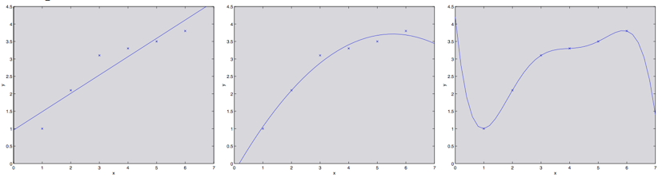
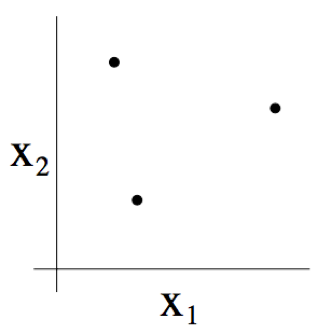
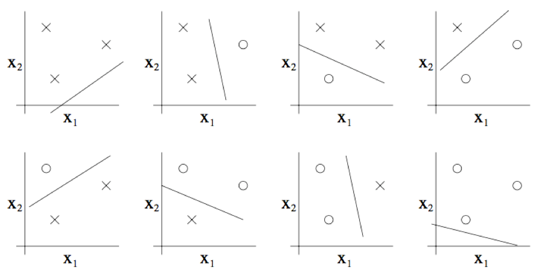
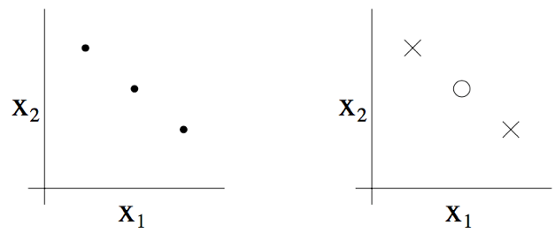

05. 学习理论（Learning Theory）

-----
[TOC]

# 1. 偏差 / 方差的权衡（Bias/variance tradeoff）

​	在讲线性回归的时候，我们讨论过这样的问题：拟合数据的时候，选择如线性 $y = \theta_0 + \theta_1 x$ 的简单模型还是如多项式 $y = \theta_0 + \theta_1 x + ... + \theta_5 x^5$ 的复杂模型。如下图所示：

如图所示，图中最左边的线性拟合和最右边的高次多项式拟合都有非常大的泛化误差。一个**假设（hypothesis）**的**泛化误差（generalization error）**是其对训练集中不一定示例的样本的**预期误差（expected error）**。然而，这两个模型各自出现的问题是不一样的。

- **偏差（bias）**：描述模型输出结果的期望与样本真实结果的差距；例如左图有很大的偏差，方差很小。
- **方差（variance）**：描述模型对于给定值的输出稳定性；例如右图有很小的偏差，方差很大。

​	通常情况下，我们需要在**偏差（bias）**和**方差（variance）**之间进行权衡妥协。如果我们的模型过于简单，而且参数非常少，那这样可能会有**很大的偏差，而方差可能就很小**；如果我们的模型过于复杂，有很多的参数，那么可能会有**很小的偏差，但方差又特别大**。

# 2. 预先准备（Preliminaries）

​	在剩下的内容中，我们开始进入机器学习的**学习理论（learning theory）**部分。本章内容非常有趣，而且有启发性，还能帮助我们培养直觉，能够得到在不同背景下如何最佳应用学习算法的经验规则。此外，我们还会探究一些问题：

- 首先，我们刚刚谈论到的**偏差（bias） / 方差（variance）**，能不能更正规地总结一下？这个问题还会引出关于**模型选择**的方法，这些方法可以在对一个训练集进行拟合的时候来帮助确定要用的多项式应该是几阶的。

- 其次，在机器学习的过程中，我们真正关注的也就是**泛化误差（generalization error）**，不过绝大部分的学习算法都是将训练集和模型结合的。那么针对训练集的表现好坏程度，为何就能告诉我们泛化误差的信息呢？例如，我们**能将训练集的误差和泛化误差联系起来么**？

- 最后，是否存在某些条件，我们能否在这些条件下证明某些学习算法能够良好工作？

  首先，我们先来给出两个很简单又很有用的**引理（lemma）**：

- **联合约束（The union bound）**：设 $A_1, A_2, ..., A_k$ 是 $k$ 个不同事件（但不一定互相独立），则有：
  $$
  P(A_1 \cup ... \cup A_k) \leq P(A_1) + ... + P(A_k)
  $$

- **Hoeffding 不等式**：设 $Z_1, Z_2, ..., Z_m$ 是 $m$ 个独立的并且遵循伯努利（Bernoulli）分布的随机变量（独立同分布随机变量：independent and identically distributed random variables， idd）。有：$P(Z_i =1)=\phi$，$P(Z_i =0)= 1 - \phi$。设 $\hat\phi=(\frac 1 m)\sum^m_{i=1}Z_i$ 是这些随机变量的平均值，然后设任意的 $\gamma \geq 0$ 为某一固定值（fixed），则有：
  $$
  P(|\phi - \hat\phi| > q) \leq 2 \exp(-2 \gamma^2 m)
  $$
  上面这个引理（也称为**切尔诺夫约束**，Chernoff bound）表明，如果我们我们从一个伯努利分布的随机变量中选取平均值 $\hat\phi$ 来作为对 $\phi$ 的估计值，那么只要 m 足够大，我们偏移真实值很远的概率就比较小。

基于上面两个引理，我们就可以开始证明学习理论中的重要结论了。为了简化表述，我们先集中关注一下二分法分类，其中的标签简化为 $y \in \{0, 1\}$。然后我们即将讲到的所有内容也都会推广到其它问题中，例如回归问题以及多类别的分类问题等等。

​	假定我们有一个给定的训练集 $S = \{ (x^{(i)}, y^{(i)}); i = 1, ..., m\}$，其样本规模为 $m$，集合中的训练样本$(x_{(i)}, y_{(i)})$ 是符合某个概率分布 $D$ 的独立同分布的随机变量。设一个假设 $h$，我们用如下的方法定义**训练误差（training error）**（在学习理论中也称为 **经验风险（empirical risk）** 或 **经验误差（empirical error）**）：
$$
\hat \xi(h) = \frac {1}{m} \sum_{i=1}^{m} 1\{h(x^{(i)}) \neq y^{(i)}\}
$$
这个值只是假设 $h$ 分类错误样本占训练样本总数的比例。如果我们针对某个特定的训练集合 $S$ 的训练误差可以写成 $\hat \xi_s(h)​$。然后我们可以定义**泛化误差（generalization error）**为：
$$
\xi(h) = P_{(x, y) \sim D}(h(x) \neq y)
$$
**泛化误差**意义是：基于分布 $D$ 给出一个新的样本 $(x, y)$，假设 $h$ 对该样本分类错误的概率就是泛化误差。

值得注意的是，这里我们有一个预先假设，即训练集和测试集都服从同一个分类 $D$。这个假设通常也被认为是 PAC 假设之一。

> PAC 是一个缩写，即 probably approximately correct，这是一个框架和一系列假设的集合，在机器学习学习理论中的很多结构都是基于这些假设而证明得到的。这个系列假设中最重要的两个，就是 训练样本的独立性 和 训练集与测试集服从同一分布。

​	考虑线性分类的情况，假设 $h_\theta(x) = 1\{\theta^T x \geq 0\}$。拟合参数 $\theta$ 的合理方法是什么呢？一个思路就是最小化训练误差，然后选择最小值时的 $\theta$：
$$
\hat \theta = arg \min_\theta \hat \xi(h_\theta)
$$
我们把上面这个过程称之为**经验风险最小化**（empirical risk minimization，ERM），这样通过学习算法得到的假设为 $\hat h = h_{\hat \theta}$。我们把 ERM 看作为最基础的学习算法，在这一系列的讲义中我们主要关注的就是这种算法（其他的例如逻辑回归等算法可以看做是对 ERM 的某种近似）。

​	在我们对学习理论的学习中，有一种做法很有用，就是把假设中的具体的参数抽象出来。我们把学习算法所使用的**假设类 $H$** 定义为所有分类器的集合。例如对于线性分类问题，$H = \{h_\theta: h_\theta = 1\{\theta^T x \geq 0\}, \theta in R^{n+1}\}$ 是一个对输入特征 $x$ 进行分类的所有分类器的集合。

​	现在，就可以把**经验风险最小化（ERM）**看作是对**假设类 $H$** 的最小化（利用学习算法选择假设）：
$$
\hat h = arg \min_{h \in H} {\hat \xi(h)}
$$

# 3. 有限个假设的情况（The case of finite H）

​	我们首先来考虑**假设类有限**情况下的学习问题，其中假设类 $H = \{h_1, h_2, ..., h_k\}$，由 $k$ 个不同假设组成。因此，$H$ 实际上就是由 $k$ 个从输入特征 $x$ 映射到集合 $\{0, 1\}$ 的函数组成的集合，而经验风险最小化（ERM）就是从这样的 $k$ 个函数中**选择训练误差最小**的作为 $\hat h$。

​	我么希望能够保证 $\hat h$ 的**泛化误差**（即泛化误差有界）。这需要两个步骤：首先要表明对所有的 $h$，训练误差 $\hat \xi(h)$ 是泛化误差 $\xi(h)$ 的一个可靠估计；其次，训练误差 $\hat \xi(h)$ 是经验风险最小化（ERM） $\hat h$ 的泛化误差的上界。

> 训练误差 $\hat \xi(h)$ 和 泛化误差 $\xi(h)$ 是相对的：对于假设 $h$，训练误差是指在训练集中，假设 $h$ 分类错误的样本占总样本的比例； 泛化误差是指基于样本分布 $D$，生成的新样本被假设 $h$ 分类错误的概率。
> $$
> \begin {aligned}
> \hat \xi(h) &= \frac {1}{m} \sum_{i=1}^{m} 1\{h(x^{(i)}) \neq y^{(i)}\} & \text {训练误差} \\
> \hat h &= arg \min_{h \in H}{\hat \xi(h)} \\ 
> \\
> \xi(h) &= P_{(x, y) \sim D}(h(x) \neq y) & \text {泛化误差} \\
> h^{*} &= arg \min_{h \in H}{\xi(h)} \\ 
> \end {aligned}
> $$
> 这个可以用来解释步骤（1），训练误差是泛化误差的一个可靠估计。
>
> 经验风险最小化（ERM）得到的 $\hat h$ 本身就是使得训练误差最小的假设 ，$\hat h$ 的泛化误差即 $\xi(\hat h)$ 的上界应该与 $\hat \xi(\hat h)$ 有关，而 $\hat \xi(\hat h) = \min {\hat \xi(h)}$，故训练误差 $\xi(h)$ 与 $\hat h$ 的泛化误差有关，对应步骤（2）.

​	任选一个 $h_i \in H$。我们在分布 $D$ 中取 $(x, y)$，假如有一个伯努利随机变量 $Z$，设 $Z = 1\{h_i(x) \neq y\}$。也就是说，我们选择一个样本，并令 $Z$ 表示 $h_i$ 是否进行了错误分类。类似的，我们也定义 $Z_j = 1\{h_i(x^{(j)}) \neq y^{(j)}\}$。由于我们的样本都服从分布 $D$，则 $Z, Z_j$ 也服从相同的分布。

​	这样我们就能找到相对假设 $h_i​$，随机产生的样本分类错误的概率就是 $Z​$ 的值，而这个概率本身也代表着**泛化误差** $\xi(h_i)​$。

​	此外，我们也可以写出**训练误差** $\hat \xi(h_i)​$ 为：
$$
\hat \xi(h_i) = \frac{1}{m} \sum_{j=1}^{m} Z_j
$$
$\hat \xi(h_i)$ 就是 $m$ 个随机变量 $Z_j$ 的平均值，而 $Z_j$ 是服从伯努利分布的独立同分布随机变量，其均值就是 $\xi(h_i)$。根据 **Hoeffding 不等式**，得到下面的式子：
$$
P(|\xi(h_i) - \hat \xi(h_i)| > \gamma) \leq 2 \exp(-2 \gamma^2 m)
$$
这就表面，对于我们给定的 $h_i$，加入训练样本的规模很大的时候，训练误差接近泛化误差的概率还是很高的。但是我们的目标不仅仅满足特定的 $h_i$，我们需要证明对所以的 $h \in H$，这个结论都成立，**以便完成步骤（1）**。为了证明这个结论，我们设 $A_i$ 表示事件 $|\xi(h_i) - \hat \xi(h_i)| > \gamma$，则有 $P(A_i) \leq 2 \exp(-2 \gamma^2 m)$。根据**联合约束**，就可以得出下面的关系：
$$
\begin {aligned}
p(\exists h \in H, |\xi(h_i) - \hat \xi(h_i)| > \gamma)) 
&= P(A_1 \cup ... \cup A_k) \\
&\leq \sum_{i=1}^{m}P(A_i)	\\
&\leq \sum_{i=1}^{m} 2 \exp(-2 \gamma^2 m)	\\
&= 2k \exp(-2 \gamma^2 m)	\\
\end {aligned}
$$
如果我们改成否命题，则有：
$$
\begin {aligned}
p(\lnot \exists h \in H, |\xi(h_i) - \hat \xi(h_i)| > \gamma)) 
&= P(\forall h \in H, |\xi(h_i) - \hat \xi(h_i)| > \gamma)	\\
&\geq 1 - 2k \exp(-2 \gamma^2 m)	\\
\end {aligned}
$$
如上所示，至少有 $1 - 2k \exp(-2 \gamma^2 m)$ 的概率，我们能确保对于所有的 $h \in H$，泛化误差 $\xi(h)$ 在训练误差 $\hat \xi(h)$ 附近的 $\gamma$ 范围内，这种结果就叫做**一致收敛**（uniform convergence）结果，因为这是对所有的 $h \in H$ 都成立。

​	我们不妨假设 $\delta = 2k \exp(-2 \gamma^2 m)$，那么在上面的讨论中，我们比较感兴趣的变量有三个：$m, \gamma, \delta$，我么可以将其中一个变量用另外两个进行约束。

- 例如，我们可以探讨这个问题：给定 $\gamma, \delta \geq 0$，如果要保证训练误差在泛化误差附近 $\gamma$ 范围内的概率不小于 $1- \delta$，那么 $m$ 应该为多大呢？我们可以解出结果为：
  $$
  m \geq \frac {1}{2\gamma^2} \log {\frac{2k}{\delta}}
  $$
  这种联合约束也说明了至少需要多少数量的训练样本才能对结果有所保证。某些方法或算法为了达到一定的性能水平所需的训练集大小 $m​$ 也称为该算法的**样本复杂度**（sample complexity）。这个约束条件下的结果有效依赖 $k​$ 是一个有限值，这个特性很重要。

- 同理，我们可以假设给定 $m, \delta \geq 0$，然后对 $\gamma$ 求解。即对所有的 $h \in H$，都有概率 $1-\delta$，使得训练误差和泛化误差的误差范围在一个范围内：
  $$
  |\xi(h) - \hat \xi(h)| \leq \sqrt{\frac{1}{2m} \log{\frac{2k}{\delta}} }
  $$

现在，根据上面的推论，我们可知，对所有的 $h \in H$，都有 $|\xi(h) - \hat \xi(h)| \leq \gamma$，那么对于我们选择的假设 $\hat h = arg \min_{h \in H} \hat \xi(h)$ 的泛化误差 $\xi(\hat h)$ 的范围有什么推论呢（开始进行步骤（2）的证明）？

​	我们假设 $h^{*} = arg \min_{h \in H}{\xi(h)}$ 为 $H$ 中的**最佳可能假设**（the best possible hypothesis）。则有：
$$
\begin {aligned}
\xi(\hat h) 
&\leq \hat \xi(\hat h) + \gamma	& \text {(1)} \\
&\leq \min_{h \in H} \hat \xi(h) + \gamma & \text {(2)}	\\
&\leq \hat \xi(h^{*}) + \gamma & \text {(3)}	\\
&\leq \xi(h^{*}) + 2\gamma & \text {(4)}	\\
\end {aligned}
$$
公式（1）（4）利用的是泛化误差和训练误差的误差范围为 $\gamma$；（2）用的是 $\hat h$ 的定义；（3）是 $h^{*} \in H$。让我们上面的一大推整理成一个定理：假设 $|H| = k$，$m, \delta$ 给定，则在至少 $1- \delta$ 的概率下，有：
$$
\xi(\hat h) \leq (\min_{h \in H} \xi(h))+2\sqrt{\frac{1}{2m} \log{\frac{2k}{\delta}}}
$$
这就表明，我们选择的经验风险最小化（ERM）的假设 $\hat h$ 的泛化误差 $\xi(\hat h)$ 最多比全局最优的泛化误差 $\xi(h^{*}) = \min_{h \in H}\xi(h)$ 多两倍的 $\gamma$。

​	这也对我们之前提到过的模型选择过程中的在**偏差（bias） / 方差（variance）**之间的权衡给出了定量方式。例如，我们有原始的假设类 $H$，然后考虑切换到某个更大规模的假设类 $H^{'} \supseteq H$。如果我们切换到了 $H^{'}$，那么第一项的 $\min \xi(h)$ 降低或不变，因此，使用一个更大规模的假设类来进行学习，我们的学习算法的**偏差只会降低**；然而 $k​$ 的增大，会导致第二项变大，那么算法的**方差就会增大**。

​	通过固定 $\gamma, \delta​$，我们像上面一样求解 $m​$，还可以得到下面的样本复杂度约束：
$$
\begin {aligned}
m &\geq \frac {1}{2\gamma^2} \log {\frac{2k}{\delta}}\\
  &= O(\frac {1}{\gamma^2} \log {\frac{k}{\delta}}) \\
\end {aligned}
$$

# 4.  无限个假设的情况（The case of infinite H）

​	我们已经针对有限个假设类的情况证明了一些有用的定理，然而有很多假设类都包含有无限个函数，那么针对这种无限个假设的情况，我们能给出相似的定理吗？我们先从一些不太准确的论证内容开始，虽然有更好的通用的论证，但这样做有助于锻炼我们在此领域内的直觉（intuitions about the domain）。

​	若我们有一个假设类 $H$，使用 $d$ 个参数来进行参数化。由于我们使用计算机表达实数，而 $double$ 型数据使用 $64$ bit 表示，这就意味着在学习算法中如果使用 $double$ 型数据表示参数的话，那么我们的算法就有 $64d$ bit 表示，这样我们的假设类个数 $k$ 最多为 $k = 2^{64d}$。结合上一节最好的推论，我们可以发现：在概率至少为 $1- \delta$ 的条件下，要保证 $\xi(\hat h) \leq \xi(h^{*}) + 2\gamma$，则训练样本规模 $m$ 需满足 $m \geq O(\frac{1}{\gamma^2} \log \frac{2^{64d}}{\delta}) = O(\frac{d}{\gamma^2}\log \frac{1}{\delta})=O_{\gamma, \delta}(d)$。因此，所需的训练样本的规模与模型中的参数个数最多也是**线性**的（linear）。

由于上述我们的推论依赖 $64$ bit 浮点数，所以上面的论证还不能令人完全满意，但是这个结论大致上是正确的：如果我们试图最小化**训练误差（training error）**，为了让具有 $d$ 个参数的假设类的学习效果 “较好“，那么我们需要与 $d$ 线性相关的个数的训练样本。（表述不一定正确，意思大概是这样）

> 事实上，对于使用经验风险最小化（empirical risk minimization，ERM）的学习算法，上面这些结论已经被证明适用；因此，样本复杂度（sample complexity）对 $d$ 的线性依赖性 适用于大多数分类识别学习算法，但训练误差或者训练误差近似值的最小化，就未必适用了。

前面的论证还有另外一部分让分不太满意，就是依赖于对 $H$ 的参数化。直观上看，这个参数化似乎应该不会有太大影响：例如我们定义的线性分类器，写成 $h_\theta(x) = 1\{\theta_0 + \theta_1x_1 +...+ \theta_ nx_n \geq 0\}$ 有 $n+1$ 个参数；而写成 $h_{u,v}(x) = 1\{(u_0 - v_0) + (u_1 - v_1)x_1 + ··· + (u_n - v_n)x_n \geq 0\}$ 有 $2n+2$ 个参数。然而这两种形式都定义了同样一个 $H$：一个 $n+1$ 维的线性分类器集合。为了推导出更准确的结果，我们接下来额外定义一些概念。

​	给定一个点的集合 $S = \{x^{(i)}, ..., x^{(d)}\}$（与训练集无关），其中 $x^{(i)} \in X$，如果 $H$ 能够实现集合 $S$ 的任意标签分布（无论 $S$ 中的 $x^{(i)}$ 的如何选取标签，$H$ 中总存在一个假设 $h$ 生成的分隔超平面能够将 $x^{(i)}$ 按标签分隔开来，即选择的假设 $h$ 满足 $h(x^{(i)}) = y^{(i)}$ 总是正确的(标签只分正、负两种)），则称 $H$ **打散（shatter）**了 $S$。

​	给定一个假设类 $H$，我们定义它的 **VC 维度**（Vapnik-Chervonenkis dimension）为 **$H$ 能打散的最大的集合的大小**（the size of largest set that shattered by H），记作 $VC(H)$。（如果 $H$ 能打散任意大的集合，则 $VC(H) = \infty$）

例如，若一个集合由下图所示的三个点组成：

那么二位线性分类器（$h(x) = 1\{\theta_0 +\theta_1 x_1 + \theta_2 x_2 \geq 0\}$）的集合 $H$ 能否讲上图所示的这个集合打散呢？答案是能。具体结果如下图所示，对于一下八种情况中的任意一个，我们都能找到一种**零训练误差**的线性分类器：

这也表明，这个假设类 $H$ 不能打散 4 个点构成的集合。因此，该假设类的 VC 维为 $VC(H) = 3$。这里要注意，$H$ 的 VC 维为 3，不代表所有的 3 个点的集合都能被打散。例如如果三个点都在一条直线上，那就没办法能够用线性分类器来对这三个点的类别进行划分了。

通过上面的例子我们可以知道，在 VC 维的定义下，如果 $VC(H)$ 至少为 $d$，只需要证明至少有一个规模为 $d$ 的集合能够被 $H$ 打散即可。这样，我们就能给出如下定理（theorem）：

**定理（Theorem）**：给定 $H​$，设 $d = VC(H)​$，然后在概率至少为 $1- \delta​$ 的条件下，所有的 $h \in H​$，存在
$$
|\xi(h) - \hat \xi(h)| \leq O(\sqrt {\frac{d}{m} \log \frac{m}{d} + \frac{1}{m} \log \frac{1}{\delta}})
$$
此外，有至少 $1- \delta$ 的概率，有
$$
\xi(h) \leq \xi(h^{*}) + O(\sqrt {\frac{d}{m} \log \frac{m}{d} + \frac{1}{m} \log \frac{1}{\delta}})
$$
换句话说，如果一个假设类 $H$ 的 VC 维有限，即 $VC(H) = d < \infty$，那么只要训练规模 $m$ 足够大，就能保证**联合收敛成立**（uniform convergence occurs），即第一个等式。和之前一样，这也能够让我们用 $\xi(h^{*})$ 来给出 $\xi(h)$ 的界限，即第二个等式表达的意思。

我们还有如下推论（corollary）：对于所有的 $h \in H$，有 $|\xi(h) - \hat \xi(h)| \leq \gamma$。

换个方式来说，要保证使用假设类 $H$ 的机器学习算法学习效果 $well$，那么训练集样本规模 $m$ 需要和 $H$ 的 VC 维度**线性相关**。这也表明，对于 $most$ 假设类 $H$ 来说，VC 维度也大概和参数的个数线性相关。这这两条综合一起，我们就能得出这也一个结论：对于一个试图讲训练误差最小化的学习算法来说，**训练样本个数** 通常都大概与 **假设类 $H$ 的参数个数** ==线性相关==。

