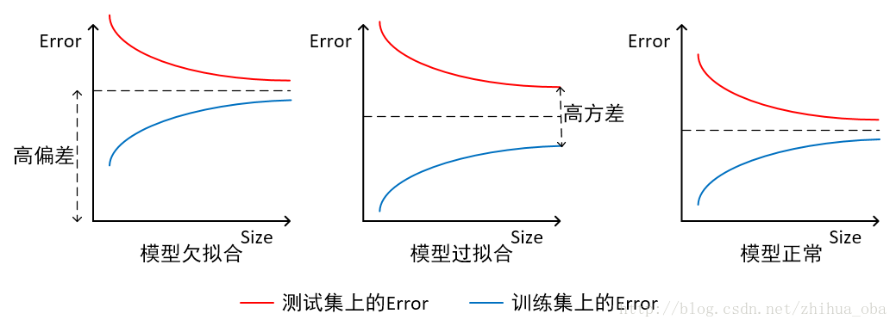

06. 正则化与模型选择（Regularization and model selection）

-----
[TOC]

**模型选择问题**：设想一个机器学习问题，有多种模型可以选择。例如，我们可能是用一个多项式回归模型 $h_\theta(x) = g(\theta_0 + \theta_1x + ... + \theta_k x^k)$，如何判定这里的多项式次数 $k$ 应该是多少？（即我们怎样才能自动选择一个能够在偏差 / 方差之间进行权衡的模型）或者在另一类参数选择模型中，我们希望能够自动选择一个带宽参数   $\tau$ 用于局部加权回归（locally weighted regression，LWR）；还有就是自动选择一个参数 $C$ 用于 $L1$ 正则化的 SVM 算法中。

形式化定义：假设可选的模型集合是 $M=\{M_1, M_2, ..., M_d\}$，例如在分类问题中，模型可以是逻辑回归算法、神经网络、支持向量机等模型，$M$ 都包含了这些模型；那么模型选择问题就是在这些模型中选择一个最好的。那么首先我们需要使用一种方法定义 “最好”，即交叉验证；然后进行选择，选择方式有很多，可以根据交叉验证的结果选择，也可以通过特征选择去筛选模型。

# 1. 交叉验证（Cross Validation）

​	假如我们有一个训练集 $S$，如果我们想要通过经验风险最小化（ERM）来进行模型选择，那么选择算法如下：

1. 在训练集 $S$ 上，对模型集合中的每个模型 $M_i$ 都进行训练，得到对应的假设 $h_i$；
2. 从这些假设中选择训练误差最小的假设（hypothesis）。

事实上，上面这个算法不可行。比如考虑要选择多项式的阶的问题，多项式的阶越高，对训练集的拟合程度越好，训练误差自然也最小；然而，这种方法选出来的都是偏差小、方差大的高阶多项式，出现**过拟合现象**。这种方法选出来的通常都是很差的选择。

## 1.1 保留交叉验证（hold-out cross validation）

​	下面这个算法就好一些，这个方法叫**保留交叉验证**（hold-out cross validation），也叫**简单交叉验证**（simple cross validation），步骤如下：

1. 将训练集 $S$ 随机拆分成 $S_{train}$（用于训练，例如选择整体数据的 $70\%$）和 $S_{cv}$（用于验证，剩余的 $30\%$）。这里的 $S_{cv}$ 就叫做**保留交叉验证集**（hold-out cross validation set）；
2. 只在集合 $S_{train}$ 上，对每一个模型 $M_i$ 进行训练，然后得到假设 $h_i$；
3. 在集合 $S_{cv}​$ 上测试每一个 $h_i​$，得到相应的训练误差 $\hat \xi_{S_{cv}}(h_i)​$；
4. 选择具有最小训练误差 $\hat \xi_{S_{cv}}(h_i)​$ 的 $h_i​$ 作为最佳模型。

这样通过在一部分未进行训练的样本集合 $S_{cv}$ 上进行测试，我们可以认为这里的训练错误 $\hat \xi_{S_{cv}}(h_i)$  接近于**泛化误差**（generalization error）。通常可以选择 ${1/4}-{1/3}$ 的样本用来作为保留交叉验证集，$30\%$ 是一个典型选择。

​	这个方法还有一种备选方法，就是在选择出最佳假设 $h_i$ 后，我们用 $h_i$ 对应的模型 $M_i$ 对整个训练集 $S$ **再次进行训练**得到 “更好” 的假设。（这个思路通常不错，但有一种情况例外，就是学习算法对初始条件和数据的扰动非常敏感的情况；在这样的算法中，适用 $S_{train}$ 的模型未必同样适用于 $S_{cv}$，这样最好放弃再训练的步骤。）

​	不过保留交叉验证方法的一个**弊端就是浪费了训练集的一部分**，甚至我们使用备用的重新进行训练的步骤也不行。因为我们的步骤（2）相当于试图在 $70\%$ 的样本上寻找一个最好的模型，而不是使用全部的样本。在样本充足的情况下，可以使用这种方法。如果样本较少，那最好用其他方法进行模型选择。

## 1.2 k-折叠交叉验证（k-fold cross validation）

​	下面我们介绍一种使用较少的验证集的方法：

1. 随机将训练集 $S$ 平均分成 $k$ 的不相交的子集，$S_1, ..., S_k$；

2. 对每个模型 $M_i$，我们都安装下面的步骤进行评估：

   对 $j= 1, ..., k$ 

   - 在除 $S_j$ 的其他子集上，对模型 $M_i$ 训练得到假设 $h_{ij}$；
   - 在 $S_j$ 上，用假设 $h_{ij}$ 进行测试，得到训练误差 $\hat \xi_{S_j}(h_{ij})​$。

   对 $\hat \xi_{S_j}(h_{ij})$ 取平均值，计算得到的值就当是模型 $M_i$ 的估计泛化误差；

3. 选择具有最小估计泛化误差的模型 $M_i$，然后在整个训练集 $S$ 上重新训练该模型，得到的假设就可以作为最优模型。

通常这里进行折叠的次数 $k$ 一般是 10，这样每次用于保留用于验证的训练样本就小多了。不过这样会消耗更多的计算成本，因为对每个模型都要进行 $k$ 次训练。

## 1.3 弃一法交叉验证（leave-one-out cross validation）

​	当然我们也可以走一点极端，设 $k = m$，这样是为了每次能够尽可能多地利用数据，尽可能少地排除数据。然后其他步骤不变，这样每个模型都要进行 $m$ 次训练。

​	总的来说，我们介绍的不同版本的交叉验证，不仅可以用来作为模型选择的方法，实际上也可以淡村的对一个具体的模型或算法进行评估。

# 2. 特征选择（Feature Selection）

​	模型选择的一个非常重要且特殊的情况就是**特征选择（Feature Selection）**。假设一个监督学习问题，其中特征值 $n$ 特别大（甚至比训练样本规模还大）；然而你怀疑可能只有一小部分的特征（feature）与学习任务相关。即便使用的是一个简单的 $n$ 维线性分类器，假设类 $H$ 的 VC 维依然也能达到 $O(n)$，因此有**过拟合的潜在风险**，除非样本规模很大。

​	在这样的背景下，就可以使用**特征选择算法**，来**降低特征值的数量**。假设有 $n$ 个特征，那么就有 $2^n$ 个特征子集，如果采用普通的枚举算法对比 $2^n$ 种模型，成本就太高了，所以通常的做法就是使用某些**启发式的搜索过程**（heuristic search procedure）。

## 2.1 封装特征选择（Wrapper feature selection）

**前向搜索**（forward search）：

1. 初始化一个集合为空集 $F=\emptyset$；

2. 重复一下过程：

   ​	a. 对 $i = 1, ..., n$，如果 $i \notin F$，则令 $F_i = F \cup \{i\}$，然后使用某种交叉验证方法来评估特征模型 $F_i$；

   ​	b. 在若干个 $F_i$ 中选择最好的一个作为 $F$ 代入 a 中；

3. 整个搜索过程中筛选出来了最佳特征子集，将其输出。

算法的外层循环即步骤（2）的停止条件可以是 $F = \{1,\cdots,n\}$ 达到全部规模，也可以是 $|F|​$ 超过某个预先设置的阈值。

​	这个算法描述的是对模型特征进行封装（**封装特征选择（Wrapper feature selection）**）的一个实例，算法本身就是一个将学习算法进行 “**打包**（wraps）” 的过程，然后重复调用这个算法来评估学习算法对**不同的特征子集**的处理效果。除了前向搜索外，还可以使用其他的搜索特征，例如**后向搜索**（backward search），从 $F = \{1, ..., n\}$ k开始，然后重复删减特征，只要满足停止条件。

​	这种封装特征选择算法通常效果不错，不过对算力开销也很大，时间复杂度约为 $O(n^2)$。

## 2.2 过滤特征选择（Filter feature selection）

​	**过滤特征选择（Filter feature selection）**方法的原理是针对每一个特征 $x_i, i = 1, ..., n$，计算 $x_i$ 相对于类别标签 $y$ 的**信息量** $S(i)$，得到 $n$ 个结果，然后按照从大到小排名，输出前 $k$ 的特征。这样在算力上的开销也更低，大概为 $O(n)$。

​	那么问题的关键是如何定义信息量 $S(i)$，实际中，通常（$x$ 为连续值时可以对其进行离散化）选择 $x_i$ 和 $y$ 的**互信息**（mutual information） $MI(x_i, y)$ 作为 $S(i)$。
$$
MI(x_i, y) = \sum_{x_i \in \{0, 1\}} \sum_{y \in \{0, 1\}} p(x_i, y) \log \frac{p(x_i, y)}{p(x_i)p(y)}
$$
（当 $x_i \in \{0, 1\}​$ 的时候，这个公式如上；更一般的情况是变量 $x_i​$ 的范围）这里的概率 $p(x_i, y), p(x_i), p(y)​$ 都可以根据训练集上的经验分布来估计。

​	要对信息量的值有一个更直观的印象，也可以将互信息表达成 **KL 散度**（Kullback-Leibler divergence）：
$$
MI(x_i, y) = KL \big( p(x_i, y)||p(x_i)p(y) \big)
$$
这里通俗的表述为，这个概念对 $p(x_i, y), p(x_i)p(y)$ 的概率分布的差异程度给出了一个衡量。如果两个随机变量相互独立，那么必有 $p(x_i, y) = p(x_i)p(y)$，那么两个分布之间的 KL 散度就应该是 0。这样符合下面这种很自然的认知：如果 $x_i$ 和 $y$ 相互独立，那么 $x_i$ 很明显对 $y$ 是 “无信息量(non-informative)”，因此对应的信息量 $S(i)$ 就应该很小。与之相反，如果 $x_i$ 对 $y$ 有 “很大的信息量”，那么这两者的互信息 ${MI}(x_i,y)$ 就应该很大。  

​	最好一个是：我们如何选择特征个数 $k$。一个标准办法就是使用交叉验证来从可能的不同 $k$ 值中进行筛选。

# 3. 贝叶斯统计和正则化（Bayesian statistics and regularization）
在本节中，我们要讲另一种工具，用来对抗**过拟合**（over fitting）。

​	在本章的开头，我们谈到了使用**最大似然**（maximum likelihood，ML）来进行参数拟合，然后根据下面的式子来选择合适的参数：
$$
\theta_{ML} = arg \max_\theta p(y^{(i)}|x^{(i)};\theta)
$$
在上式中，我们都把 $\theta$ 看做一个**未知参数**（unknown parameter）。**频率统计**（frequentist statistics）中也把 $\theta$ 当成一个未知常量。在频率论世界观中，$\theta$ 只是一个**未知**的、**不随机**的常量，我们的任务就是提出某种统计程序（例如，最大似然）来对参数进行估计。

​	另一种解决参数估计问题的方法是使用贝叶斯世界观，把 $\theta$ 当成**未知**的**随机**变量。这个方法中我们要先指定一个在 $\theta$ 上的**先验分布**（prior distribution） $p(\theta)$，这个分布表达了我们关于参数的 ”**预先判断**“ 。给定一个训练集 $S = \{ (x^{(i)}, y^{(i)}) \}_{i=1}^{m}$，当我们对一个新的 $x$ 的值进行预测的时候，我们可以先计算参数的**后验分布**（posterior distribution）：
$$
\begin {aligned}
p(\theta | S) 
&= \frac {p(S|\theta)p(\theta)}{p(S)} \\
&= \frac {\big[\prod_{i=1}^{m}p(y^{(i)}|x^{(i)},\theta)\big] p(\theta)}
{\int_{\theta} \big [\prod_{i=1}^{m}p(y^{(i)}|x^{(i)},\theta)p(\theta) \big ] d\theta}
\end {aligned}
$$
在上面的等式中，$p(y^{(i)}|x^{(i)}, \theta)​$ 来自学习问题中所用的模型。例如，在**贝叶斯逻辑回归**问题中（Bayesian logistics regression）：$p(y^{(i)}|x^{(i)}, \theta) = h_\theta(x^{(i)})^{y^{(i)}} (1- h_\theta(x^{(i)}))^{(1-y^{(i)})}​$，其中，$h_\theta(x^{(i)}) = 1/(1+\exp(-\theta^T x^{(i)}))​$。

> 由于我们这里把 $\theta$ 看成一个随机变量，那么就可以使用条件判断，即用 $p(y^{(i)}|x^{(i)}, \theta)$ 替代 $p(y^{(i)}|x^{(i)}; \theta)$。

若有一个新的样本 $x$，我们可以使用 $\theta$ 上的后验分布来计算标签的后验分布：
$$
p(y|x, S) = \int_{\theta} p(y|x, \theta) p(\theta|S) d \theta
$$
如果目标是根据输入 $x$ 来预测输出 $y$ 的均值，那么可以通过下式计算：
$$
E[y|x, S] = \int_{y} y p(y|x, S)dy
$$
上面就是我们简述的过程，可以认为是一种 ”**完全贝叶斯**（fully Bayesian）“ 预测，其中我们的预测是通过计算相对于 $\theta$ 上的后验概率 $p(\theta|S)$ 的平均值得出的。实际上，这个后验分布的计算通常比较困难，例如分母上的积分，而 $\theta$ 通常是高维度的，这通常不能以**闭合形式** （closed-form）来实现。 

​	因此实际应用中，我们都是用 $\theta$ 的后验分布的近似替代。一个常用的近似是把对 $\theta$ 的后验分布替换为一个**单点估计**（signal point estimate）。$\theta$ 的**最大一个后验（maximum a posteriori， MAP）估计**为：
$$
\theta_{MAP} = arg \max_{\theta} \prod_{i=1}^{m}p(y^{(i)}|x^{(i)})p(\theta)
$$
与最大似然 $\theta_{ML}$ 相比，$\theta_{MAP}$ 在末尾多了一个先验概率分布 $p(\theta)$。

​	实际应用中，对先验概率分布 $p(\theta)$ 的常见选择是假设 $\theta - N(0, \tau^2 I)$。使用这样一个先验概率分布，拟合出来的参数 $\theta_{MAP}$ 将比最大似然得到的参数 $\theta_{ML}$ 有**更小的范数（smaller norm）**。是实践中，贝叶斯最大后验估计比参数的最大似然估计更容易避免过拟合。

# 4. 怎样使用机器学习算法

这个是 CS229-11 课上的 PPT 总结，主要介绍的是怎样使用机器学习算法处理问题，主要分为三个部分：

- 学习算法的调试诊断法；
- 误差分析和销蚀分析；
- 如何处理一个机器学习问题
  - 过早优化问题。

针对第一部分的学习算法的调试诊断法，我们可以先判断算法是否欠拟合或过拟合，通过分析学习曲线，提出相应的解决方法：

我们可以发现：模型欠拟合的时候，会出现高偏差问题，可以通过增加特征解决；当模型过拟合的时候，会出现高方差问题，可以通过增大训练集、减少特征解决。