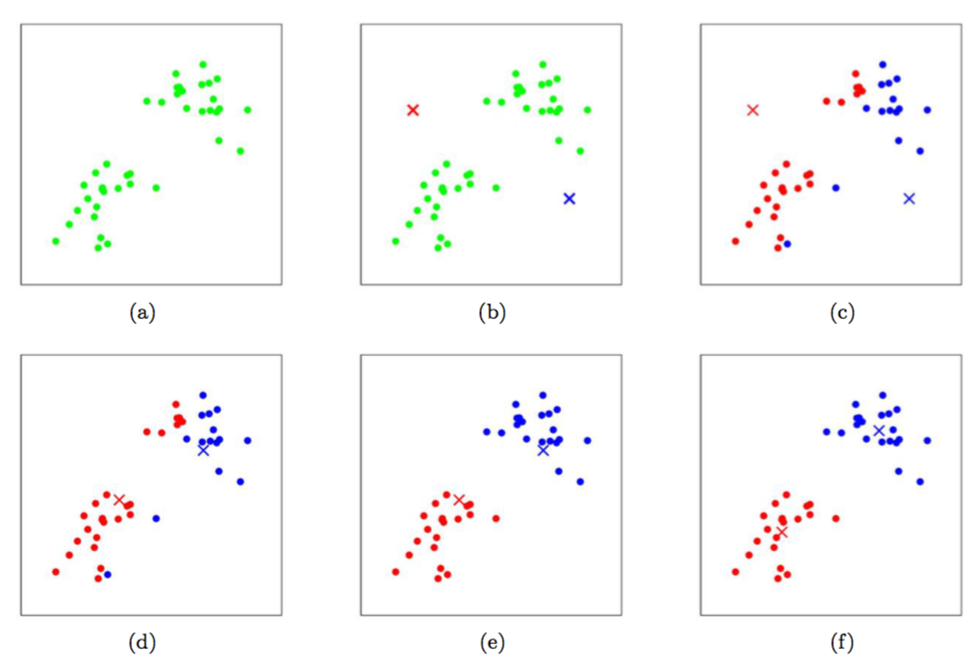

08. k 均值聚类算法和高斯混合模型

-----
[TOC]

# 1. k 均值聚类算法（k-means clustering algorithm）

​	在**聚类问题**（clustering problem）中，我们得到一组训练集 $\{x^{(1)}, ..., x^{(m)}\}$，然后想要把这些样本划分到若干个**集群**（clusters）中。其中，$x^{(i)} \in R^n$，而并未给出分类标签 $y^{(i)}$，这就是一个无监督学习问题。

**k 均值聚类算法**（看meansclustering algorithm）如下所示：

1. 随机初始化 $k$ 个聚类重心 $\mu_1, \mu_2, ..., \mu_k \in R^n$；

2. 重复一下过程直至收敛：

   - 对每个 $i$，设
     $$
     c^{(i)} = arg \min_j ||x^{(i)} - \mu_j||^2
     $$

   - 对每个 $j$，设
     $$
     \mu_j = \frac {\sum_{i=1}^{m} 1\{c^{(i)} = j\}x^{(i)}} {\sum_{i=1}^{m} 1\{c^{(i)} = j\}}
     $$

在上面的算法中，$k$ 是我们这个算法的一个参数，也是我们要分出来的**群组个数**（number of clusters）；而**聚类重心** $\mu_j$ 表示的是我们对各个聚类的中心位置的当前猜测。算法第一步中，需要初始化聚类重心，可以这样实现：随机选择 $k$ 个训练样本，然后设置聚类重心等于这 $k$ 个样本各自的值（也有其他的初始化方法）。第二步中，循环体内重复执行两个步骤：1）将每个训练样本 $x^{(i)}$  “分配” 给距离最近的聚类重心 $\mu_j$，并用 $c^{(i)}$ 表示其归属的聚类重心；2）把每个聚类重心 $\mu_j$ 移动到所分配的样本点的均值位置。下图就展示了运行 $k$ 均值聚类算法的过程：

​	$k$ 均值聚类算法在一定意义上是可以保证收敛的。我们可以定义**失真函数**（distortion function）如下所示：
$$
J(c,\mu) = \sum_{i=1}^{m} ||x^{(i)}-\mu_{c^{(i)}}||^2
$$
这样就可以用 $J$ 来衡量每个样本 $x^{(i)}$ 和对应的聚类重心 $\mu_{c^{(i)}}$ 之间距离的平方和。很明显可以看出 $k$ 均值聚类算法正好就是对 $J$ 的坐标下降过程。尤其是内部的循环体中，$k$ 均值聚类算法重复对 $J$ 进行最小化，当 $\mu$ 固定的时候用 $c$ 来最小化 $J$；当 $c$ 固定的时候则用 $\mu$ 来最小化 $J$。这就保证了 $J$ 是单调降低的，它的值也就必然收敛。

​	失真函数 $J$ 是一个**非凸函数**（non-convex function），所以对 $J$ 进行坐标下降并不一定能够收敛到全局最小值，即可能得到局部最优的结果。除了这个问题外，$k$ 均值聚类效果都不错，能给出很好的聚类。如果担心陷入比较差的局部最小值，可以通过多次运行 $k​$ 均值聚类算法（尝试不同的初始值），从中选择最好的。

# 2. 高斯混合模型（Mixtures of Gaussians）

​	在本节中，我们要介绍的是使用**期望最大化**（Expection-Maximization，EM）来进行**密度估计**（density estimation）。和之前一样，假设我们得到了某个训练样本集 $\{x^{(i)}, ..., x^{(m)}\}$。由于这是非监督学习（unsupervised learning），所以这些样本就没有标签。

​	我们希望通过联合分布 $p(x^{(i)}, z^{(i)}) = p(x^{(i)}|z^{(i)})p(z^{(i)})$ 对数据进行建模。其中，$z^{(i)} \sim Multinormial(\phi)$（即 $z^{(i)}$ 是一个以 $\phi$ 多项式分布，其中 $\phi_j = p(z^{(i)} = j),\ \phi_j \geq 0,\ \sum_{j=1}^{k}\phi_j = 1$，这里的 $z^{(i)}=j$ 表示的是 $x^{(i)}$ 属于集群 $j$ 的概率）；另外， $x^{(i)} | z^{(i)}=j \sim N(\mu_j, \Sigma_j)$（高斯分布）。我们设 $k$ 来表示 $z^{(i)}$ 能取的值的个数。因此，我们的模型可以简单描述为对于每个样例 $x^{(i)}$，我们先从 $k$ 个类别中按多项式分布抽取一个 $z^{(i)}$，然后根据 $z^{(i)}$ 所对应的 $k$ 个多值高斯分布中的一个生成 $x^{(i)}$。这就叫做**高斯混合模型**（Mixtures of Gaussians model）。这里要注意的是 $z^{(i)}$ 是一个隐藏的随机变量。，我们要对模型中的参数有 $\phi, \mu, \Sigma$ 进行估计，对似然函数进行对数化如下所示：
$$
\begin {aligned}
l(\phi, \mu, \Sigma) 
&= \sum_{i=1}^{m} \log  p(x^{(i)};\phi,\mu,\Sigma)\\
&= \sum_{i=1}^{m} \log \sum_{z^{(i)}=1}^{k} p(x^{(i)}|z^{(i)};\mu,\Sigma)p(z^{(i)};\phi)\\
\end {aligned}
$$
这个式子的最大值是不能通过前面使用的求导数为 $0$ 的方法解决的，因为求的结果不是**闭合形式**（close form）。假设我们知道每个样本 $x^{(i)}$ 的 $z^{(i)}$，那么这个最大似然估计问题可以简化成：
$$
l(\phi,\mu,\Sigma) = \sum_{i=1}^{m}[\log p(x^{(i)}|z^{(i)};\mu,\Sigma)+ \log p(z^{(i)};\phi)]
$$
对上面的函数最大化，就能得到对应的参数的表达式：
$$
\begin {aligned}
\phi_j &= \frac{1}{m} \sum_{i=1}^{m}1\{z^{(i)}=j\} \\
\mu_j &= \frac{\sum_{i=1}^{m}1\{z^{(i)}=j\}x^{(i)}}{\sum_{i=1}^{m}1\{z^{(i)}=j\}}\\
\Sigma_j &= \frac{\sum_{i=1}^{m}1\{z^{(i)}=j\}(x^{(i)}-\mu_j)(x^{(i)}-\mu_j)^T}{\sum_{i=1}^{m}1\{z^{(i)}=j\}}
\end {aligned}
$$
事实上，我们已经看到了，如果 $z^{(i)}$ 是已知的（相当于高斯判别分析中提供的标签），那么这个最大似然估计就几乎等同于之前高斯判别分析模型中对参数的估计，即 $z^{(i)}$ 作为高斯判别分析模型中的标签。

​	然而，在密度估计问题中，$z^{(i)}$ 是不知道的。为了解决这个问题，我们使用期望最大化算法（EM algorithm）。**期望最大化算法（EM algorithm）**是一个迭代算法，有两个主要步骤，在步骤 E 中，算法试图取猜测 $z^{(i)}$ 的值；然后在步骤 M 中，这一步我们假设了上一部是对的，然后更新参数，以获得最大似然估计。算法如下：

重复以下过程直到收敛：

- 步骤 E：对每个 $i, j$，设
  $$
  w_{j}^{(i)} := p(z^{(i)} = j | x^{(i)}; \phi, \mu, \Sigma)
  $$

- 步骤 M：更新参数
  $$
  \begin {aligned}
  \phi_j &:= \frac{1}{m}\sum_{i=1}^{m}w_j^{(i)}	\\
  \mu_j &:= \frac{\sum_{i=1}^{m}w_j^{(i)}x^{(i)}}{\sum_{i=1}^{m}w_j^{(i)}}	\\
  \Sigma_j &:= \frac{\sum_{i=1}^{m}w_j^{(i)}(x^{(i)}-\mu_j)(x^{(i)}-\mu_j)^T}{\sum_{i=1}^{m}w_j^{(i)}}	\\
  \end {aligned}
  $$
  

​	在步骤 E 中，在给定 $x^{(i)}$ 以及使用当前参数设置的情况下，我们计算出了参数 $z^{(i)}$ 的后验概率。使用**贝叶斯规则**（Bayes rule），我们可以得到：
$$
p(z^{(i)}=j|x^{(i)};\phi,\mu,\Sigma) = \frac
{p(x^{(i)}|z^{(i)}=j;\mu,\Sigma)p(z^{(i)}=j;\phi)}
{\sum_{l=1}^k p(x^{(i)}|z^{(i)}=l;\mu,\Sigma)p(z^{(i)}=l;\phi)}
$$

上面的式子中，$p(x^{(i)}|z^{(i)}=j;\mu,\Sigma)$ 是通过评估一个高斯分布的密度得到的，这个高斯分布的均值为 $\mu_j$，协方差为 $\Sigma_j$；$p(z^{(i)} = j;\phi)$ 是通过 $\phi_j$ 得到的。在步骤 E 中计算出来的 $w_j^{(i)}$ 表示我们对 $z^{(i)}$ 这个值的**弱估计**（soft guesses）。

​	另外，我们可以将步骤 M 中进行的更新与 $z^{(i)}$ 已知的形式进行对比。二者的形式是相同的，不同的是之前使用的是**指示函数** $1\{z^{(i)}=j\}$，**表示样本具体服从的高斯分布**；而现在用**概率** $w_j^{(i)}$ 展示，**表示样本服从某高斯分布的概率**。

​	EM 算法也和 k 均值聚类算法相似，只不过 k 均值聚类算法中对样本所属集群 $c^{(i)}$ 进行了**强赋值**（hard）；而在 EM 算法中，对 $w_j^{(i)}$ 进行**弱赋值**（soft）。与 k 均值聚类算法类似，EM 算法也容易导致局部最优，所以一个好方法就是使用不同的初始参数重新进行初始化。很明显，EM 算法中对 $z^{(i)}$ 进行重复猜测是一个很自然的思路，但是这个算法如何产生，并且是否收敛等性质需要我们进行探讨。我们会在下一章中介绍这些内容。