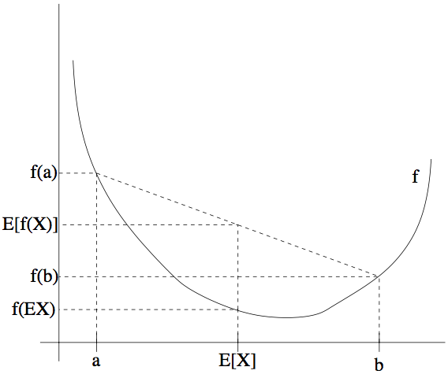

09. 期望最大化算法（The EM algorithm）

-----
[TOC]

​	在前面高斯混合模型中，我们已经讲过了期望最大化算法对其进行拟合。在本章中，我们要给出**期望最大化算法**（EM algorithm）的更广泛应用，并且演示如何将其应用到一个大系列的具有**潜在变量**（latent variables）的**估计问题**（estimation problems）。下面主要介绍 EM 的整个推导过程。

# 1. Jensen 不等式（Jensen‘s inequality）

​	设 $f$ 为一个函数，其定义域为整个实数域。如果函数 $f$ 的二阶导数 $f''(x) \geq 0(x \in R)$，则函数 $f$ 为一个**凸函数（convex function）**。如果输入为向量，那么这个函数就泛化了，这个时候该函数的**海森矩阵**（hessian）$H$ 就是一个半正定矩阵。如果对于所有的 $x$，都有二阶导数 $f''(x) > 0$，我们称这个函数 $f$ 是**严格凸函数**（对于输入 $x$ 是向量的情况，对应的条件就是海森矩阵正定）。这样就可以用如下形式来表述 **Jensen 不等式**：

**定理**（Theorem）：设 $f$ 是一个凸函数，且设 $X$ 是一个随机变量。然后则有：
$$
E[f(X)] \geq f(E[X])\\
(函数值的期望 大于等于 期望的函数值)\\
$$
此外，如果函数 $f$ 是严格凸函数，那么 $E[f(X)] = f(E[X])$ 当且仅当 $X=EX$ 的概率为 1，即 $X$ 是常量。

为了方便理解这个定理，可以参考下面的图：

上图中，$f$ 是一个凸函数，在图中用实线表示。另外 $X$ 是一个随机变量，有 0.5 的概率取值为 $a$，另外有 0.5 的概率取值为 $b$。这样，$X$ 的期望 $EX$ 就在图中所示的 $a$ 和 $b$ 的中点位置。图中在 $y$ 轴上也标出了 $f(a), f(b)$ 和 $f(EX)$。函数值的期望 $E[f(X)]$ 在 $y$ 轴上就处于 $f(a)$ 和 $f(b)$ 之间的中点位置。由于 $f$ 是凸函数，很明显 $E[f(X)] \geq f(EX)$。

> 当且仅当 $-f$ 是严格凸函数的时候，$f$ 是**严格凹函数**（strictly concave function）。Jensen 不等式也适用于凹函数（concave function），不等式的方向要反过来，即 $E[f(X)] \leq f(EX)$。

# 2. EM 算法（The EM algorithm）

​	假设我们有一个估计问题，其中训练集 $\{ x^{(1)}, ..., x^{(m)} \}$ 包含了 $m$ 个独立样本。我们用模型 $p(x, z)$ 对数据进行建模，拟合其参数，其**似然函数**（likelihood）如下所示：
$$
\begin {aligned}
l(\theta) &= \sum_{i=1}^{m} \log p(x;\theta)\\
		  &= \sum_{i=1}^{m} \log \sum_zp(x,z;\theta)	\\
\end {aligned}
$$
然而，确切地找到对参数 $\theta$ 的最大似然估计可能会很难，此处的 $z^{(i)}$ 是一个**潜在的随机变量**。通常情况下，如果 $z^{(i)}$ 事先得到了，然后在进行最大似然估计，就容易多了。**期望最大化算法**（EM algorithm）是一种解决存在隐含变量优化问题的有效方法。既然不能直接最大化 $l(\theta)$，我们可以不断地构建 $l$ 的下界（步骤 E）；然后对这个下界进行优化（步骤 M）。

​	对于每个 $i$，设 $Q_i$ 表示该样本隐藏变量 $z^{(i)}$ 的某种分布，即 $z^{(i)} \sim Q_i, \sum_{z^{(i)}} Q_i(z^{(i)}) =1, Q_i(z^{(i)}) \geq 0$。（根据上面的高斯混合模型，可以将 $z^{(i)}$ 可能的取值假设为 $1,2,.., k$ 等 $k$ 个值）则有下列各式：
$$
\begin {aligned}
\sum_i \log p(x^{(i)}; \theta) 
&= \sum_i \log \sum_{z^{(i)}} p(x^{(i)}, z^{(i)}; \theta) &\text {(1)}\\
&= \sum_i \log \sum_{z^{(i)}} Q_i(z^{(i)}) \frac{p(x^{(i)}, z^{(i)}; \theta)}{Q_i(z^{(i)})} &\text {(2)}\\
&\geq \sum_i \sum_{z^{(i)}}Q_i(z^{(i)})\log \frac{p(x^{(i)}, z^{(i)}; \theta)}{Q_i(z^{(i)})} &\text {(3)}\\
\end {aligned}
$$
上面的等式（3）使用了 Jensen 不等式。其中的 $f(x) = \log(x)$ 是一个凹函数，而且式子
$$
\sum_{z^{(i)}} Q_i(z^{(i)}) \frac{p(x^{(i)}, z^{(i)}; \theta)}{Q_i(z^{(i)})}
$$
表示的是变量 $\frac{p(x^{(i)}, z^{(i)}; \theta)}{Q_i(z^{(i)})}$ 基于 $z^{(i)}$ 的期望，其中 $z^{(i)}$ 是根据 $Q_i$ 给定的分布确定。然后利用 Jensen 不等式可以得到：
$$
f(E_{z^{(i)}\sim Q_i}[\frac{p(x^{(i)}, z^{(i)}; \theta)}{Q_i(z^{(i)})}]) \geq
E_{z^{(i)}\sim Q_i} [f(\frac{p(x^{(i)}, z^{(i)}; \theta)}{Q_i(z^{(i)})})]
$$
​	接下来，对于任意的一个分布 $Q_i​$，等式（3）就给出了似然函数 $l(\theta)​$ 的下界。$Q_i​$ 有很多种可能选择，我们应该选择哪一个（我们选择合适的 $Q_i​$ 的目的是让下界尽可能大，等号尽可能成立，这样保证似然函数最大，然后得到参数 $\theta​$）？假设我们对参数 $\theta​$ 有某种估计（即 $\theta​$ 假设已知），很自然的做法就是让下界紧逼当前 $\theta​$ 值下的似然函数。也就是说，针对当前的 $\theta​$ 值，我们让等号成立（即先构建下界，然后对下界优化）。

​	根据 Jensen 不等式，要让等式成立，需要让随机变量变成常数值，也就是需要：
$$
\frac{p(x^{(i)}, z^{(i)}; \theta)}{Q_i(z^{(i)})} = c
$$
其中常数 $c$ 不依赖 $z^{(i)}$。要实现这一条件，只需满足：
$$
{Q_i(z^{(i)})} \propto {p(x^{(i)}, z^{(i)}; \theta)}
$$

实际上，由于我们已知 $\sum_{z^{(i)}} Q_i(z^{(i)}) = 1​$，即 $\sum_{z^{(i)}} p(x^{(i)}, z^{(i)}; \theta) = c​$，这就进一步表明：
$$
\begin {aligned}
Q_i(z^{(i)}) 
&= \frac{ Q_i(z^{(i)})}{\sum_{z^{(i)}} Q_i(z^{(i)})} \\ 
&= \frac{p(x^{(i)}, z^{(i)}; \theta)}{\sum_{z^{(i)}} p(x^{(i)}, z^{(i)}; \theta)}\\
&= \frac {p(x^{(i)}, z^{(i)}; \theta)}{p(x^{(i)};\theta)}	\\
&= p(z^{(i)}|x^{(i)};\theta)	\\
\end {aligned}
$$
因此，在给定 $x^{(i)}$ 和参数 $\theta$ 的条件下，我们可以简单的选择 $Q_i$ 为 $z^{(i)}$ 的**后验分布**（posterior distribution）。

​	至此，等式（3）给出了似然函数的一个下界，我们的目的就是最大化似然函数，目的转化为对 $Q_i$ 的选择；然后在参数 $\theta$ 假定的情况下， $Q_i$ 的计算公式就是 $z^{(i)}$ 的后验分布；这就是 EM 算法的步骤 E。接下来的步骤 M 中，就是在给定 $Q_i$ 的条件下，最大化等式（3）中的方程，得到新的参数 $\theta$。重复这两个步骤，就是完整的 EM 算法，总结如下：

重复一下过程直到收敛：$\{$

- 步骤 E：对每个 $i$，设：
  $$
  \begin {aligned}
  Q_i(z^{(i)}) &:= p(z^{(i)}|x^{(i)};\theta) &\text{(4)}\\
  \end {aligned}
  $$

- 步骤 M：设
  $$
  \begin {aligned}
  \theta &:= \arg \max_\theta \sum_i \sum_{z^{(i)}} Q_i(z^{(i)}) \log \frac{p(x^{(i)}, z^{(i)}; \theta)}{Q_i(z^{(i)})}	&\text{(5)}\\
  \end {aligned}
  $$

$\}$

​	我们怎么知道这个算法是否收敛？事实上，假设 $\theta^{(t)}​$ 和 $\theta^{(t+1)}​$ 是上面 EM 算法迭代过程中的某两个相邻参数，如果存在 $l(\theta^{(t)}) \leq l(\theta^{(t+1)})​$，这就表明 EM 算法迭代过程总是让似然函数**单调递增**的。根据上述介绍的 EM 算法，我们的参数起点不妨设为 $\theta^{(t)}​$，这样我们选择的 $Q_i​$ 为：
$$
Q_i^{(t)}(z^{(i)}) := p(z^{(i)}|x^{(i)};\theta^{(t)})
$$
在等式（3）的推导过程中，我们选择的 $Q_i​$ 可以让不等式的等号成立，因此：
$$
\begin {aligned}
l(\theta^{(t)}) &= \sum_i \sum_{z^{(i)}} Q_i^{(t)} (z^{(i)}) \log \frac{p(x^{(i)}, z^{(i)}; \theta^{(t)})}{Q_i^{(t)} (z^{(i)})} &\text{(6)} \\
\end {aligned}
$$
参数 $\theta^{(t+1)}$ 是通过让上式中等号右侧的部分最大化而得到的，即有：
$$
\begin {aligned}
l(\theta^{(t+1)}) 
&\geq \sum_i \sum_{z^{(i)}} Q_i^{(t)} (z^{(i)}) \log \frac{p(x^{(i)}, z^{(i)}; \theta^{(t+1)})}{Q_i^{(t)} (z^{(i)})} &\text{(7)}\\
&\geq \sum_i \sum_{z^{(i)}} Q_i^{(t)} (z^{(i)}) \log \frac{p(x^{(i)}, z^{(i)}; \theta^{(t)})}{Q_i^{(t)} (z^{(i)})}	&\text{(8)}\\
&\geq l(\theta^{(t)})	&\text{(9)}\\
\end {aligned}
$$
不等式（7）成立的条件可以参见不等式（3），不等式（3）对于任意值的 $Q_i, \theta$ 都成立。不等式（8）的条件来自于 $\theta^{(t+1)}$ 的选择性，根据不等式（5）， $\theta^{(t+1)}$ 取的是使得似然函数下界最大的参数值，故也成立。不等式（9）的条件来自于等式（6）。因此，EM 算法得到的参数能够保证似然函数的单调收敛。

> 如果我们定义
> $$
> J(Q,\theta) = \sum_i \sum_{z^{(i)}} Q_i(z^{(i)}) \log \frac{p(x^{(i)}, z^{(i)}; \theta)}{Q_i(z^{(i)})}
> $$
> 通过我们之前的推导，可以知道 $l(\theta) \geq J(Q,\theta)$。这样 EM 算法也可看作是在 $J$ 上的坐标上升法，其中步骤 E 在 $Q$ 上对 $J$ 进行了最大化，然后步骤 M 则在 $\theta$ 上对 $J$ 进行最大化。

# 3. 高斯混合模型（Mixture of Gaussians Model）

​	有了对 EM 算法的广义定义之后，我们再来回顾一下之前的高斯混合（MoG）模型问题。其中要拟合的参数有 $\phi, \mu, \Sigma$。在高斯混合模型中，我们知道一下概率分布：
$$
\begin {aligned}
p(z^{(i)}=j) &= \phi_j	\\
p(x^{(i)}|z^{(i)}=j) &= \frac{1}{(2\pi)^{n/2} |\Sigma_j|^{1/2}}\exp(-\frac{1}{2}(x^{(i)}-\mu_j)^T \Sigma_j^{-1}(x^{(i)}-\mu_j)) \\
\end {aligned}
$$
步骤 E 很简单，还是按照上面的算法推导过程，只需要计算：
$$
w_j^{(i)} = Q_i(z^{(i)} = j) = P(z^{(i)}=j|x^{(i)};\phi,\mu, \Sigma)
$$
这里面的 $Q_i(z^{(i)} = j)​$ 表示的是在分布 $Q_i​$ 上 $z^{(i)}​$ 取值为 $j​$ 的概率。

接下来在步骤 M 中，就是要最大化关于参数 $\phi, \mu, \Sigma$ 的值：
$$
\begin {aligned}
\sum_{i=1}^{m} &\sum_{z^{(i)}}Q_i(z^{(i)}) \log \frac{p(x^{(i)},z^{(i)};\phi,\mu,\Sigma)}{Q_i(z^{(i)})}	\\
&= \sum_{i=1}^{m} \sum_{j=1}^{k}Q_i(z^{(i)} = j) \log \frac{p(x^{(i)}|z^{(i)}=j;\mu,\Sigma)p(z^{(i)}=j;\phi)}{Q_i(z^{(i)} = j)}	\\
&= \sum_{i=1}^{m} \sum_{j=1}^{k} w^{(i)}_j \log \frac{\frac{1}{(2\pi)^{n/2} |\Sigma_j|^{1/2}}\exp(-\frac{1}{2}(x^{(i)}-\mu_j)^T \Sigma_j^{-1}(x^{(i)}-\mu_j))\phi_j}{w^{(i)}_j}
\end {aligned}
$$

1）先关于 $\mu_j$ 来进行最大化，即先求关于 $\mu_j$ 的偏导数，得到：
$$
\nabla_{\mu_j} = \sum_{i=1}^{m}w^{(i)}_j(\Sigma_{j}^{-1}x^{(i)}-\Sigma_{j}^{-1}\mu_j)
$$
令上式为零，然后解出 $\mu_j$ 就得到了更新规则：
$$
\mu_j := \frac {\sum_{i=1}^{m}w_j^{(i)}x^{(i)}}{\sum_{i=1}^{m}w_j^{(i)}}
$$
2）然后推导 M 步骤中参数 $\phi_j$ 的更新规则。把仅关于参数 $\phi_j$ 的表达式结合起来，就能发现只需要最大化下面的表达式：
$$
\sum_{i=1}^{m} \sum_{j=1}^{k}w_j^{(i)} \log \phi_j
$$
然而，此处还有一个附加的约束条件，即 $\phi_j​$ 的和为 1，因为其表示的是概率。为了保证约束条件成立，我们构建一个拉格朗日函数如下：
$$
L(\phi) = \sum_{i=1}^{m} \sum_{j=1}^{k}w_j^{(i)} \log \phi_j + \beta (\sum_{j=1}^{k}\phi_j-1)
$$

> 这里我们不用在意约束条件 $\phi_j \geq 0$，因为很快就能发现，这里推导得到的解会自然满足这个条件的。

其中的 $\beta​$ 是拉格朗日乘数。求导，然后得到：
$$
\nabla_{\phi_j}L(\phi) = \sum_{i=1}^{m} \frac{w^{(i)}_j}{\phi_j} + \beta  
$$
设导数为零，然后解方程，就得到了：
$$
\begin {aligned}
\phi_j &= \frac{\sum_{i=1}^{m}w^{(i)}_j}{-\beta}	\\
\sum_{j=1}^{k} \phi_j 
&= \frac{\sum_{j=1}^{k}\sum_{i=1}^{m}w^{(i)}_j}{-\beta}	\\
&= \frac{\sum_{i=1}^{m} \sum_{j=1}^{k} w^{(i)}_j}{-\beta} \\
&= \frac{\sum_{i=1}^{m} 1}{-\beta} \\
&= \frac{m}{-\beta} = 1 \\
\end {aligned}
$$
由于 $\sum_{j=1}^{k}\phi_j = 1$，可得 $-\beta = m$，由此可以得到参数 $\phi_j$ 的更新规则：
$$
\phi_j = \frac{1}{m} \sum_{i=1}^{m}w^{(i)}_j
$$
接下来对 M 步骤中对 $\Sigma_j$ 的更新规则的推导就很容易了。

# 4. 朴素贝叶斯混合模型（Mixture of Naive Bayes Model）

​	根据之前讲的生成式算法朴素贝叶斯法，在文本分类问题中，使用朴素贝叶斯混合模型的概率分布如下：
$$
\begin {aligned}
p(z^{(i)} = 1) &= \phi \\
p(x^{(i)}|z^{(i)}) &= \prod_{j=1}^{n} p(x_j^{(i)}|z^{(i)})	\\
p(x_j^{(i)} = 1|z^{(i)} = 1) &= \phi_{j|z=1}	\\
p(x_j^{(i)} = 1|z^{(i)} = 0) &= \phi_{j|z=0}	\\
\end {aligned}
$$
然后，我们可以写出 EM 算法的各步骤计算过程：

步骤 E：
$$
w^{(i)} = p(z^{(i)}=1|x^{(i)};\phi,\phi_{j|z})
$$
步骤 M：
$$
\begin {aligned}
\phi &= \frac{1}{m}\sum_{i=1}^{m}w^{(i)}	\\
\phi_{j|z=1} &= \frac{\sum_{i=1}^{m} w^{(i)}1\{x^{(i)}_j = 1\}}{\sum_{i=1}^{m}w^{(i)}}\\
\phi_{j|z=0} &= \frac{\sum_{i=1}^{m} (1-w^{(i)})1\{x^{(i)}_j = 1\}}{\sum_{i=1}^{m}(1-w^{(i)})}\\
\end {aligned}
$$
其实与生成式算法相似，只不过把 $y$ 换成了 $z$，并重复多次直至收敛。

