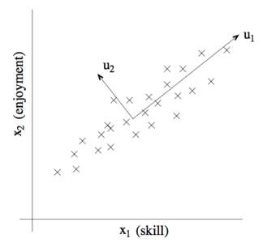
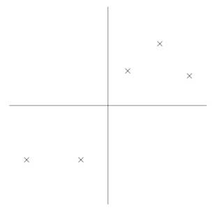
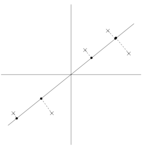
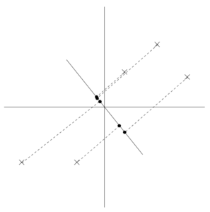

11. 主成分分析（PCA）

-----
[TOC]

​	在因子分析（factor analysis）模型中，我们在某个 $k$ 维度子空间对 $x \in R^n$ 进行近似建模，其中 $k << n$。具体来说，我们设想每个点 $x^{(i)}$ 用如下方法创建：首先在 $k$ 维度仿射空间（affine space）中生成某个 $z^{(i)}$，然后计算公式 ${\mu + \Lambda z}$，最好增加均值为 $0$，协方差为 $\Psi$ 的噪声。因子分析是一个基于概率模型，然后使用迭代期望最大化算法进行参数估计（parameter estimation）的算法。

​	在本章中，我们要学习一种新的方法：主成分分析（Principal Components Analysis，PCA），这个方法也是用来对数据近似所处的子空间进行判别（identity）。然而，主成分分析算法（PCA）会更加直接，只需要进行一种特征向量计算（在 Matlab 里面可以通过 `eig` 函数轻松实现），不需要再去使用期望最大化（EM）算法。

# 1. 主成分分析算法

​	设想有一个数据集，其中包含的是对一个无线遥控直升机飞行员协会进行调查得到的数据，其中的 $x_1^{(i)}$ 指的是飞行员 $i$ 的飞行技能，$x_2^{(i)}$ 指的是该飞行员对飞行的喜爱程序。无线遥控直升机是很难操作的，只有那些非常投入并且热爱飞行的学生，才能称为好的飞行员。所以，上面这两个属性 $x_1$ 和 $x_2$ 之间应该强相关。故我们可以认为在数据中沿着对角线方向（即下图中的 $u_1$ 方向）表征了一个人对飞行投入程度的 “源动力”（karma），只有少量的噪声脱离这个对角线方向。如下图所示，我们怎么自动计算出 $u_1$ 的方向呢？（或者说，$x_1, x_2$ 存在冗余，我们如何自动检测和删除这一冗余。）

接下来我们就要讲主成分分析算法（PCA algorithm）了。但在运行 PCA 之前，我们首先要进行一些预处理，正则化数据的均值和方差。

## 1.1 预处理

1. 设 $\mu = \frac{1}{m}\sum_{i=1}^{m} x^{(i)}$;

2. 将每个 $x^{(i)}$ 替换成 $x^{(i)} - \mu$；

3. 设 $\sigma_j^2 = \frac{1}{m}\Sigma_i (x_j^{(i)})^2$；

4. 将每个 $x_j^{(i)}$ 替换成 $x_j^{(i)}/\sigma_j$；

​	步骤 1 和 2 把数据的平均值清零；步骤 3 和 4 将每个坐标缩放，使之具有单位方差，确保不同的属性都在同样的 “尺度” 上。例如，如果 $x_1$ 是汽车的最大速度（以 mph 为单位，精确到十位）；然后 $x_2$ 是汽车的座位数量（取值一般在 2 - 4）。这样这个重新正则化就把不同的属性进行了缩放，然后这些不同属性就更具有对比性。如果我们事先已经知道不同的属性在同一尺度上，就可以省略第 3、4 步。

## 1.2 主成分分析

​	接下来，进行正则化之后，对数据近似所处的方向，也就是 “变化的主轴” $\vec u$，该如何进行计算？一种方法是找出一个单位向量 $\vec u$，使得数据在向量 $\vec u$ 上投影时，投影的数据的方差最大。直观上看，在这个方向上，数据一开始就有一定规模的方差 / 信息量（variance / information）。我们要选择的是这样一个方向的单位向量 $\vec u$：数据能近似位于与向量 $\vec u$ 一致的方向 / 子空间（direction / subspace）中，并且尽可能多地保留上面的方差。

​	设下面的数据集，我们已经进行了正则化步骤：

现在，加入我们选择的 $\vec u$，对应于下图中所示的方向。下图中的圆点表示的就是原始数据在这条线上面的投影。

可以看到，上面投影得到的数据依然有还算比较大的方差，而且这些投影点距离零点也都比较远。反例则如下图所示，我们选择另一个方向上的向量：

上面这幅图的投影中的方差就明显小了很多，而且投影得到的点位置也距离原点近很多。

​	我们希望能自动地选择出来如上面两幅通知第一幅那样方向的单位向量 $\vec u​$。要对这个过程进行方程化，要注意到给定一个向量 $\vec u​$ 和一个点 $x​$，$x​$ 投影到 $u​$ 上的投影长度可以通过 $x^T u​$ 来得到。也就是说，如果 $x^{(i)}​$ 是我们数据集中的一个点，那么这个点在 $u​$ 上的投影就是从原点到 ${x^{(i)}}^T u​$ 的距离。因此，要最大化投影的方差，就要找到一个能够将下面式子最大化的单位长度向量 $u​$：
$$
\begin {aligned}
\arg \max_u \frac{1}{m} \sum_{i=1}^{m}({x^{(i)}}^T u)^2 
&= \frac{1}{m} \sum_{i=1}^{m} u^T x^{(i)} {x^{(i)}}^T u	\\
&= u^T \Big( \frac{1}{m} \sum_{i=1}^{m} x^{(i)} {x^{(i)}}^T \Big)u \\
\end {aligned}
$$

很容易就能发现，要让上面的式子最大化，需满足如下条件：向量 $||u|| = 1$ 且为 $\Sigma = \frac{1}{m} \sum_{i=1}^{m} x^{(i)} {x^{(i)}}^T$ 的主特征向量（principal eigenvector），其中 $\Sigma$ 正好是数据的经验协方差矩阵（数据正则化后均值为零）。

​	总结一下，如果我们要找一个 1 维度子控件来近似数据，就要选择 $\Sigma​$ 的主特征向量（principal eigenvector）作为单位向量 $u​$。更广义的理解，就是如果要将数据投影到一个 $k​$ 维度子空间（$k < n​$），就应当选择 $\Sigma​$ 的 $k​$ 个特征向量来作为单位向量 $u_1, ..., u_k​$。这里的 $u_i​$ 就形成了数据的一组新的正交基。然后，要使用这组正交基来表示 $x^{(i)}​$，只需要进行如下计算：
$$
y^{(i)} = \begin {bmatrix} 
u_1^T x^{(i)}	\\
u_2^T x^{(i)}	\\
.	\\
.	\\
.	\\
u_k^T x^{(i)}	\\
\end {bmatrix} \in R^k
$$
$x^{(i)} \in R^n$，向量 $y^{(i)} \in R^k$ 就是对 $x^{(i)}$ 的 $k$ 低维度的近似 / 表示。因此，主成分分析算法（PCA）也被称为是一种维度降低算法（dimensionality reduction algorithm），其中的单位向量 $u_1, u_2, ..., u_k$ 也称为数据集的前 $k$ 个主成分（principal components）。我们对基向量的选择应当是尽可能得包留原始数据的方差信息。

# 2. 备注

​	在习题集 4 中，你会发现主成分分析算法（PCA）也可以有另外一种推导方式：将数据投影到数据所张成的 $k$ 维度子空间中，然后选择一组基向量，使得投影引起的近似误差最小。

​	主成分分析算法（PCA）有很多用法：我们接下来就给出若干样例来收尾这部分。首先是压缩，即降维：用更低纬度的 $y^{(i)}$ 来表示 $x^{(i)}$。如果我们把高纬度的数据降维到 $k = 2 \ or \ 3$，那么就可以将 $y^{(i)}$ 进行可视化了。例如，如果我们把汽车数据降维到 2 维度，那么就可以把压缩后的数据画出来，来看看哪些车彼此相似、可以聚类成组。

​	另一个常见的应用是：在 $x^{(i)}​$ **作为输入特征进行监督学习算法前**，作为降低数据维度的预处理步骤。除了有助于缓解计算压力外，降低数据维度还可以降低**假设类**（hypothesis class）的复杂度，然后避免过拟合。（例如：低纬度的输入特征上的线性分类器会有更小的 **VC 维度**）

​	最后，正如在遥控直升机飞行员那个样例，我们可以把 PCA 用作一种降噪算法。在该例子中，可以使用算法在对飞行技巧和热爱程度的含噪数据中估计直观的 ”遥控飞行源动力（piloting karma）“。在课程中，我们还看到了把这种思路用在人脸图像上，得到的就是面部特征算法。其中每个点 $x^{(i)} \in R^{100 \times 100}$ 都是一个 $10000$ 维度的向量，每个坐标对应的是人脸图像中的一个像素灰度值。使用主成分分析算法，我们就可以用更低维度的 $y^{(i)}$ 来表示每个图像 $x^{(i)}$。在这个过程中，我们希望主成分能够保存面孔间有趣的、系统的变化，而不是由于细微的光线变化、轻微的拍摄状况等差别引入的 ”噪声“。然后我们通过计算降低维度后的 $||y^{(i)} - y^{(j)}||$ 来测量面孔 $i, j$ 之间的距离。这样就能得到一个令人惊艳的面部匹配和检索算法。

下表为目前**无监督学习**方式下的算法总结：主要根据算法的类型、算法处理的数据集类型进行区分。

|                         |             |      非概率算法       |        密度估计算法         |
| :---------------------: | :---------: | :-------------------: | :-------------------------: |
|   数据在团块中 clumps   | “聚类” 问题 | k 均值聚类（k-means） |     高斯混合模型（MoG）     |
| 数据在子空间中 subspace | “降维” 问题 |   主成分分析（PCA）   | 因子分析（Factor analysis） |

